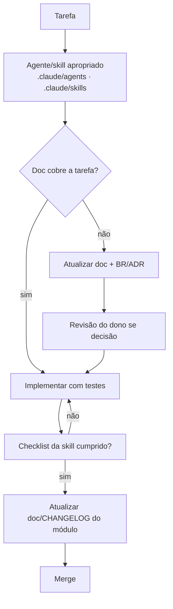

# Governança Docs-First

> **Status:** Aprovado · **Última atualização:** 2026-07-03 · **Responsável:** chief-architect

## 1. Objetivo

Definir o processo que garante as regras obrigatórias do projeto: nenhum código sem documentação, nenhuma decisão sem ADR, nenhuma regra de negócio apenas no código.

## 2. As cinco leis do projeto

1. **Doc antes de código.** A implementação de qualquer funcionalidade começa conferindo o documento do módulo; se estiver desatualizado ou omisso, atualiza-se o documento primeiro.
2. **Decisão vira ADR.** Escolha de tecnologia, padrão, formato de dado ou estratégia com efeito duradouro → ADR em `27-ADR` (status `Proposto` até o dono aprovar).
3. **Regra de negócio vira BR-xxx.** Registro canônico em `01-Regras-de-Negocio`; código e teste citam o ID.
4. **Documentação acompanha o merge.** PR que muda comportamento sem atualizar o doc correspondente é PR incompleto.
5. **Documento tem dono e status.** Cabeçalho obrigatório (template `_templates/TEMPLATE-DOCUMENTO.md`).

## 3. Fluxo de trabalho (com Claude Code)

- Cada skill em `.claude/skills/` embute o checklist mínimo da sua tarefa (ex.: `criar-migration` exige doc 04 atualizado).
- Agentes especializados em `.claude/agents/` carregam missão, limites e critérios de qualidade por área.

## 4. Versionamento

- **Recomendação:** inicializar repositório Git imediatamente (a fundação já é um ativo) com commits pequenos e mensagens convencionais em pt-BR (`docs: ...`, `feat(estoque): ...`, `fix(nfe): ...`).
- Branch padrão `main` protegida por CI a partir do Gate 01; trabalho em branches curtas (`feat/...`, `fix/...`, `docs/...`).
- Tags de release por gate concluído (`gate-00`, `gate-01`, …).

## 5. Ciclo de revisão da documentação

| Quando | O quê |
|---|---|
| A cada PR | Docs dos módulos tocados |
| Fim de cada gate | Revisão completa da pasta do módulo entregue + atualização do Roadmap |
| Trimestral | Varredura de status `Rascunho`/`Obsoleto`, links quebrados, glossário |

## 6. Riscos

| Risco | Mitigação |
|---|---|
| Documentação virar peso morto e ser abandonada | Docs enxutos, um assunto por arquivo, cross-link em vez de repetição; skills lembram o checklist |
| ADRs aprovados de fato mas não formalizados | Revisão de fim de gate confere ADRs `Proposto` pendentes |
