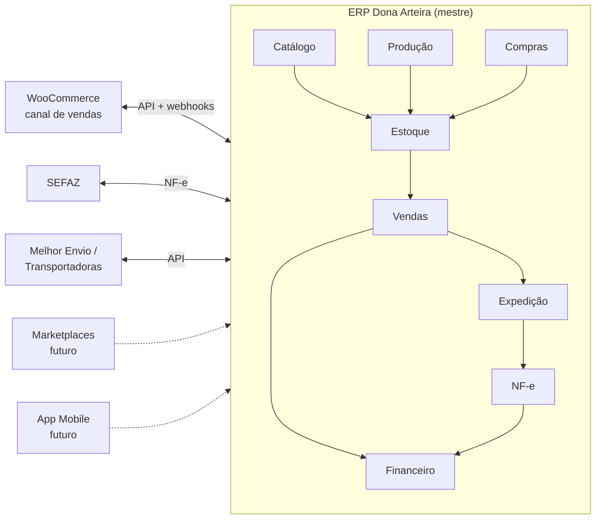

# 00 — Visão Geral

> **Status:** Aprovado · **Última atualização:** 2026-07-03 · **Responsável:** chief-architect
> **Documentos desta pasta:** [Escopo](01-escopo-e-nao-escopo.md) · [Stakeholders](02-stakeholders-e-papeis.md) · [Governança](03-governanca-docs-first.md) · [Análise crítica](04-analise-critica-gate00.md) · [Modelo de custos](05-modelo-de-custos.md)

## 1. Objetivo

Dar a qualquer pessoa (dev, dono, contador, futuro contratado) o entendimento completo do projeto em 15 minutos de leitura: o que é o ERP, por que existe, o que cobre e como será construído.

## 2. O problema

A Dona Arteira opera hoje com três ilhas desconectadas:

1. **Sistema desktop Python** — cadastro de peças, clientes e pedidos manuais. Sem produção, sem financeiro, sem fiscal, sem multiusuário real. Não será evoluído.
2. **WooCommerce** (WordPress) — e-commerce em produção com produtos, clientes, pedidos, imagens, estoque e histórico de vendas. É patrimônio de dados da empresa.
3. **Processos manuais** — produção, compras, financeiro e expedição controlados fora de sistema (planilhas/papel).

Consequências: estoque divergente entre canais, retrabalho de digitação, ausência de visão financeira consolidada, impossibilidade de emitir NF-e integrada e nenhuma rastreabilidade da produção artesanal.

## 3. A solução

Um **ERP web próprio** (Laravel 12 + React), hospedado em `gestao.donaarteira.com.br`, que se torna o **sistema mestre (Single Source of Truth)** de toda a operação:

O WordPress/WooCommerce **não é substituído**: continua sendo o e-commerce, rebaixado a canal de vendas sincronizado exclusivamente via API ([ADR-0006](../27-ADR/ADR-0006-erp-ssot.md)).

## 4. Fluxo operacional coberto

Compra de peça crua → Recebimento → Secagem/quarentena → Pintura artesanal → Acabamento → Controle de qualidade → Estoque → Venda (loja/site/atacado) → Separação → Embalagem → Expedição → Emissão de NF-e → Financeiro → Relatórios.

Cada elo tem documentação própria (pastas 08 a 14) e regras registradas na pasta 01.

## 5. Dependências estruturais

| Dependência | Estado | Risco se falhar |
|---|---|---|
| Decisão de hospedagem ([ADR-0016](../27-ADR/ADR-0016-hospedagem.md)) | **Pendente — dono** | Compromete filas, NF-e e backups |
| Acesso à API do WooCommerce (chaves REST) | A obter | Bloqueia migração e sincronização |
| Certificado digital A1 válido | Existente | Bloqueia NF-e (Gate 05) |
| Validação fiscal com contador (regime, CFOP, NCM) | **Pendente** | Notas rejeitadas/incorretas |
| Levantamento de regras com a operação (pasta 30) | Parcial | Módulo de produção irreal |

## 6. Boas práticas desta pasta

- A visão geral não descreve *como* implementar — isso é papel das pastas 03–07; aqui só *o quê* e *por quê*.
- Toda mudança de escopo passa por atualização do [documento de escopo](01-escopo-e-nao-escopo.md) e aprovação do dono.

## 7. Riscos macro do projeto

| Risco | Prob. | Impacto | Mitigação |
|---|---|---|---|
| Hospedagem compartilhada inviabilizar filas/workers/NF-e | Alta | Alto | ADR-0016 recomenda VPS antes do Gate 02 |
| Equipe pequena (bus factor 1) | Alta | Alto | Docs-first, CI obrigatória, código convencional |
| Reforma tributária 2026+ alterar layout NF-e (IBS/CBS) | Certa | Médio | Pasta 13; acompanhar NTs; considerar API fiscal gerenciada |
| Dados sujos no WooCommerce contaminarem o ERP | Média | Alto | Fase de saneamento obrigatória na migração (pasta 17) |
| Escopo crescer antes do núcleo estabilizar | Média | Alto | Gates com critérios de saída (pasta 28) |

## 8. Evoluções futuras

Marketplaces, app mobile, WhatsApp transacional, gateway de pagamento, BI — todas registradas no [Roadmap](../28-Roadmap/README.md) como fases 6+, nenhuma antes do núcleo operacional estável.
