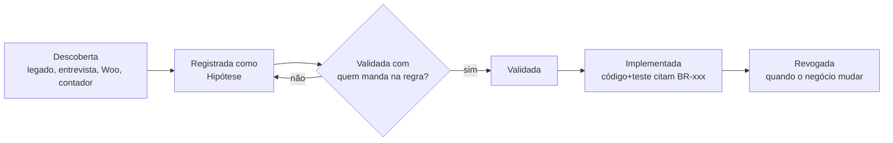

# 01 — Regras de Negócio

> **Status:** Aprovado · **Última atualização:** 2026-07-03 · **Responsável:** business-analyst
> **Documentos:** [Registro de regras](01-registro-de-regras.md) · [Levantamento do legado](02-levantamento-legado.md)

## 1. Objetivo

Manter o **registro canônico e único** de todas as regras de negócio do ERP. Uma regra que vive só no código é invisível para o negócio e some quando o código muda; aqui ela ganha ID, dono, status e rastreabilidade.

## 2. Responsabilidades

- **Está aqui:** enunciado, condições, exceções, exemplos e status de cada regra (`BR-xxx`).
- **Não está aqui:** detalhes de implementação (docs dos módulos) e parametrizações de instância (configuração do sistema).

## 3. Fluxo de vida de uma regra

Fontes de descoberta, em ordem de autoridade: **dono do produto > contador (fiscal) > operação (produção/vendas) > sistema legado > WooCommerce**. O legado é evidência de como era, não prova de como deve ser.

## 4. Convenções

- IDs sequenciais por bloco de módulo: `BR-0xx` gerais/cadastro, `BR-1xx` produção, `BR-2xx` estoque, `BR-3xx` vendas, `BR-4xx` compras, `BR-5xx` financeiro, `BR-6xx` fiscal/NF-e, `BR-7xx` integrações/migração, `BR-8xx` segurança/permissões.
- Template obrigatório: [`_templates/TEMPLATE-REGRA-DE-NEGOCIO.md`](../_templates/TEMPLATE-REGRA-DE-NEGOCIO.md) (regras simples podem viver como linha da tabela do registro; regras complexas ganham arquivo próprio).
- Código referencia a regra em teste (`it('BR-201: não permite saldo negativo', ...)`) e, quando útil, em comentário na implementação.

## 5. Dependências

| Depende de | Motivo |
|---|---|
| [30-Dominio-da-Dona-Arteira](../30-Dominio-da-Dona-Arteira/README.md) | Roteiro de descoberta com a operação |
| [02-levantamento-legado.md](02-levantamento-legado.md) | Evidências extraídas do sistema desktop |
| Contador | Autoridade sobre regras `BR-6xx` |

Todos os módulos (08–14) dependem desta pasta.

## 6. Boas práticas

- Enunciado **testável** (se não dá para escrever um teste, a regra está mal escrita).
- Exceções explícitas com alçada (quem pode furar a regra e como isso é auditado).
- Nunca apagar regra: revogar com data e motivo.

## 7. Riscos

| Risco | Mitigação |
|---|---|
| Regras assumidas do legado estarem obsoletas | Status `Hipótese` por padrão; validação nominal antes de implementar |
| Registro divergir do código com o tempo | Testes citam IDs; revisão de fim de gate confere o par doc↔teste |

## 8. Evoluções futuras

- Fase 6+: expor regras parametrizáveis na UI de configurações do ERP (ex.: % de perda aceitável, buffer de estoque por canal).
