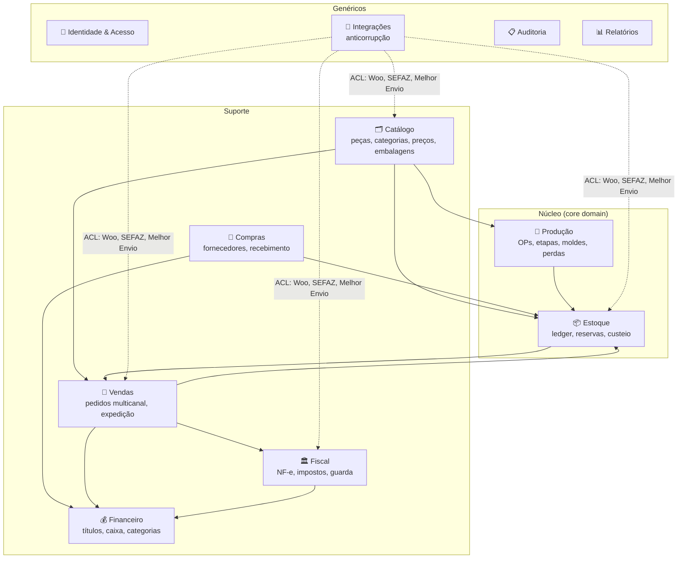

# 02 — Domínio

> **Status:** Aprovado · **Última atualização:** 2026-07-03 · **Responsável:** chief-architect
> **Documentos:** [Eventos de domínio](01-eventos-de-dominio.md)
> **ADRs relacionados:** ADR-0001 (monolito modular), ADR-0015 (camadas)

## 1. Objetivo

Definir o mapa de contextos do negócio (bounded contexts), os agregados centrais com suas invariantes e a dose certa de DDD para este projeto — vocabulário e fronteiras que valem para banco, backend, API e conversas com o negócio.

## 2. Dose de DDD adotada

Aplicamos **DDD estratégico completo** (contextos, linguagem ubíqua, mapa de contextos) e **DDD tático seletivo** (agregados, invariantes e eventos de domínio nos módulos ricos — Produção, Estoque, Vendas, Fiscal). **Não** adotamos CQRS, Event Sourcing ou value objects dogmáticos em CRUDs simples: a complexidade não se justifica para o porte da operação e pioraria a manutenção por equipe pequena. Justificativa completa no ADR-0001.

## 3. Mapa de contextos

**Núcleo do negócio é Produção + Estoque**: é o que nenhum sistema de prateleira modela bem para gesso artesanal (moldes, secagem, quebra, pintura manual). Vendas/Financeiro/Fiscal são importantes, mas convencionais.

### Relações entre contextos

- **Integrações é camada anticorrupção (ACL)**: payloads externos (Woo, SEFAZ, Melhor Envio) são traduzidos para DTOs internos; nenhum contexto de negócio conhece formato externo (BR-701).
- Contextos se comunicam **dentro do monolito** por chamadas de serviço síncronas (mesma transação quando invariante exige) e por **eventos de domínio** para efeitos colaterais assíncronos (sincronizações, notificações, auditoria).

## 4. Agregados centrais e invariantes

| Agregado (raiz) | Contexto | Invariantes principais |
|---|---|---|
| `Product` (peça) | Catálogo | SKU único e imutável (BR-002); dados fiscais completos antes de emitir NF-e (BR-606) |
| `ProductionOrder` (OP) | Produção | Etapas na ordem configurada (BR-102); qty_produzida + perdas ≤ qty_planejada; só CQ aprovado gera entrada em PA (BR-107) |
| `Mold` (molde) | Produção | Usos ≤ vida útil (alerta, não bloqueio) (BR-105) |
| `InventoryItem` (saldo por produto×local) | Estoque | Saldo ≥ 0 (BR-201); saldo = Σ movimentos (BR-202); disponível = físico − reservado |
| `Order` (pedido) | Vendas | Transições válidas da máquina de estados (BR-303); preço congelado por item (BR-302); reserva ↔ status coerentes (BR-203) |
| `PurchaseOrder` | Compras | Recebido ≤ pedido + tolerância; divergências registradas (BR-403) |
| `Receivable`/`Payable` (título) | Financeiro | Σ baixas ≤ valor; estorno por contrapartida (BR-504) |
| `FiscalDocument` (NF-e) | Fiscal | Numeração sequencial por série (BR-602); imutável após autorização; cancelamento no prazo (BR-604) |
| `Customer` / `Supplier` | Catálogo/Compras | Documento válido e único (BR-001) |

Regra prática: **transação = fronteira do agregado**. Operações que tocam dois agregados (ex.: confirmar pedido + reservar estoque) são orquestradas por um Service de aplicação que define a ordem e o comportamento em falha — documentado no módulo correspondente.

## 5. Linguagem ubíqua

O vocabulário oficial vive no [Glossário](../29-Glossario/README.md). Termos de código derivam dele: `Piece` foi mantido do legado? **Não** — no ERP o termo é `Product` (alinhado ao Woo), com `kind = finished_good | raw_material | packaging | resale | supply`; "peça" permanece na UI em pt-BR. Mapeamentos completos por contexto no doc de banco (pasta 04).

## 6. Dependências

Alimenta diretamente: 03-Arquitetura (módulos), 04-Banco (modelo), 05-Backend (estrutura de pastas por contexto), 07-API (recursos por contexto).

## 7. Riscos

| Risco | Mitigação |
|---|---|
| Fronteiras erradas por desconhecimento do processo real | Entrevistas da pasta 30 antes do Gate 03 (produção) |
| Contextos virarem pastas decorativas com acoplamento cruzado | Regra de dependência entre módulos verificada em revisão (deptrac na fase 2 — ver 05-Backend) |

## 8. Evoluções futuras

- Extrair contexto de Integrações para workers dedicados se o volume exigir (gatilho no ADR-0001).
- Contexto de Atendimento/CRM (fase 7+) se o WhatsApp virar canal ativo.
