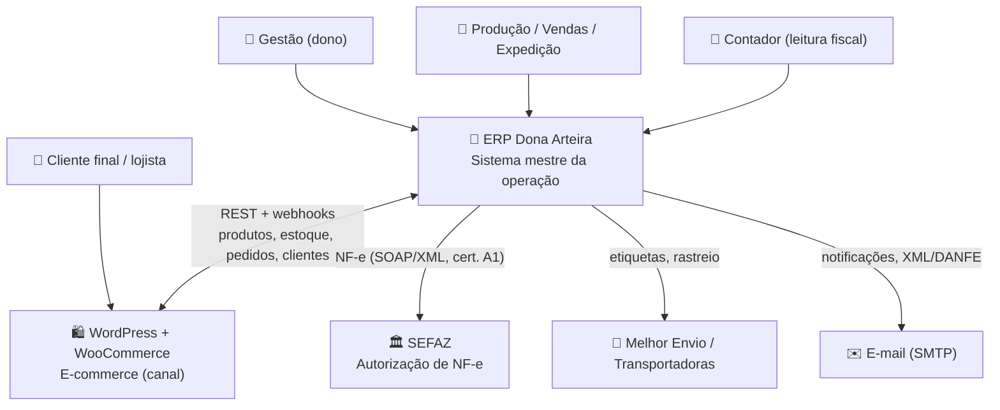
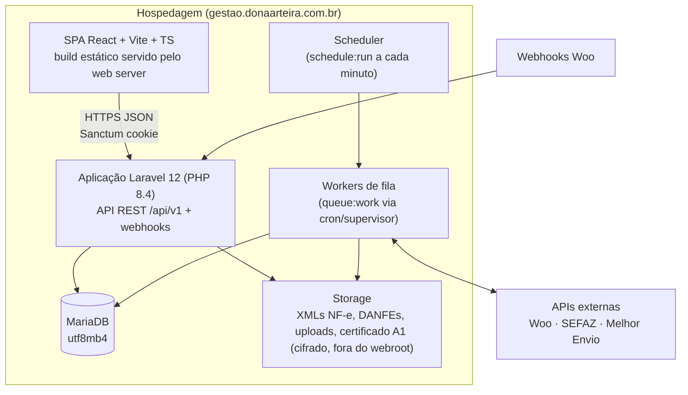
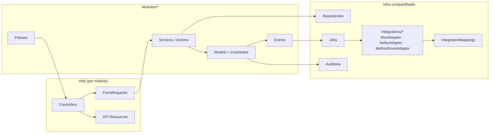

# Visão C4

> **Status:** Aprovado · **Última atualização:** 2026-07-03 · **Responsável:** chief-architect

Diagramas nos níveis 1–3 do modelo C4. Nível 4 (código) é responsabilidade das pastas 05/06 e do próprio código.

## Nível 1 — Contexto

## Nível 2 — Contêineres

**Nota:** a viabilidade de `WORKER`/`SCHED` no plano Hostinger Business é a principal restrição aberta — ver [ADR-0016](../27-ADR/ADR-0016-hospedagem.md).

## Nível 3 — Componentes do contêiner Laravel

Estrutura de pastas correspondente definida em [05-Backend](../05-Backend/README.md).
