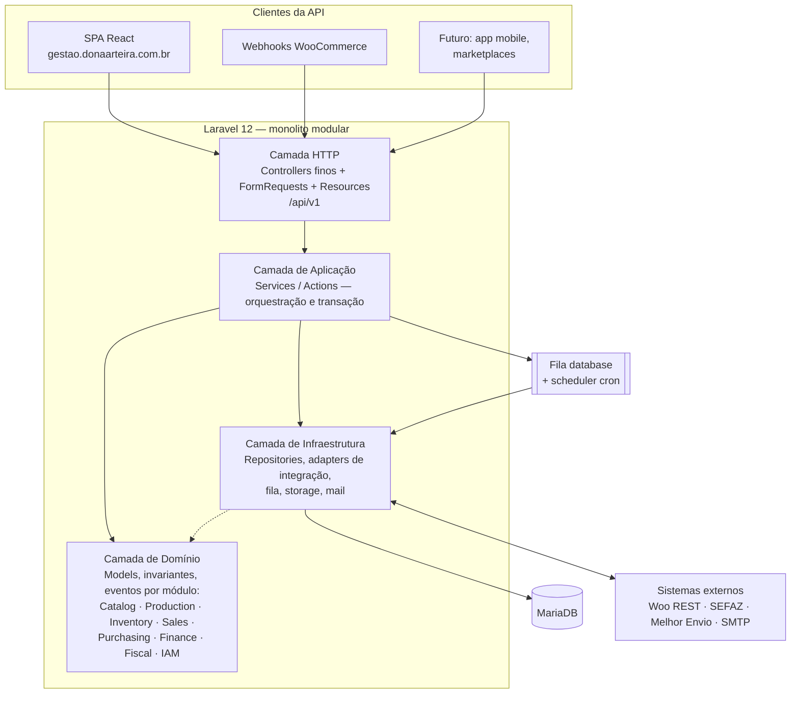

# 03 — Arquitetura

> **Status:** Aprovado · **Última atualização:** 2026-07-03 · **Responsável:** chief-architect
> **Documentos:** [Visão C4](01-visao-c4.md) · [Requisitos não funcionais](02-requisitos-nao-funcionais.md)
> **ADRs:** 0001 (monolito modular) · 0003 (API First) · 0004 (SPA) · 0005 (auth) · 0007 (sync assíncrona) · 0014 (filas) · 0015 (camadas)

## 1. Objetivo

Definir o estilo arquitetural do ERP, as camadas, os fluxos síncronos e assíncronos e as regras de dependência que mantêm o sistema saudável por anos.

## 2. Estilo: monolito modular com API First

Um único deploy Laravel contendo **módulos por bounded context** (pasta 02), expondo **API REST versionada** consumida pela SPA React e pelas integrações. Justificativa no [ADR-0001](../27-ADR/ADR-0001-monolito-modular.md): equipe de 1 dev, hospedagem única, domínio médio — microserviços multiplicariam custo operacional sem benefício; um monolito bem modularizado preserva a opção de extração futura.

## 3. Regras de dependência (invioláveis)

1. **Domínio não conhece HTTP, fila nem sistemas externos.** Models/eventos não importam nada de `Http`, `Integrations` ou clients externos.
2. **Módulos de negócio não se importam mutuamente de forma circular.** Dependências permitidas seguem o mapa de contextos (ex.: Sales → Inventory, nunca Inventory → Sales; comunicação inversa via eventos).
3. **Integrações é camada anticorrupção**: só ela fala com o mundo externo; traduz payloads para DTOs internos; o resto do sistema não conhece formato Woo/SEFAZ (BR-701).
4. **Controller fino**: valida (FormRequest), chama um Service/Action, retorna Resource. Nenhuma regra de negócio, nenhuma query complexa.
5. **Transação pertence ao Service.** Uma operação de negócio = um método de Service = uma transação (quando aplicável).
6. **Efeito colateral vai para evento + listener em fila** (sync Woo, e-mails, notificações) — nunca inline no fluxo do usuário.

## 4. Fluxos de referência

### Síncrono (request do usuário)
`SPA → Controller (validação) → Service (transação: domínio + repositórios) → eventos disparados → Resource JSON`. Meta: p95 < 500 ms.

### Assíncrono (integração)
`Evento → Listener enfileira Job → Job chama Adapter (Integrations) → API externa → atualiza integration_mappings → loga resultado`. Retry com backoff exponencial (1m, 5m, 30m, 2h, falha → parking + alerta). Detalhes na pasta 15.

### Webhook de entrada
`Woo → POST /api/webhooks/woocommerce (verificação HMAC, resposta 200 imediata) → payload bruto persistido → Job processa (idempotência por delivery id) → Service do módulo`. Nunca processar webhook inline.

## 5. Dependências

| Depende de | Motivo |
|---|---|
| 02-Dominio | Fronteiras dos módulos |
| ADR-0016 (hospedagem) | Fila, workers e agendamento dependem do ambiente |
| 07-API | Contratos da camada HTTP |

## 6. Boas práticas

- Toda exceção de negócio é tipada (`DomainException` filhas) e mapeada para erro HTTP padronizado (pasta 07).
- Feature flags simples (config/DB) para ligar/desligar integrações sem deploy.
- Correlation ID por request/job propagado nos logs (pasta 24).

## 7. Riscos

| Risco | Prob. | Impacto | Mitigação |
|---|---|---|---|
| Módulos degenerarem em "big ball of mud" | Média | Alto | Regras de dependência + revisão de arquitetura por gate; deptrac quando houver código |
| Fila database sob carga (sem Redis) | Média | Médio | ADR-0014: aceitável no porte atual; gatilhos de migração definidos |
| Shared hosting limitar workers/daemons | Alta | Alto | ADR-0016 — decisão pendente com recomendação de VPS |

## 8. Evoluções futuras

- Extração de workers de integração para processo/host dedicado (gatilho: fila > 5 min de atraso recorrente).
- Cache de leitura (Redis) para dashboards, quando o ambiente permitir.
- Webhooks de saída do ERP para terceiros (fase 6+), reutilizando o padrão da pasta 15.
