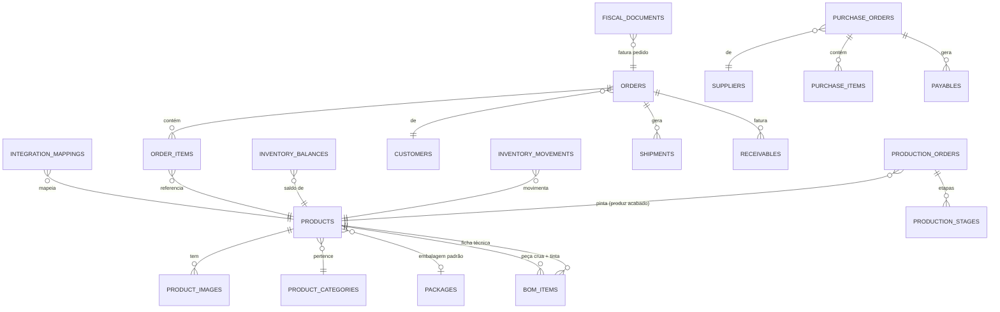

# Modelo Conceitual de Dados

> **Status:** Em revisão · **Última atualização:** 2026-07-03 · **Responsável:** senior-dba
> Modelo **conceitual/lógico** — nomes prováveis de tabelas e relações, sem DDL. A migration real (Gate 01+) referencia esta página.

## Visão geral dos módulos

## Catálogo

| Tabela | Campos essenciais | Notas |
|---|---|---|
| `products` | public_id, **sku UNIQUE**, name, slug, description, `kind` (finished_good/**raw_piece**/raw_material/packaging/resale/supply), unit (UN/KG/L…), status (active/archived), peso e dimensões, dados fiscais (`ncm`, `cest`, `origin`, `gtin` nullable="SEM GTIN"), `default_package_id`, `min_stock`, `drying_days` (lead de secagem), flags de canal (`sell_on_woo`) | Unifica peça acabada, **peça crua**, MP, embalagem e revenda — um só estoque (BR-207). `raw_piece` = peça comprada crua, substrato da pintura ([ADR-0023](../27-ADR/ADR-0023-producao-e-pintura-nao-fundicao.md)); é componente da ficha técnica do acabado, não vendável. Peças do legado (já pintadas): `kind=finished_good` |
| `product_categories` | parent_id (árvore), name, slug | Espelha árvore do Woo na migração (BR-007) |
| `product_images` | product_id, path/url, position, `source` (woo/erp) | Estratégia de mídia: ADR-0017 |
| `product_prices` | product_id, `price_list` (retail/wholesale), price DECIMAL(15,2), valid_from | Histórico de preço; par varejo/atacado do legado (BR-003) |
| `packages` | name, dimensões, peso | Catálogo de embalagens (BR-004) |
| `bom_items` (ficha técnica) | product_id (peça acabada), component_id (**peça crua** + tinta/verniz + embalagem), qty DECIMAL(15,3), `waste_pct` | Base do consumo teórico e custo (BR-103/108). O componente de moldagem some; entra a peça crua substrato + insumos de pintura ([ADR-0023](../27-ADR/ADR-0023-producao-e-pintura-nao-fundicao.md)) |

## Parceiros

| Tabela | Campos essenciais | Notas |
|---|---|---|
| `customers` | public_id, type (PF/PJ), name, **doc UNIQUE quando informado**, email, phone, `is_wholesale`, `state_registration`, notes, `origin` (erp/woo/legacy), lgpd_consent_at | Documento nullable para balcão (validar BR-001); dedupe na migração por doc+email |
| `customer_addresses` | customer_id, label, logradouro completo, cep, `is_default_shipping/billing` | Múltiplos endereços (legado tinha 1) |
| `suppliers` | razão social, cnpj UNIQUE, contato, prazo médio de entrega | |
| `carriers` | nome, cnpj, integração (melhor_envio/manual) | |

## Estoque (ADR-0008)

| Tabela | Campos essenciais | Notas |
|---|---|---|
| `locations` | name (Ateliê, Depósito, Loja, **Quarentena/Secagem**…), `type` (inclui `quarantine`) | Mesmo com 1 local, modelar desde já. O `type=quarantine` guarda a peça crua úmida recebida; produção e sync do canal **ignoram** esse tipo ([ADR-0024](../27-ADR/ADR-0024-quarentena-de-secagem.md)) — a liberação da secagem é um `transfer` para o Ateliê |
| `inventory_movements` | product_id, location_id, `qty` (com sinal) DECIMAL(15,3), `type` (purchase_receipt, production_output, production_input, sale_shipment, adjustment_in/out, transfer_in/out, loss, return_in), `unit_cost`, `reference` (polimórfico: OP, pedido, compra, contagem), occurred_at, created_by | **Imutável, append-only** (BR-202). Estorno = contra-movimento |
| `inventory_balances` | product_id + location_id UNIQUE, `qty_on_hand`, `qty_reserved`, `avg_cost` | Atualizada na mesma transação do movimento; reconciliável por Σ movimentos |
| `stock_reservations` | product_id, order_id, qty, status (active/consumed/released) | BR-203 |
| `stock_counts` + `stock_count_items` | contagem física, contado vs sistema, aprovador ≠ contador | BR-205; ajuste gera movimentos |

## Produção

| Tabela | Campos essenciais | Notas |
|---|---|---|
| `production_orders` | number, product_id (peça **acabada**), qty_planned, qty_produced, qty_lost, status (draft/released/in_progress/done/cancelled), origem (stock/order), order_id?, datas | BR-101. **Sem `mold_id`** — não há fundição ([ADR-0023](../27-ADR/ADR-0023-producao-e-pintura-nao-fundicao.md)) |
| `production_order_stages` | production_order_id, `stage` (**painting/finishing/qc**), status, started_at, finished_at, assigned_to, `minutes_spent`, notes | Sequência configurável (BR-102). Etapas de **pintura + acabamento + CQ**; `minutes_spent` da pintura alimenta a mão de obra do custeio (BR-108). A secagem saiu daqui → é quarentena de recebimento ([ADR-0024](../27-ADR/ADR-0024-quarentena-de-secagem.md)) |
| `production_consumptions` | production_order_id, component_id (peça crua, tinta, verniz), qty, movement_id | Consumo real ↔ movimento de estoque (BR-103): `production_input` da peça crua + insumos |
| `production_losses` | production_order_id, stage (painting/finishing/qc), qty, reason (breakage/paint_defect/qc_reject/other), notes | BR-104; alimenta relatório de perdas. Quebra **antes** da OP (recebimento/secagem) é `loss` de estoque, não daqui ([ADR-0024](../27-ADR/ADR-0024-quarentena-de-secagem.md)) |

## Vendas

| Tabela | Campos essenciais | Notas |
|---|---|---|
| `orders` | public_id, number, `channel` (erp/woocommerce/marketplace_x), customer_id, `status` (máquina BR-303), price_list aplicada, totals (subtotal, discount, shipping, total), payment_method, delivery_method, promised_date, woo metadata via mapping | Pedidos Woo: BR-304 |
| `order_items` | order_id, product_id, qty, `unit_price` congelado, discount, note | BR-302; note cobre personalização (legado) |
| `order_status_history` | order_id, from→to, user/system, motivo | Auditoria da máquina de estados |
| `shipments` | order_id, carrier_id, `tracking_code`, label_url, shipped_at, delivered_at, custo | Rastreioé devolvido ao Woo |
| `payments` | order_id, method, amount, status, paid_at, gateway_ref? | V1: registro manual; gateway fase 7 |

## Compras

`purchase_orders` (supplier, status, datas), `purchase_order_items` (product_id, qty, unit_cost), `goods_receipts` + `goods_receipt_items` (qty recebida, divergência, movement_id, `received_at`, `expected_release_at` = received_at + drying_days, `released_at` real) — BR-401/403. O recebimento de **peça crua** entra na localização `quarantine`; a **liberação da secagem** é um `transfer` para o Ateliê, referenciando o recebimento, que é o **lote** para a taxa de quebra por fornecedor ([ADR-0024](../27-ADR/ADR-0024-quarentena-de-secagem.md)).

## Financeiro

| Tabela | Campos essenciais | Notas |
|---|---|---|
| `finance_categories` | árvore simples (Receita > Vendas Site…) | plano gerencial (BR-503) |
| `finance_accounts` | Caixa, Banco X, PIX… | |
| `receivables` / `payables` | origem polimórfica (order/purchase/manual), descrição, due_date, amount, status (open/partial/settled/cancelled) | BR-501 |
| `finance_settlements` | título, account_id, amount, settled_at, created_by | Baixas parciais (BR-502); estorno por contrapartida (BR-504) |

## Fiscal / NF-e

| Tabela | Campos essenciais | Notas |
|---|---|---|
| `fiscal_documents` | model (55), `series`, `number`, order_id?, customer snapshot, status (draft/signed/transmitted/**authorized**/rejected/cancelled/contingency), `access_key` UNIQUE(44), protocol, environment (1-prod/2-homolog), xml_path, danfe_path, totals, rejection_reason | Imutável após autorizada; numeração via `fiscal_series` com lock (BR-602) |
| `fiscal_document_items` | doc_id, product snapshot, cfop, ncm, csosn, valores/impostos por item | Snapshot fiscal completo |
| `fiscal_document_events` | doc_id, type (cancel/cce/inutilization), protocol, xml_path | BR-604 |
| `fiscal_series` | series, next_number, environment — **UPDATE com lock pessimista** | Evita furo/duplicidade |
| `tax_profiles` | perfil fiscal por tipo de operação (dentro/fora UF × PF/PJ) → cfop/csosn padrão | Preenchido com o contador (pasta 13) |

## Integrações

| Tabela | Campos essenciais | Notas |
|---|---|---|
| `integration_mappings` | `entity_type`, `local_id`, `remote_system` (woocommerce/melhor_envio…), `remote_id`, checksum, last_synced_at — UNIQUE(entity, system, remote_id) | BR-704 |
| `incoming_webhooks` | source, event, `delivery_id` UNIQUE, payload JSON, status (received/processed/failed), processed_at | Idempotência (BR-703) |
| `sync_jobs_log` | direção, entidade, resultado, erro, duração, correlation_id | Painel de integrações |
| `integration_settings` | credenciais **cifradas** (cast encrypted), flags on/off | |

## IAM / Auditoria

`users` (+ 2FA), `roles`, `permissions` (spatie), `audits` (auditable polimórfico, event, old/new JSON, user, ip, user_agent) — pastas 18/19/26.

## Índices estratégicos (mínimo inicial)

- `inventory_movements (product_id, location_id, occurred_at)` — extrato de estoque.
- `orders (channel, status)`, `orders (customer_id, created_at)` — listagens.
- `receivables (status, due_date)` / `payables (status, due_date)` — aging.
- `integration_mappings (remote_system, entity_type, remote_id)` UNIQUE — lookup de sync.
- `audits (auditable_type, auditable_id, created_at)` — trilha por entidade.
- FULLTEXT `products (name, description)` — busca do catálogo (avaliar no Gate 01).

## Perguntas em aberto

- ~~Variações de produto (cores/tamanhos)~~ → **decidido em 2026-07-25 com os dados reais do inventário**, como esta linha mandava: variação é **produto próprio com SKU próprio**, e o SKU é sequencial neutro `DA-0001`. Ver [ADR-0022](../27-ADR/ADR-0022-modelo-de-produto-e-sku.md) e a [pasta 32](../32-Catalogo/README.md).
- Locais de estoque reais (só ateliê? loja separada?) — entrevista pasta 30.
