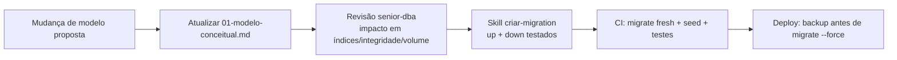

# 04 — Banco de Dados

> **Status:** Aprovado · **Última atualização:** 2026-07-03 · **Responsável:** senior-dba
> **Documentos:** [Modelo conceitual](01-modelo-conceitual.md) · [Convenções](02-convencoes-de-banco.md)
> **ADRs:** 0002 (MariaDB) · 0008 (ledger de estoque) · 0013 (tipos monetários)

## 1. Objetivo

Definir a estratégia de dados do ERP: modelo conceitual por módulo, convenções de esquema, integridade, evolução (migrations) e ciclo de vida dos dados. Nenhuma migration é criada sem que a mudança esteja refletida aqui (skill `criar-migration` verifica).

## 2. Responsabilidades

- **Está aqui:** modelo conceitual/lógico, convenções, políticas de retenção, integridade e índices estratégicos.
- **Não está aqui:** DDL/migrations (código, Gate 01+), tuning de instância (Hostinger administra o servidor).

## 3. Princípios

1. **Integridade no banco, não só na aplicação**: FKs obrigatórias, `UNIQUE` para unicidades de negócio (SKU, CPF/CNPJ, chave NF-e), `CHECK` quando disponível. A aplicação valida para dar boa mensagem; o banco garante para não corromper.
2. **Fatos são imutáveis**: movimentos de estoque, títulos baixados, NF-e autorizadas e auditoria nunca sofrem UPDATE destrutivo — correção é feita por contrapartida (BR-202, BR-504).
3. **Dinheiro em `DECIMAL(15,2)`, quantidades em `DECIMAL(15,3)`** — nunca float (ADR-0013). O legado usa `Float` para preço: será convertido com arredondamento bancário e conferência na migração.
4. **Soft delete apenas onde negócio exige "inativar"** (cadastros com movimento — BR-008); tabelas de fatos não têm soft delete (não se apaga fato).
5. **IDs**: `BIGINT UNSIGNED AUTO_INCREMENT` como PK interna + `ULID` público (`public_id`) nas entidades expostas via API — não vaza volume sequencial e facilita merges (detalhe no ADR-0002).
6. **Migração tem esquema próprio**: tabelas `stg_*` (staging) isolam dados brutos do Woo/legado até a carga validada (pasta 17).

## 4. Fluxo de evolução do esquema

Migrations são **aditivas** sempre que possível (expand/contract): adicionar coluna nullable → backfill → tornar obrigatória em migration posterior. Nunca renomear/dropar coluna em uso no mesmo release que a substitui.

## 5. Dependências

| Depende de | Motivo |
|---|---|
| 02-Dominio | Fronteiras e agregados definem as tabelas e transações |
| 01-Regras-de-Negocio | Invariantes viram constraints |
| ADR-0016 | Backup/restore e versão do MariaDB dependem do ambiente |

## 6. Retenção e ciclo de vida

| Dado | Retenção | Estratégia |
|---|---|---|
| XMLs NF-e + eventos | ≥ 5 anos (legal) | storage + backup redundante; nunca purgar sem parecer do contador |
| Auditoria | ≥ 2 anos online | arquivamento anual em cold storage após |
| Logs de integração (payloads) | 90 dias | expurgo mensal automatizado |
| Webhooks brutos processados | 30 dias | expurgo |
| Pedidos/financeiro | permanente | — |
| Dados pessoais de clientes inativos | conforme LGPD (pasta 25) | anonimização sob solicitação/critério |

## 7. Riscos

| Risco | Prob. | Impacto | Mitigação |
|---|---|---|---|
| Backup da Hostinger insuficiente/não testado | Alta | Crítico | Rotina própria de dump diário + cópia externa; teste de restore trimestral (pasta 23) |
| Falta de privilégios (SUPER, event scheduler) no shared | Média | Médio | Tudo que é agendado roda pelo scheduler do Laravel, não do MySQL |
| Migração converter floats de preço com diferença de centavos | Média | Médio | Relatório de conferência na carga (pasta 17) |
| Crescimento de `audits`/`integration_logs` degradar backup | Média | Baixo | Particionamento lógico por data + expurgo |

## 8. Evoluções futuras

- Réplica de leitura para relatórios (só se VPS e volume justificarem).
- Views materializadas manuais (tabelas snapshot) para dashboards pesados (fase 6).
