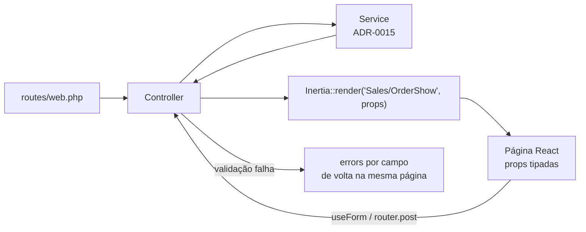

# 06 — Frontend (Inertia · React · TypeScript)

> **Status:** Em revisão — reescrito para o [ADR-0019](../27-ADR/ADR-0019-inertia-substitui-spa.md) · **Última atualização:** 2026-07-22 · **Responsável:** react-specialist
> **ADRs:** [0019](../27-ADR/ADR-0019-inertia-substitui-spa.md) (Inertia — substitui o 0004) · [0005](../27-ADR/ADR-0005-autenticacao-sanctum.md) (autenticação) · [0016](../27-ADR/ADR-0016-hospedagem.md) (hospedagem — restringe o build)
> **Substitui:** a versão de 2026-07-03, que descrevia uma SPA React separada consumindo a API REST.

## 1. Objetivo

Padronizar as telas do ERP: estrutura, bibliotecas, fluxo de dados e critérios de qualidade de interface para uso operacional diário (produção, vendas, expedição).

**Continua sendo React com TypeScript.** O que mudou é o transporte: as telas recebem dados como *props* enviadas pelos controllers via Inertia, em vez de buscá-los por HTTP num client gerado do OpenAPI.

## 2. O que o Inertia muda na prática

| Antes (SPA — ADR-0004) | Agora (Inertia — ADR-0019) |
|---|---|
| React Router define as rotas no cliente | Rotas vivem em `routes/web.php`; o controller escolhe a página |
| TanStack Query busca e cacheia dados da API | O controller passa os dados como props na resposta da visita |
| Client TS gerado do OpenAPI; tipos podem sair de sincronia | Props tipadas à mão em `resources/js/types/`; sem client, sem geração |
| Erros 422 mapeados manualmente aos campos | Erros de validação chegam prontos em `errors`, por campo |
| Login por cookie Sanctum + bootstrap de CSRF | Sessão nativa do Laravel; CSRF automático |
| Dois builds, dois deploys | Uma aplicação, um deploy |

**Regra de ouro:** se a tela precisa de um dado, quem o entrega é o controller. Não se cria endpoint de API para alimentar tela interna.

## 3. Stack decidida

| Camada | Escolha | Justificativa |
|---|---|---|
| Ponte | **Inertia.js** (adapter React) | ADR-0019 |
| Build | Vite + TypeScript `strict` | requisito do projeto |
| Roteamento | **Laravel** (`routes/web.php`) + `<Link>` do Inertia | rota é do backend; sem router no cliente |
| Dados de servidor | **props do Inertia** + *partial reloads* | dispensa camada de cache de servidor no cliente |
| Estado global de UI | Zustand, só se necessário | preferências e UI transversal; **nunca** dado de servidor |
| Formulários | **`useForm` do Inertia** | erros, estado `processing` e *dirty tracking* já resolvidos. Zod só onde houver validação client-side não trivial |
| UI kit | Tailwind CSS + shadcn/ui | produtividade + controle visual da marca |
| Tabelas | TanStack Table (headless) | ordenação/paginação continuam **server-side**, vindas do controller |
| Rotas nomeadas no JS | Ziggy | evita URL literal espalhada pelo código |
| Datas/moeda | `date-fns` + `Intl.NumberFormat('pt-BR')` | centralizado em `resources/js/lib/format.ts` |
| Testes | Pest (`assertInertia`) + Vitest/Testing Library | pasta [22](../22-Testes/README.md) |

**Sem SSR.** O ERP é aplicação interna autenticada, sem SEO — SSR só adicionaria um processo Node permanente que a hospedagem compartilhada não comporta ([ADR-0016](../27-ADR/ADR-0016-hospedagem.md)).

## 4. Estrutura de pastas

```text
resources/js/
├── app.tsx              # bootstrap do Inertia + resolvedor de páginas
├── Pages/               # uma página por rota — espelha os módulos do backend
│   ├── Catalog/         ├── Production/   ├── Inventory/
│   ├── Sales/           ├── Purchasing/   ├── Finance/
│   ├── Fiscal/          ├── Integrations/ └── Identity/
├── Layouts/             # AppLayout (menu, header), AuthLayout — layouts persistentes
├── Components/          # UI compartilhada: DataTable, MoneyInput, StatusBadge…
├── lib/                 # format, permissions, helpers
└── types/               # tipos das props por módulo (espelham os Resources/DTOs)
```

Regras:
- **Página não importa de outra página.** O que for comum sobe para `Components/` ou `lib/`.
- **`Layouts/` são persistentes** (definidos em `Page.layout`): o menu não remonta a cada navegação, preservando estado e rolagem.
- **`types/` é escrito à mão e revisado no PR.** Sem geração automática, a disciplina de manter o tipo alinhado ao controller é humana — e por isso o teste de página (§7) é obrigatório.

## 5. Fluxo de dados



Pontos de atenção:

- **Listagens** recebem os dados já paginados e filtrados pelo controller. Mudança de filtro é uma *visita* com `preserveState`, usando **partial reload** (`only: ['orders']`) para não reenviar o resto da tela.
- **Dados compartilhados** (usuário autenticado, permissões, mensagens flash, contadores de alerta) vão pelo middleware `HandleInertiaRequests` e são lidos com `usePage().props`. Manter esse payload **enxuto** — ele viaja em toda visita.
- **Painéis lentos** (dashboards, agregações) usam props diferidas, para a tela abrir antes de o cálculo terminar.
- **Ações de negócio** continuam sendo POST para rotas explícitas (`/orders/{id}/confirm`), nunca PATCH de status — a máquina de estados valida a transição ([BR-303](../01-Regras-de-Negocio/01-registro-de-regras.md)).

## 6. Autenticação, permissões e erros

- **Sessão nativa do Laravel** ([ADR-0005](../27-ADR/ADR-0005-autenticacao-sanctum.md), revisto pelo 0019). Sem token em `localStorage`, sem bootstrap de CSRF, sem CORS.
- **Permissões** chegam nas props compartilhadas; o helper `can('inventory.adjust')` esconde ações não permitidas. **A autoridade é sempre o backend** (Policy) — a UI só melhora a experiência, nunca protege ([pasta 19](../19-Permissoes/README.md)).
- **Validação (422):** os erros voltam em `errors`, já por campo, e o `useForm` os expõe direto ao input. Não há mapeamento manual.
- **Regra de negócio violada (409):** o service lança exceção de domínio; o handler devolve à página anterior com mensagem flash explicando a consequência ("Estoque insuficiente: a peça GB-0042 tem 3 unidades disponíveis").
- **Erro inesperado (5xx):** página de erro com o `correlation_id` visível, para rastrear no log ([pasta 24](../24-Monitoramento/README.md)).

## 7. Testes

| O quê | Como | Onde |
|---|---|---|
| A rota renderiza a página certa com as props certas | Pest + `assertInertia(fn ($page) => $page->component('Sales/OrderShow')->has('order.items', 3))` | teste de feature |
| Componente isolado (MoneyInput, DataTable) | Vitest + Testing Library | `resources/js/**/*.test.tsx` |
| Fluxo crítico ponta a ponta | Playwright (fase 2) | pasta [22](../22-Testes/README.md) |

O teste de página com `assertInertia` **substitui o teste de contrato** que a SPA teria: é ele que garante que o controller e o tipo da página não saiam de sincronia.

## 8. Build e deploy (restrições reais do ambiente)

A [validação do ambiente](../23-Deploy/01-validacao-ambiente-business.md) impõe duas regras não negociáveis:

1. **O build de assets nunca roda no servidor.** Não há Node no plano, e `node_modules` consumiria dezenas de milhares de inodes de uma cota de 600.000 (91.387 já em uso pelo WordPress). O `npm run build` roda no CI ou na máquina do desenvolvedor; **sobe apenas `public/build/`**.
2. **Sem `symlink`** — o versionamento de assets do Vite (hash no nome do arquivo) passa a ser o mecanismo de cache-busting, e o deploy substitui os arquivos no lugar.

## 9. Padrões de interface

- Desktop-first (balcão e escritório), funcional em tablet (apontamento de produção no ateliê).
- pt-BR em toda a UI; moeda R$, datas dd/mm/aaaa, decimais com vírgula (máscaras nos campos de dinheiro e quantidade).
- Toda listagem: busca, **filtros persistentes na URL** (naturais no Inertia, pois a URL é a fonte do estado), paginação server-side, estado vazio que orienta a próxima ação.
- Toda mutação: feedback otimista só em ação reversível; ação destrutiva pede confirmação com a consequência explícita ("Cancelar o pedido libera a reserva de estoque").
- Acessibilidade mínima: navegação por teclado nos formulários de operação (velocidade no balcão), contraste AA, foco visível.
- Todo componente de dados tem os três estados: carregando (skeleton), erro (com ação de repetir), vazio.

## 10. Dependências

| Depende de | Motivo |
|---|---|
| [05-Backend](../05-Backend/README.md) | os controllers são a fonte das props |
| [19-Permissoes](../19-Permissoes/README.md) | gating de UI |
| [23-Deploy](../23-Deploy/README.md) | pipeline de build dos assets |

**Alimenta:** [21-Dashboards](../21-Dashboards/README.md) (componentes de gráfico), [20-Relatorios](../20-Relatorios/README.md) (telas de filtro e exportação).

## 11. Riscos

| Risco | Prob. | Impacto | Mitigação |
|---|---|---|---|
| Tipo da página sair de sincronia com o controller (sem geração automática) | **Alta** | Médio | Teste `assertInertia` obrigatório por página; tipo revisado no PR |
| Props compartilhadas incharem e pesarem toda visita | Média | Médio | Auditoria periódica do `HandleInertiaRequests`; dados volumosos vão por prop de página, não compartilhada |
| Regra de negócio vazar para o frontend | Média | Alto | A tela formata e orquestra; a decisão é do Service e volta como 409/422 |
| Criar endpoint de API "só para uma tela" | **Alta** | Médio | Proibido por este documento e pelo [ADR-0019](../27-ADR/ADR-0019-inertia-substitui-spa.md); revisão de PR barra |
| Build de assets acabar rodando no host e estourar inodes | Média | Alto | §8; CI é o único lugar que executa `npm run build` |

## 12. Evoluções futuras

- Tema visual da marca Dona Arteira (design tokens) — fase 2.
- PWA leve para apontamento de produção em tablet — fase 6/7.
- Se surgir app mobile (fase 7): ele consome a **API de integração** ([pasta 07](../07-API/README.md)), que precisará ser ampliada — gatilho de revisão registrado no [ADR-0019](../27-ADR/ADR-0019-inertia-substitui-spa.md).
