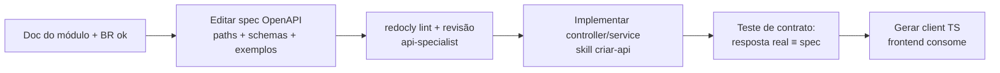

# Fluxo OpenAPI (Documentação Primeiro)

> **Status:** Aprovado · **Última atualização:** 2026-07-03 · **Responsável:** api-specialist

## 1. Objetivo

Garantir que o contrato da API seja **escrito, revisado e versionado antes** da implementação, e que frontend e integrações consumam tipos gerados desse contrato — eliminando drift.

## 2. Artefatos

```text
docs/07-API/openapi/
├── openapi.yaml          # raiz (info, servers, security, tags)
├── components/           # schemas reutilizáveis (Money, Problem, Pagination…)
└── paths/                # um arquivo por recurso (products.yaml, orders.yaml…)
```

O spec é a **fonte da verdade** do contrato (OpenAPI 3.1). Ferramentas: `redocly lint` (CI), Redoc para navegação humana, `openapi-typescript` para o client TS.

## 3. Fluxo para criar/alterar endpoint



Checklist mínimo por endpoint no spec: descrição em pt-BR, exemplos de request/response, **todos** os erros possíveis (incluindo códigos 409 de negócio), permissões requeridas (extensão `x-permission`), paginação/filtros documentados.

## 4. Regras

1. PR que altera rota/Resource sem alterar o spec é rejeitado (checklist da skill `criar-api`).
2. Spec de endpoint não implementado é marcado `x-status: planned` — o roadmap da API vive no próprio spec.
3. Exemplos do spec usam dados do domínio real (peça "Coruja Decorativa GB-0042"), nunca foo/bar — os exemplos viram documentação viva para integradores.
4. Versionamento: o spec é versionado junto do código; tag de release congela o contrato daquele release.

## 5. Riscos

| Risco | Mitigação |
|---|---|
| Spec virar burocracia e ser preenchido depois do código | Teste de contrato falha se divergir; cultura docs-first (pasta 00/03) |
| Spec monolítico gigante | Particionado por recurso em `paths/` com `$ref` |
