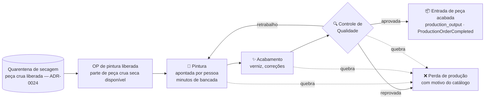

# 08 — Produção

> **Status:** 💡 Em revisão — reescrito para a premissa correta (pintura, não fundição); aguarda validação das BRs 1xx e das entrevistas da [pasta 30](../30-Dominio-da-Dona-Arteira/README.md) · **Última atualização:** 2026-07-27 · **Responsável:** production-specialist
> **Regras:** BR-101…BR-109 · **Fase:** Gate 03 · **Modelo de dados:** [04/01](../04-Banco-de-Dados/01-modelo-conceitual.md)

> ✅ **Corrigido em 2026-07-27** — reescrito para a premissa correta
> (pintura, não fundição). A Dona Arteira **não funde as peças**: compra-as
> prontas mas **cruas** de fornecedores e as **pinta à mão**. Não há
> fundição, moldes nem consumo de gesso para moldar. Ver
> [ADR-0023](../27-ADR/ADR-0023-producao-e-pintura-nao-fundicao.md)
> (produção é pintura) e
> [ADR-0024](../27-ADR/ADR-0024-quarentena-de-secagem.md) (secagem é
> quarentena de recebimento, não etapa de produção).

## 1. Objetivo

Controlar a **pintura artesanal** das peças de gesso — da liberação da
peça crua **já seca** até a aprovação no controle de qualidade — dando
visibilidade de:

- **WIP** (peças em processo, por etapa da OP);
- **perdas** por etapa e motivo — quebra é evento normal em gesso (BR-104);
- **consumo real** de peça crua, tinta e verniz (BR-103);
- **custo da peça acabada incluindo a mão de obra de pintura** — o maior
  componente de valor da operação e hoje invisível (BR-108).

É o **core domain** do ERP: nenhum sistema de prateleira modela bem a
pintura artesanal como processo com perda, gargalo humano e custo de mão
de obra. A peça crua chega comprada de fornecedor (pasta 11) e seca na
**quarentena de recebimento** ([ADR-0024](../27-ADR/ADR-0024-quarentena-de-secagem.md));
a produção só começa quando ela está **seca e liberada** (BR-109).

## 2. Responsabilidades

- **Faz:**
  - ordens de produção (OP) de **pintura** a partir de peça crua seca (BR-101);
  - etapas com apontamento leve — **pintura, acabamento, CQ** (BR-102) —,
    registrando os **minutos de bancada** gastos na pintura;
  - consumo real de **peça crua + tinta/verniz** (BR-103), sempre via
    serviço do módulo Estoque (`production_input`);
  - perdas por etapa e motivo do catálogo (BR-104);
  - custo de produção com **mão de obra de pintura** (BR-108);
  - sugestão de reposição (produzir para repor peça acabada abaixo do mínimo).
- **Não faz:**
  - **fundição** — não existe na operação; a peça vem pronta e crua
    ([ADR-0023](../27-ADR/ADR-0023-producao-e-pintura-nao-fundicao.md));
  - **movimentar estoque diretamente** — sempre via serviço do módulo
    Estoque (`production_input`/`production_output`), nunca movimento direto
    ([ADR-0008](../27-ADR/ADR-0008-ledger-estoque.md));
  - **compras** de peça crua e insumos (pasta 11);
  - **secagem** — é quarentena de recebimento, responsabilidade de
    Compras/Estoque ([ADR-0024](../27-ADR/ADR-0024-quarentena-de-secagem.md)),
    não etapa de produção;
  - precificação de venda (Catálogo/dono).

## 3. O processo artesanal (modelo)



Pontos que tornam o domínio específico:

- **Quebra é normal e relevante** em gesso — registrada em **qualquer etapa
  da OP** com motivo do catálogo (BR-104); o % histórico de perda alimenta o
  planejamento (produzir 110 para entregar 100). Quebra **antes** da OP
  (recebimento, secagem) é `loss` de estoque, **não** perda de produção
  ([ADR-0024](../27-ADR/ADR-0024-quarentena-de-secagem.md)).
- **Pintura é gargalo humano e o maior custo** — o apontamento dos **minutos
  de bancada** por peça/lote é o que transforma o custo de "remarcação sobre
  a compra" em **custo real** (peça crua + insumos + mão de obra), revelando
  a margem verdadeira (BR-108).
- **A peça crua já chega e é liberada seca** — a secagem é uma quarentena
  **pós-recebimento** (pasta 11 / [ADR-0024](../27-ADR/ADR-0024-quarentena-de-secagem.md)),
  não uma etapa da OP. A OP consome apenas peça crua **liberada** (BR-109).
- **Uma peça crua vira várias cores acabadas** — peça crua (`raw_piece`) e
  peça acabada (`finished_good`) são **SKUs distintos** (BR-009): a "Coruja
  crua" é o substrato da "Coruja azul", "Coruja vermelha"… A ficha técnica da
  peça acabada lista a peça crua + tinta/verniz como componentes.

> 💡 **Hipótese a validar (pasta 30).** A sequência
> **pintura → acabamento → CQ**, os tempos de bancada e os % de quebra por
> etapa são o modelo proposto, **ainda não confirmados** pela operação. As
> entrevistas da [pasta 30](../30-Dominio-da-Dona-Arteira/README.md) são
> pré-requisito do Gate 03; regra em status 💡 vai ao business-analyst antes
> de virar código.

**Sem etapa de fundição e sem etapa de secagem na OP** — os moldes (BR-105)
e a secagem como etapa (BR-106) foram **revogados**
([ADR-0023](../27-ADR/ADR-0023-producao-e-pintura-nao-fundicao.md)).

## 4. Fluxos principais

### Criação de OP (BR-101)

Origem: **manual**, **sugestão por estoque mínimo** (`StockBelowMinimum`) ou
**encomenda** (pedido make-to-order, BR-307). A OP nasce `draft` com: peça
**acabada** alvo, quantidade, origem (stock/order) e **consumo teórico**
calculado da ficha técnica (peça crua substrato + tinta/verniz + `waste_pct`
de perda esperada). A OP encomendada carrega o `order_id` e a data prometida;
a entrega reserva a peça acabada automaticamente.

### Execução (BR-102, BR-103, BR-104, BR-107)

1. `released` → a OP só é liberada se houver **peça crua seca disponível** no
   Ateliê (saldo fora da quarentena, BR-109).
2. **Pintura** (`painting`): apontamento de conclusão por peça ou lote, com
   **responsável** e **minutos de bancada**; o consumo real de peça crua +
   tinta/verniz é registrado pelo Estoque como `production_input` (BR-103).
3. **Acabamento** (`finishing`): verniz e correções; consumo de verniz
   apontado como `production_input`.
4. **CQ** (`qc`): aprovadas → o Estoque registra `production_output` com o
   custo unitário calculado (**só CQ aprovado entra em estoque**, BR-107);
   reprovadas → **perda** ou **retrabalho** (volta para pintura).
5. `done`: reconciliação **`qty_planned = qty_produced + qty_lost + em
   aberto`**; toda peça planejada tem destino (produzida, perdida ou ainda em
   processo) e divergência exige justificativa.

Exceção auditada: é possível **pular uma etapa com motivo** registrado sem
travar o ateliê — a rigidez do sistema nunca deve parar a bancada; a exceção
fica na auditoria.

### Custeio ABC (BR-108)

```
custo da peça acabada = custo da peça crua (custo médio)
                      + insumos consumidos (tinta, verniz — custo médio)
                      + mão de obra de pintura (minutos de bancada × custo/hora)
                      + rateio de overhead configurável
```

Custos de lote (mão de obra, overhead) são divididos pela **quantidade
aprovada no CQ**. O custo é sempre marcado como **estimado**. O faseamento
(começar com **custo/hora padrão configurável** e evoluir para apontamento
fino de tempo por peça) fica registrado em BR-108 e será validado com o dono.

## 5. Dependências

| Depende de | Motivo |
|---|---|
| Catálogo ([pasta 32](../32-Catalogo/README.md)) | ficha técnica com **peça crua substrato + tinta/verniz** e `drying_days` — **sem moldes** |
| Estoque ([pasta 09](../09-Estoque/README.md)) | consumo (`production_input`) e entrada (`production_output`) via movimentos; **disponibilidade da peça crua liberada** |
| Compras ([pasta 11](../11-Compras/README.md)) | recebimento com **quarentena de secagem**; a liberação da peça crua é pré-requisito da OP ([ADR-0024](../27-ADR/ADR-0024-quarentena-de-secagem.md)) |
| Vendas ([pasta 10](../10-Vendas/README.md)) | **encomendas** geram OPs ligadas a pedido com data prometida |
| Pasta 30 (entrevistas) | **valida o processo real de pintura antes do Gate 03** |

Eventos de domínio emitidos ([02/01](../02-Dominio/01-eventos-de-dominio.md)):
`ProductionOrderCreated`, `ProductionStageCompleted`,
`ProductionLossRegistered`, `ProductionOrderCompleted`.

## 6. Boas práticas

- **Apontamento mais rápido que anotar em papel:** telas de toque simples
  (tablet no ateliê), lote como unidade de apontamento, caso comum em **≤ 3
  toques**. A artesã tem de preferir apontar no sistema a anotar no caderno.
- **Apontar os minutos de bancada** é o que torna o custo real — sem eles, a
  pintura vira custo genérico e a margem some (BR-108).
- **Nunca bloquear a produção por rigidez do sistema:** exceções permitidas
  com registro e auditoria (ex.: pular etapa com motivo).
- **Kanban de WIP por etapa** dá o pulso do ateliê num relance (pasta 21).
- Toda quantidade em `DECIMAL(15,3)`: peças em unidades inteiras; tinta e
  verniz consumidos em quantidade **fracionada**.

## 7. Riscos

| Risco | Prob. | Impacto | Mitigação |
|---|---|---|---|
| Modelo de etapas não refletir o ateliê real | Alta | Alto | Entrevistas (pasta 30) antes do Gate 03; etapas configuráveis por produto (BR-102) |
| Operação não apontar (fricção) | Alta | Alto | UX mínima de toques (tablet); começar apontando só pintura + CQ e evoluir |
| Ficha técnica inexistente/incompleta na largada | Alta | Médio | Gate 03 inclui mutirão de fichas técnicas; consumo manual permitido enquanto isso |
| Custo distorcido por não apontar minutos de pintura | Alta | Alto | Custo marcado como **estimado**; custo/hora padrão configurável na fase inicial; revisão com o dono |

## 8. Evoluções futuras

- Apontamento **fino de tempo** de pintura por peça/lote, para custo de mão
  de obra por peça (evolução do BR-108).
- **Fotos no CQ** (evidência de qualidade) e catálogo de defeitos.
- Planejamento de produção com calendário e capacidade da bancada.
- Kanban de WIP por etapa no dashboard de Produção (pasta 21).

## 9. Perguntas em aberto (entrevista)

> 💡 A validar com a operação — roteiro completo na
> [pasta 30](../30-Dominio-da-Dona-Arteira/README.md):

- Qual é a **sequência real** de pintura e acabamento (uma demão, várias,
  base + detalhe, verniz por último)?
- Qual o **tempo médio de pintura** por peça e por tamanho — insumo do custo
  de mão de obra?
- Qual o **% de quebra** típico por etapa da OP?
- Uma peça crua vira **quantas cores** acabadas, em média?
- **Quem pinta o quê** — há especialização por pessoa/peça que valha medir?
