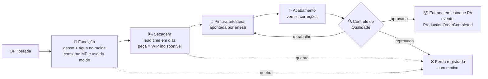

# 08 — Produção

> **Status:** Em revisão (aguarda entrevistas da pasta 30) · **Última atualização:** 2026-07-03 · **Responsável:** production-specialist
> **Regras:** BR-101…BR-108 · **Fase:** Gate 03 · **Modelo de dados:** [04/01](../04-Banco-de-Dados/01-modelo-conceitual.md)

## 1. Objetivo

Controlar a fabricação artesanal das peças de gesso — da fundição no molde à aprovação no controle de qualidade — dando visibilidade de WIP, perdas, consumo de matéria-prima, uso de moldes e custo. É o **core domain** do ERP: nada de prateleira modela bem este processo.

## 2. Responsabilidades

- **Faz:** ordens de produção (OP), etapas com apontamentos, consumo de MP, perdas por etapa, ciclo de vida de moldes, custo de produção, sugestão de reposição.
- **Não faz:** movimentar estoque diretamente (pede ao módulo Estoque via serviço/evento); compras de MP (módulo 11); precificação de venda (Catálogo).

## 3. O processo artesanal (modelo)

Pontos que tornam o domínio específico:

- **Quebra é normal e relevante** em gesso — registrada por etapa com motivo (BR-104); o % histórico de perda alimenta o planejamento (produzir 110 para entregar 100).
- **Secagem impõe lead time natural** (dias, sensível a clima) — `drying_days` por produto; a OP fica "dormente" sem ação humana (BR-106).
- **Molde é ativo produtivo com vida útil** — cada fundição consome usos; alerta antecipa a confecção de molde novo (BR-105).
- **Pintura é gargalo humano** — apontamento por pessoa habilita medir produtividade e, no futuro, custo de mão de obra por peça.

## 4. Fluxos principais

### Criação de OP
Origem: manual, sugestão por estoque mínimo (`StockBelowMinimum`) ou encomenda (pedido make-to-order, BR-307). OP nasce `draft` com: produto, quantidade, molde (opcional), consumo teórico calculado da ficha técnica (BOM) com % de perda esperada.

### Execução
1. `released` → etapa Fundição: aponta MP realmente consumida (pré-preenchida pela BOM) → módulo Estoque registra `production_input` (BR-103); molde incrementa uso.
2. Secagem: início/fim (auto-sugestão de fim por `drying_days`).
3. Pintura/Acabamento: apontamento de conclusão por peça ou lote, com responsável.
4. CQ: aprovadas → Estoque registra `production_output` com custo unitário calculado; reprovadas → perda ou retrabalho (BR-107).
5. OP `done`: qty_produced + qty_lost reconciliadas com qty_planned; divergência exige justificativa.

### Custo (BR-108, fase 3 = modelo simples)
`custo unitário = (Σ MP consumida a custo médio + rateio configurável de MO/overhead) ÷ qty aprovada`. Fase 3 usa rateio fixo por peça configurável; apuração fina de MO por apontamento é evolução (fase 6).

## 5. Dependências

| Depende de | Motivo |
|---|---|
| Catálogo (BOM, drying_days, moldes) | dados mestres da produção |
| Estoque | consumo e entrada via movimentos |
| Vendas | encomendas geram OPs |
| Pasta 30 (entrevistas) | **valida o processo real antes do Gate 03** |

## 6. Boas práticas

- Apontamento tem que ser mais rápido que anotar em papel: telas de toque simples (tablet no ateliê), lote como unidade de apontamento.
- Nunca bloquear a produção por rigidez do sistema: exceções são permitidas com registro e auditoria (ex.: pular etapa com motivo).
- Toda quantidade em `DECIMAL(15,3)` — gesso é consumido em kg fracionado.

## 7. Riscos

| Risco | Prob. | Impacto | Mitigação |
|---|---|---|---|
| Modelo de etapas não refletir o ateliê real | Alta | Alto | Entrevistas (pasta 30) antes do Gate 03; etapas configuráveis por produto |
| Operação não apontar (fricção) | Alta | Alto | UX mínima de toques; começar apontando só fundição+CQ e evoluir |
| BOM inexistente/incompleta na largada | Alta | Médio | Gate 03 inclui mutirão de fichas técnicas; consumo manual permitido enquanto isso |
| Custo simplista distorcer preço | Média | Médio | Custo marcado como "estimado"; revisão trimestral com o dono |

## 8. Evoluções futuras

- Planejamento de produção com calendário e capacidade (fase 6+).
- Custo de MO real por apontamento de tempo (fase 6).
- Fotos no CQ (evidência de qualidade) e catálogo de defeitos.
- Kanban de WIP por etapa no dashboard (fase 6 — pasta 21).

## 9. Perguntas em aberto (entrevista)

Ver roteiro completo na [pasta 30](../30-Dominio-da-Dona-Arteira/README.md): sequência real de etapas? tempos de secagem por tamanho de peça? quem pinta o quê? % de quebra típico? moldes são numerados hoje? produção puxada por estoque ou encomenda?
