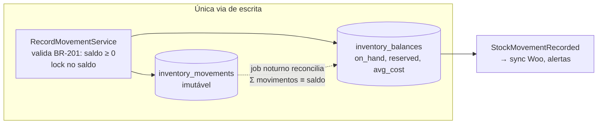

# 09 — Estoque

> **Status:** Aprovado · **Última atualização:** 2026-07-03 · **Responsável:** inventory-specialist
> **Regras:** BR-201…BR-207 · **Fase:** Gate 01–02 · **ADR:** [0008 (ledger)](../27-ADR/ADR-0008-ledger-estoque.md)

## 1. Objetivo

Ser a fonte única e auditável da posição de estoque de **tudo** (matéria-prima, WIP, produto acabado, embalagem, revenda — BR-207), em todos os locais, alimentando venda multicanal sem oversell e custo médio confiável.

## 2. Responsabilidades

- **Faz:** ledger imutável de movimentos, saldos materializados, reservas, contagens/ajustes, custo médio móvel, alertas de mínimo, extrato por produto.
- **Não faz:** decidir *quando* comprar/produzir (sugere via evento `StockBelowMinimum`); publicar no Woo (Integrações consome os eventos).

## 3. Arquitetura do módulo (ADR-0008)

**Nenhum código altera `qty_on_hand` diretamente.** Toda mudança nasce como movimento append-only; o saldo é atualizado na mesma transação e é sempre reconciliável:



| Tipo de movimento | Sinal | Origem (reference) |
|---|---|---|
| `purchase_receipt` | + | recebimento de compra |
| `production_input` | − (MP) | consumo de OP |
| `production_output` | + (PA) | conclusão de OP aprovada no CQ |
| `sale_shipment` | − | expedição de pedido |
| `return_in` | + | devolução de venda |
| `adjustment_in/out` | ± | contagem aprovada (BR-205) |
| `transfer_out/in` | par ± | transferência entre locais |
| `loss` | − | quebra fora de OP (manuseio, transporte) |

Estorno **nunca** apaga: gera contra-movimento referenciando o original (BR-202).

## 4. Disponibilidade e reservas (o antídoto do oversell)

```
disponível = on_hand − reserved
publicado no Woo = disponível − buffer_do_produto   (BR-204)
```

- Pedido confirmado (qualquer canal) **reserva** (BR-203); expedição consome a reserva e gera `sale_shipment`; cancelamento libera.
- Pedido Woo: o webhook cria o pedido no ERP já reservando — a janela de risco de oversell fica limitada à latência da fila (< 2 min, NFR) mais o buffer.
- Encomenda (sem saldo): não reserva; gera demanda de produção (BR-307) e reserva automaticamente quando a OP entrega.

## 5. Contagem e ajuste (BR-205)

Contagem cíclica por categoria ou geral: congela-se a lista, conta-se fisicamente, sistema mostra divergências, **aprovador ≠ contador** aprova, ajustes viram movimentos auditados com motivo. O estoque inicial do ERP nasce de uma contagem física completa no cutover (pasta 17) — nem o `in_stock` do legado nem o do Woo são confiáveis por construção.

## 6. Custeio — média móvel (BR-206)

Entradas (compra/produção) recalculam `avg_cost`; saídas usam o custo médio corrente. Escolha justificada: simples, aceito fiscalmente para gerencial, adequado a produção contínua de itens idênticos. PEPS/lote só se surgir exigência real (evolução).

## 7. Dependências

Consomem este módulo: Produção, Vendas, Compras, Integrações (sync Woo), Relatórios. Este módulo depende apenas do Catálogo (produtos/locais).

## 8. Boas práticas

- Extrato de movimento por produto é a tela de debug número 1 — investir nela desde o Gate 01.
- Toda operação de saldo usa lock pessimista no registro de `inventory_balances` (convenções, pasta 04).
- Job de reconciliação noturno: `Σ movimentos ≠ saldo` → alerta crítico (indica bug ou intervenção manual no banco).

## 9. Riscos

| Risco | Prob. | Impacto | Mitigação |
|---|---|---|---|
| Oversell no site em pico de venda | Média | Alto | Reserva via webhook + buffer por produto + sync < 2 min + reconciliação diária com Woo |
| Estoque inicial errado contaminar tudo | Alta | Alto | Contagem física obrigatória no cutover (pasta 17) |
| Operação "dar um jeitinho" fora do sistema | Média | Alto | Ajuste fácil e auditado é o antídoto do jeitinho; treinar equipe |
| Deadlocks em movimentos concorrentes | Baixa | Médio | Ordem de lock consistente (product_id, location_id); retries |

## 10. Evoluções futuras

- Múltiplos locais físicos reais (loja/feira/consignação) — o modelo já suporta.
- Rastreabilidade por lote de produção (se cliente atacado exigir) — adicionar `batch_id` ao movimento.
- Curva ABC automática para priorizar contagens cíclicas (fase 6).
