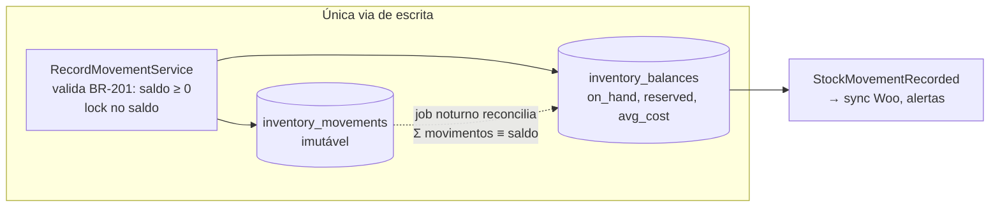

# 09 — Estoque

> **Status:** Aprovado · **Última atualização:** 2026-07-03 · **Responsável:** inventory-specialist
> **Regras:** BR-201…BR-207 · **Fase:** Gate 01–02 · **ADR:** [0008 (ledger)](../27-ADR/ADR-0008-ledger-estoque.md)

## 1. Objetivo

Ser a fonte única e auditável da posição de estoque de **tudo** (peça crua, peça acabada, matéria-prima, WIP, embalagem, revenda — BR-207), em todos os locais, alimentando venda multicanal sem oversell e custo médio confiável.

## 2. Responsabilidades

- **Faz:** ledger imutável de movimentos, saldos materializados, reservas, contagens/ajustes, custo médio móvel, alertas de mínimo, extrato por produto.
- **Não faz:** decidir *quando* comprar/produzir (sugere via evento `StockBelowMinimum`); publicar no Woo (Integrações consome os eventos).

## 2.1 Estado da implementação

> ✅ **Ledger e via de escrita no ar — 2026-07-27.** `locations`,
> `inventory_movements` e `inventory_balances` criadas;
> `RecordMovementService` é a única porta de escrita, com transação, lock
> e as BR-201/202/205/206 cobertas por teste.
>
> ✅ **Telas de leitura no ar — 2026-07-27.** Posição (`/estoque`) e
> extrato por peça e local, este com o **saldo depois de cada movimento**:
> sem essa coluna a tela empilha entradas e saídas e deixa a soma para a
> cabeça de quem lê, que é o trabalho que ela deveria poupar. O saldo
> corrente é calculado de trás para frente a partir do saldo atual — uma
> agregação por página, e não uma varredura do ledger desde o começo.
>
> O nome do produto chega pelo `ProductLookupService` do Catálogo, que
> devolve `ProductSummary` e nunca o model: o ADR-0020 avisa que o
> `arch()` verifica namespace e não semântica, e um Service que
> devolvesse `Product` passaria no teste enquanto vazava o acoplamento
> inteiro. A busca por nome/código também é do Catálogo — duplicá-la
> deste lado criaria duas buscas que divergem com o tempo.
>
> ✅ **Contagem física com segregação — 2026-07-27.** `stock_counts` +
> `stock_count_items`, com o ciclo `counting` → `awaiting_approval` →
> `approved`. Abrir congela a lista com o saldo daquele instante; a
> aprovação transforma cada divergência em movimento de ajuste
> referenciando a contagem. **Com isto o estoque é operável por gente, e
> o critério de saída do Gate 01 está atendido.**
>
> **Quatro decisões que a implementação obrigou a tomar:**
>
> - **Aprovador ≠ contador é do serviço, não da tela.** A tela esconde o
>   botão de quem contou, mas o `ApproveStockCountService` recusa de
>   qualquer forma — esconder não é proteger.
> - **`qty_counted` nulo não é zero.** "Ainda não contei" e "contei e não
>   tem nenhuma" levam a ações opostas, e num inventário de 754 peças o
>   não-contado é a maior parte da lista até o fim. Item não contado não
>   gera ajuste; se `null` virasse zero, aprovar no meio do trabalho
>   zeraria o estoque de tudo que ninguém percorreu ainda.
> - **O ajuste sai contra o saldo congelado**, não contra o saldo de
>   agora. O que a contagem afirma é o que havia quando ela abriu;
>   expedição ocorrida durante a contagem é real e permanece.
> - **Uma contagem aberta por local.** Duas produziriam ajustes calculados
>   sobre o mesmo saldo congelado, e a segunda desfaria a primeira sem
>   que ninguém percebesse.
>
> **Ainda não existe:** reserva (BR-203, depende de Vendas), publicação no
> site (BR-204, depende de Integrações), custo médio alimentado por
> compra/produção (BR-206 — o cálculo existe e é testado, mas nenhum
> módulo ainda envia custo) e o job de reconciliação noturno.
>
> **Três decisões que a implementação obrigou a tomar:**
>
> - **O sinal vem do tipo, não de quem chama.** `MovementType::sinal()`
>   decide, e o serviço só aceita quantidade positiva. Aceitar negativo
>   criaria dois jeitos de registrar uma saída, e um deles inverteria o
>   outro.
> - **A BR-201 vale inclusive no ajuste.** A regra abre exceção para
>   "ajuste com permissão específica"; a permissão existe
>   (`inventory.adjust`, separada de `inventory.move`) e decide **quem
>   ajusta** — não autoriza saldo negativo, porque contagem física devolve
>   quantas peças há na prateleira e prateleira não tem menos que zero.
>   Se aparecer caso real que exija furar o piso, muda-se aqui e no
>   ADR-0008.
> - **Ajuste não mexe no custo médio.** Contagem corrige quantidade, não
>   valor. Deixá-la recalcular faria a peça reaparecida valer zero e
>   contaminar a margem de todas as outras.

## 3. Arquitetura do módulo (ADR-0008)

**Nenhum código altera `qty_on_hand` diretamente.** Toda mudança nasce como movimento append-only; o saldo é atualizado na mesma transação e é sempre reconciliável:



| Tipo de movimento | Sinal | Origem (reference) |
|---|---|---|
| `purchase_receipt` | + | recebimento de compra |
| `production_input` | − (MP) | consumo de OP |
| `production_output` | + (PA) | conclusão de OP aprovada no CQ |
| `sale_shipment` | − | expedição de pedido |
| `return_in` | + | devolução de venda |
| `adjustment_in/out` | ± | contagem aprovada (BR-205) |
| `transfer_out/in` | par ± | transferência entre locais |
| `loss` | − | quebra fora de OP (manuseio, transporte) |

Estorno **nunca** apaga: gera contra-movimento referenciando o original (BR-202).

## 4. Disponibilidade e reservas (o antídoto do oversell)

```
disponível = on_hand − reserved
publicado no Woo = disponível − buffer_do_produto   (BR-204)
```

- Pedido confirmado (qualquer canal) **reserva** (BR-203); expedição consome a reserva e gera `sale_shipment`; cancelamento libera.
- Pedido Woo: o webhook cria o pedido no ERP já reservando — a janela de risco de oversell fica limitada à latência da fila (< 2 min, NFR) mais o buffer.
- Encomenda (sem saldo): não reserva; gera demanda de produção (BR-307) e reserva automaticamente quando a OP entrega.

### Quarentena de secagem (peça crua) — [ADR-0024](../27-ADR/ADR-0024-quarentena-de-secagem.md)

A peça crua chega do fornecedor úmida e não pode ser pintada até secar. Ela é
recebida numa **localização de tipo `quarantine`** ("Quarentena/Secagem"):
conta no saldo físico, mas **não é disponível para produção** (BR-109) nem é
publicada no canal. A **liberação da secagem** é um `transfer` da quarentena
para o Ateliê (default `received_at + drying_days`; manual ou por data — BR-404),
a partir do qual a peça crua fica disponível para a OP de pintura. Nada disso
muda o ledger: é localização + transferência já existentes. Quebra na
quarentena é `loss` referenciando o recebimento (o **lote** para a taxa de
quebra por fornecedor, BR-405).

## 5. Contagem e ajuste (BR-205)

Contagem cíclica por categoria ou geral: congela-se a lista, conta-se fisicamente, sistema mostra divergências, **aprovador ≠ contador** aprova, ajustes viram movimentos auditados com motivo. O estoque inicial do ERP nasce de uma contagem física completa no cutover (pasta 17) — nem o `in_stock` do legado nem o do Woo são confiáveis por construção.

## 6. Custeio — média móvel (BR-206)

Entradas (compra/produção) recalculam `avg_cost`; saídas usam o custo médio corrente. Escolha justificada: simples, aceito fiscalmente para gerencial, adequado a produção contínua de itens idênticos. PEPS/lote só se surgir exigência real (evolução).

Como o `avg_cost` é por **produto×local**, a **liberação da secagem** (transfer Quarentena→Ateliê — [ADR-0024](../27-ADR/ADR-0024-quarentena-de-secagem.md)) precisa carregar o custo médio da origem no `transfer_in`; senão a peça crua chega ao Ateliê a **custo zero** e a OP a consome a zero, furando o custeio (BR-108). Cobrir por teste no Gate 03.

## 7. Dependências

Consomem este módulo: Produção, Vendas, Compras, Integrações (sync Woo), Relatórios. Este módulo depende apenas do Catálogo (produtos/locais).

## 8. Boas práticas

- Extrato de movimento por produto é a tela de debug número 1 — investir nela desde o Gate 01.
- Toda operação de saldo usa lock pessimista no registro de `inventory_balances` (convenções, pasta 04).
- Job de reconciliação noturno: `Σ movimentos ≠ saldo` → alerta crítico (indica bug ou intervenção manual no banco).

## 9. Riscos

| Risco | Prob. | Impacto | Mitigação |
|---|---|---|---|
| Oversell no site em pico de venda | Média | Alto | Reserva via webhook + buffer por produto + sync < 2 min + reconciliação diária com Woo |
| Estoque inicial errado contaminar tudo | Alta | Alto | Contagem física obrigatória no cutover (pasta 17) |
| Operação "dar um jeitinho" fora do sistema | Média | Alto | Ajuste fácil e auditado é o antídoto do jeitinho; treinar equipe |
| Deadlocks em movimentos concorrentes | Baixa | Médio | Ordem de lock consistente (product_id, location_id); retries |

## 10. Evoluções futuras

- Múltiplos locais físicos reais (loja/feira/consignação) — o modelo já suporta.
- Rastreabilidade por lote ao longo da vida da peça (se atacado/recall exigir) — adicionar dimensão `batch` ao movimento (gatilho do [ADR-0008](../27-ADR/ADR-0008-ledger-estoque.md); a quebra por lote de **recebimento** já sai sem isso, via [ADR-0024](../27-ADR/ADR-0024-quarentena-de-secagem.md)).
- Curva ABC automática para priorizar contagens cíclicas (fase 6).
