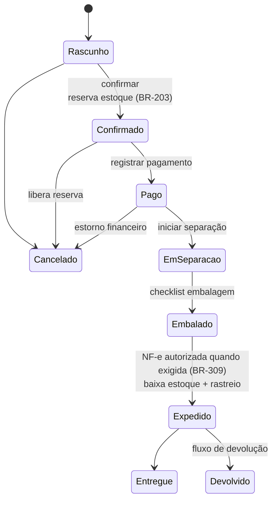

# 10 — Vendas

> **Status:** Em revisão · **Última atualização:** 2026-07-03 · **Responsável:** sales-specialist
> **Regras:** BR-301…BR-309 · **Fase:** Gate 02 · **Modelo:** [04/01](../04-Banco-de-Dados/01-modelo-conceitual.md)

## 1. Objetivo

Unificar pedidos de **todos os canais** (balcão/atacado/encomenda no ERP + WooCommerce + futuros marketplaces) em um fluxo único: pedido → reserva → separação → embalagem → expedição → NF-e → financeiro.

## 2. Responsabilidades

- **Faz:** pedidos e itens, máquina de estados, preços/descontos com alçada, clientes, separação/embalagem/expedição, devoluções (fase 2 do módulo).
- **Não faz:** mexer em saldo (pede reserva/baixa ao Estoque), emitir NF-e (chama Fiscal), cobrar (Financeiro), falar com Woo (Integrações reage a eventos).

## 3. Máquina de estados do pedido (BR-303)

- Transições são **ações explícitas da API** (`POST /orders/{id}/confirm|cancel|ship`, pasta 07); cada uma valida pré-condições e dispara os eventos (`OrderConfirmed`, `OrderShipped`…).
- `order_status_history` grava toda transição com autor e motivo.
- **Pedidos WooCommerce** (BR-304): entram via integração já `Confirmado`/`Pago` conforme mapeamento de status (pasta 16); ERP não edita itens/valores — apenas conduz o fulfillment. Cancelamento no Woo reflete no ERP e vice-versa (pasta 16 define quem vence em cada caso).

## 4. Preços e descontos

- Duas listas (BR-003): varejo (= site) e atacado. Elegibilidade ao atacado: **BR-301 pendente de definição** (cliente marcado? quantidade mínima? ambos?).
- Preço congelado no item (BR-302) + desconto por item/pedido; desconto acima do limite → aprovação de alçada (BR-305, limite definido na pasta 19).
- Frete: informado manualmente (balcão) ou vindo do Woo; cálculo via Melhor Envio na expedição (fase 6).

## 5. Fulfillment (separação → expedição)

1. **Separação**: lista de picking por pedido (ou lote de pedidos) com localização; separador confirma item a item.
2. **Embalagem**: peças de gesso = frágil; checklist por pedido usando a embalagem padrão da peça (BR-004) + materiais de proteção (consumo de embalagem baixa estoque, configurável).
3. **Expedição**: exige NF-e autorizada quando aplicável (BR-309); gera etiqueta (Melhor Envio, fase 6), registra rastreio, baixa reserva → `sale_shipment`, evento `OrderShipped` → Woo recebe status+rastreio, cliente é notificado.

## 6. Encomendas (make-to-order, BR-307)

Item sem saldo pode ser vendido como encomenda com `promised_date` (legado já fazia via `delivery_date`): gera demanda de produção vinculada; quando a OP entrega, a reserva é feita automaticamente e o pedido segue o fluxo normal. Painel de encomendas ordena a fila de produção.

## 7. Dependências

| Depende de | Motivo |
|---|---|
| Estoque | reservas e baixas |
| Catálogo | produtos, preços, embalagens |
| Fiscal | NF-e antes de expedir (BR-309) |
| Financeiro | títulos ao faturar (BR-501) |
| Integrações | pedidos Woo entram, status/rastreio saem |

## 8. Boas práticas

- Balcão precisa de velocidade: atalho de teclado, busca por SKU/nome, cliente "Consumidor" padrão para venda rápida (respeitando BR-001 para NF).
- Toda tela de pedido mostra disponibilidade em tempo real e alerta encomenda.
- Cancelamento sempre pergunta o motivo (relatório de causas).

## 9. Riscos

| Risco | Prob. | Impacto | Mitigação |
|---|---|---|---|
| Duplo fluxo de verdade (Woo × ERP) durante o Gate 02 | Alta | Alto | Cutover claro (pasta 17): até lá o Woo opera sozinho; depois, ERP manda |
| Regra de atacado indefinida travar o Gate 02 | Média | Médio | BR-301 na pauta da primeira entrevista (pasta 30) |
| Cancelamentos pós-NF-e sem processo | Média | Alto | Fluxo de devolução + cancelamento fiscal (BR-604) documentados antes do Gate 05 |

## 10. Evoluções futuras

- Devoluções/trocas completas com nota de devolução (fase 5–6).
- Orçamentos com validade que viram pedido (atacado) — fase 6.
- Comissões de vendedor (se surgir equipe de vendas) — fase 7.
- Marketplaces como novos canais reutilizando o mesmo pipeline (fase 7).
