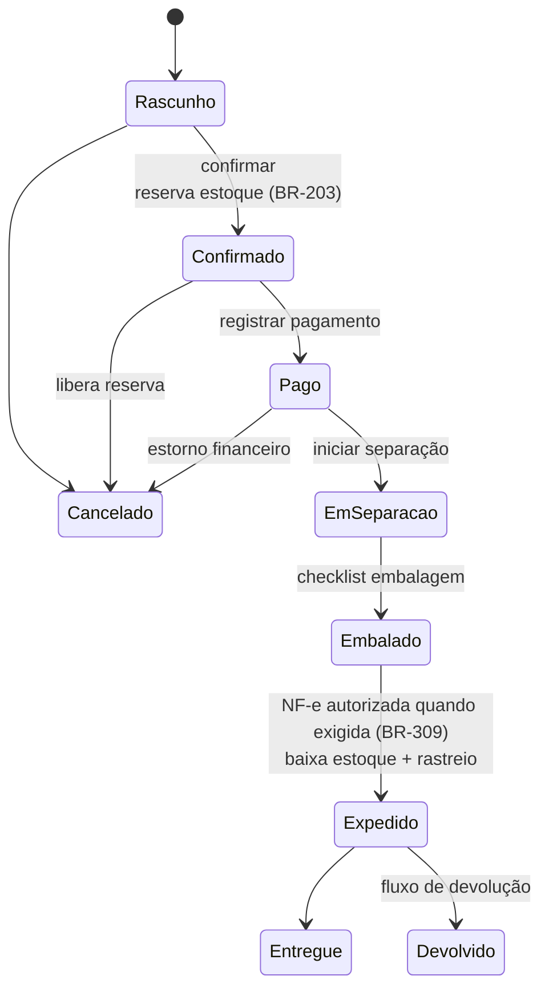

# 10 — Vendas

> **Status:** Em revisão · **Última atualização:** 2026-07-03 · **Responsável:** sales-specialist
> **Regras:** BR-301…BR-309 · **Fase:** Gate 02 · **Modelo:** [04/01](../04-Banco-de-Dados/01-modelo-conceitual.md)

## 1. Objetivo

Unificar pedidos de **todos os canais** (balcão/atacado/encomenda no ERP + WooCommerce + futuros marketplaces) em um fluxo único: pedido → reserva → separação → embalagem → expedição → NF-e → financeiro.

## 2. Responsabilidades

- **Faz:** pedidos e itens, máquina de estados, preços/descontos com alçada, clientes, separação/embalagem/expedição, devoluções (fase 2 do módulo).

> ✅ **Clientes implementados em 2026-07-27** — é a parte do módulo que o
> Gate 01 pede; pedidos continuam no Gate 02. O módulo `Sales/` nasce com
> eles, e não como um módulo `Customers/` que depois teria de ser fundido
> (pasta 05 §2 já os colocava aqui).
>
> Cadastro com múltiplos endereços, marcação de atacadista, consentimento
> LGPD e inativação por *soft delete* — cliente não se apaga, porque há
> histórico de compra apontando para ele e a NF-e emitida guarda o
> destinatário por obrigação fiscal.
>
> **Três decisões que a implementação obrigou a tomar:**
>
> - **O documento é nulável, e isso resolve a pendência da BR-001**
>   ("validar se cliente de balcão sem NF pode ser cadastrado sem
>   documento"): pode. Exigi-lo no cadastro empurraria a operação a
>   inventar número para fechar a venda — e número inventado ou reprova no
>   dígito verificador, ou passa no de outra pessoa. Sem documento o
>   cliente existe e a **emissão** é que fica bloqueada, no momento em que
>   a falta importa. A listagem mostra a pendência antes da venda.
> - **Guardado só com dígitos.** A máscara é apresentação; gravá-la faria
>   o mesmo CPF escrito de dois jeitos passar pela unicidade. A busca
>   também limpa a máscara antes de comparar.
> - **A validação de CPF/CNPJ mora em `Support\Documento`**, não em
>   `Sales/`: fornecedor, transportadora e o emitente da NF-e usam a mesma
>   regra (ADR-0020 — value object no núcleo compartilhado). Duas
>   implementações divergiriam, e a que divergisse seria descoberta pela
>   SEFAZ.
>
> **Ainda não existe:** anonimização LGPD (pasta 25 §3). Fica para quando
> houver pedido e NF-e — a rotina precisa recusar anonimizar quem tem
> dever legal de guarda, e hoje essa checagem não teria o que consultar.
> Construí-la agora entregaria um controle que sempre diz "pode".
- **Não faz:** mexer em saldo (pede reserva/baixa ao Estoque), emitir NF-e (chama Fiscal), cobrar (Financeiro), falar com Woo (Integrações reage a eventos).

## 2.1 Corte do Gate 02 (decidido em 2026-07-28)

O dono escolheu construir primeiro o **pedido para separar/enviar depois**
— o fluxo do site e da encomenda, que **reserva** o estoque na confirmação
e baixa só na expedição. (As outras opções eram balcão pague-e-leve, que
baixaria direto sem reserva, e os dois juntos.)

O que entra em cada corte, e o porquê da ordem:

| Corte | Entrega | Estado |
|---|---|---|
| 1. Reserva de estoque | `ReserveStockService` (BR-203) — pré-requisito do pedido | ✅ 2026-07-28 |
| 2. Pedido | rascunho → confirmado (reserva) → cancelado (libera); item com preço de varejo congelado (BR-302) | ✅ 2026-07-28 |
| 3. Fulfillment | separação → embalagem → expedição → `consumir` reserva (baixa) → entrega | ✅ 2026-07-28 |
| 4. Sync Woo (entrada+saída) | pedido do site entra (reserva); e a expedição devolve status/rastreio ao Woo | ✅ 2026-07-28 (em produção, inerte até o cutover) |

> **Reordenação (2026-07-28, decisão do dono).** O corte 3 (fulfillment)
> foi para **standby** e o corte 4 (entrada de pedidos do site) assumiu a
> frente; entregue e **em produção** no mesmo dia (inerte até o cutover).
> Em seguida o corte 3 **saiu do standby** — é ele que fecha o ciclo
> "pedido do site ao rastreio" e destrava a **saída** ERP→Woo (status/
> rastreio), que nasce na expedição.
>
> **Escopo do corte 3 (fluxo completo, sem fiscal por ora):** máquina de
> estados `Confirmado → EmSeparacao → Embalado → Expedido → Entregue`; a
> expedição **consome a reserva** (`sale_shipment` no ledger baixa o
> `on_hand`) e dispara `OrderShipped`. **Pago** é pulado até o Gate 04
> (Financeiro) — o pedido do site já entra `Confirmado` (corte 4), e a
> separação parte daí. **NF-e** (BR-309, Gate 05) e **Melhor Envio**
> (etiqueta/frete, fase 6) ficam de fora: expede-se com rastreio e frete
> informados à mão, documentado. `OrderShipped` é o gancho que o corte 4
> usará para devolver status/rastreio ao Woo quando for ativado.

> ✅ **Corte 2 (pedido) em 2026-07-28.** `Order` + `OrderItem` +
> `order_status_history`, máquina `draft → confirmed → cancelled`.
> Confirmar reserva o estoque de **todos** os itens ou de nenhum — se um
> não cabe no disponível, a transação volta inteira e o pedido segue
> rascunho (meia-reserva prometeria parte de um pedido que não se cumpre).
> Cancelar libera o que foi reservado. Preço de item congela ao adicionar
> (BR-302); o nome do produto na tela vem por Service do Catálogo, não
> snapshot (ADR-0020). Cliente é opcional (balcão "Consumidor").
>
> **A confirmação exige estoque, e a contagem física ainda não aconteceu**
> — então em produção os pedidos abrem como rascunho mas só confirmam
> depois do inventário inicial (cutover). O mecanismo está correto e
> testado; a operação o exercita quando houver saldo.
>
> ⚠️ **`sales.require_stock_reservation` (decisão da diretoria,
> 2026-08-10).** Flag em `config/sales.php`
> (`SALES_REQUIRE_STOCK_RESERVATION`, default `true` — a regra vale).
> Desligada, `ConfirmOrderService` confirma sem reservar nada, para
> validar o fluxo de pedidos em produção antes de existir contagem
> física real. **Precisa voltar para `true` antes do cutover com o
> cliente** — desligada, BR-204 (disponível publicado no site) e a
> proteção contra oversell não têm o que proteger.
>
> **Falta no pedido:** desconto com alçada (BR-305), encomenda sem estoque
> (BR-307, depende de Produção remodelada), e a expedição que consome a
> reserva (corte 3, onde entra a NF-e do Gate 05).

**Adiado no Gate 02, com motivo:**
- **Preço de atacado** — a regra (BR-301) é entrevista obrigatória **e** a
  lista de atacado nunca foi registrada; o corte 2 usa só varejo.
- **Encomenda (make-to-order, BR-307)** — depende de Produção, em
  remodelagem (ADR-0023/0024).
- **NF-e antes de expedir (BR-309)** — Gate 05; o corte 3 expede sem o
  gate fiscal por ora, documentado. Gatilho e gate desenhados em
  [ADR-0025](../27-ADR/ADR-0025-emissao-automatica-nfe.md).
- **Pagamento / financeiro** — Gate 04.

## 3. Máquina de estados do pedido (BR-303)

- Transições são **ações explícitas da API** (`POST /orders/{id}/confirm|cancel|ship`, pasta 07); cada uma valida pré-condições e dispara os eventos (`OrderConfirmed`, `OrderShipped`…).
- `order_status_history` grava toda transição com autor e motivo.
- **Pedidos WooCommerce** (BR-304): entram via integração já `Confirmado`/`Pago` conforme mapeamento de status (pasta 16); ERP não edita itens/valores — apenas conduz o fulfillment. Cancelamento no Woo reflete no ERP e vice-versa (pasta 16 define quem vence em cada caso).

## 4. Preços e descontos

- Duas listas (BR-003): varejo (= site) e atacado. Elegibilidade ao atacado: **BR-301 pendente de definição** (cliente marcado? quantidade mínima? ambos?).
- Preço congelado no item (BR-302) + desconto por item/pedido; desconto acima do limite → aprovação de alçada (BR-305, limite definido na pasta 19).
- Frete: informado manualmente (balcão) ou vindo do Woo; cálculo via Melhor Envio na expedição (fase 6).

## 5. Fulfillment (separação → expedição)

1. **Separação**: lista de picking por pedido (ou lote de pedidos) com localização; separador confirma item a item.
2. **Embalagem**: peças de gesso = frágil; checklist por pedido usando a embalagem padrão da peça (BR-004) + materiais de proteção (consumo de embalagem baixa estoque, configurável).
3. **Expedição**: exige NF-e autorizada quando aplicável (BR-309); gera etiqueta (Melhor Envio, fase 6), registra rastreio, baixa reserva → `sale_shipment`, evento `OrderShipped` → Woo recebe status+rastreio, cliente é notificado.

## 6. Encomendas (make-to-order, BR-307)

Item sem saldo pode ser vendido como encomenda com `promised_date` (legado já fazia via `delivery_date`): gera demanda de produção vinculada; quando a OP entrega, a reserva é feita automaticamente e o pedido segue o fluxo normal. Painel de encomendas ordena a fila de produção.

## 7. Dependências

| Depende de | Motivo |
|---|---|
| Estoque | reservas e baixas |
| Catálogo | produtos, preços, embalagens |
| Fiscal | NF-e antes de expedir (BR-309) — [ADR-0025](../27-ADR/ADR-0025-emissao-automatica-nfe.md) |
| Financeiro | títulos ao faturar (BR-501) |
| Integrações | pedidos Woo entram, status/rastreio saem |

## 8. Boas práticas

- Balcão precisa de velocidade: atalho de teclado, busca por SKU/nome, cliente "Consumidor" padrão para venda rápida (respeitando BR-001 para NF).
- Toda tela de pedido mostra disponibilidade em tempo real e alerta encomenda.
- Cancelamento sempre pergunta o motivo (relatório de causas).

## 9. Riscos

| Risco | Prob. | Impacto | Mitigação |
|---|---|---|---|
| Duplo fluxo de verdade (Woo × ERP) durante o Gate 02 | Alta | Alto | Cutover claro (pasta 17): até lá o Woo opera sozinho; depois, ERP manda |
| Regra de atacado indefinida travar o Gate 02 | Média | Médio | BR-301 na pauta da primeira entrevista (pasta 30) |
| Cancelamentos pós-NF-e sem processo | Média | Alto | Fluxo de devolução + cancelamento fiscal (BR-604) documentados antes do Gate 05 |

## 10. Evoluções futuras

- Devoluções/trocas completas com nota de devolução (fase 5–6).
- Orçamentos com validade que viram pedido (atacado) — fase 6.
- Comissões de vendedor (se surgir equipe de vendas) — fase 7.
- Marketplaces como novos canais reutilizando o mesmo pipeline (fase 7).
