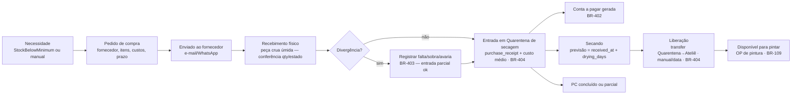

# 11 — Compras

> **Status:** Em revisão · **Última atualização:** 2026-08-10 · **Responsável:** business-analyst (até especialista dedicado)
> **Regras:** BR-401…BR-405 · **Fase:** Gate 03

## 1. Objetivo

Controlar o abastecimento de **peça crua** (comprada pronta mas sem pintura, e nem sempre seca), insumos de pintura (tintas, vernizes), embalagens e itens de revenda: do pedido ao fornecedor até a entrada em estoque — passando pela **quarentena de secagem** ([ADR-0024](../27-ADR/ADR-0024-quarentena-de-secagem.md)) — com custo correto e conta a pagar gerada.

> ⚠️ **Fases de entrega (decisão da diretoria, 2026-08-10).** O escopo P0
> prioriza fornecedores + pedido de compra + conta a pagar **sem tocar
> Estoque**. O fluxo completo abaixo (§3) continua sendo o desenho-alvo,
> mas é entregue em duas fases:
>
> - **Fase 1 (agora, P0):** cadastro de fornecedor + Pedido de Compra (PC)
>   com itens → PC **confirmado/lançado** já gera a conta a pagar
>   (BR-402). Não há etapa de recebimento físico separada, não há
>   localização `quarantine`, não há movimento de estoque — é registro
>   financeiro/documental. Custo médio, divergência de recebimento
>   (BR-403) e taxa de quebra por lote (BR-405) ficam para a Fase 2.
> - **Fase 2 (com Estoque, P2):** recebimento com conferência física,
>   quarentena de secagem e sua liberação (BR-404), custo médio real e
>   taxa de quebra — como descrito no restante deste documento (§3–§7).
>
> Nas seções abaixo, tudo que menciona "recebimento", "quarentena" ou
> "estoque" é o desenho da **Fase 2** — ainda não implementado.
>
> ✅ **A Fase 1 está implementada** em `app/Modules/Purchasing` (telas em
> `/fornecedores` e `/compras`, permissão `purchasing.manage`). O que
> existe em código: cadastro de fornecedor (CNPJ/CPF validado e único,
> prazo de pagamento e de entrega em dias), PC com itens e custo
> negociado, e a máquina de estados
> `rascunho → enviado → confirmado`, com `cancelado` saindo dos dois
> primeiros e trilha em `purchase_order_status_history`. **Confirmar
> chama `Finance\Services\RegisterPayableService` na mesma transação** e
> gera um título com vencimento = emissão + prazo do fornecedor (nulo
> quando o prazo não está cadastrado). Detalhes que a doc não previa e
> foram decididos na implementação:
>
> - **Confirmar direto do rascunho é permitido** (sem passar por
>   "enviado") — é o PC retroativo simplificado que o §7 pede como
>   mitigação da compra informal.
> - **PC confirmado não cancela**: a dívida já existe e sumir com ela
>   exigiria o estorno do Financeiro (BR-504, Gate 04). Cancelar vale só
>   em rascunho/enviado.
> - **"Enviado" é só registro**: não há disparo automático de e-mail nem
>   de WhatsApp neste corte; o envio continua na mão de quem compra.
> - **PC sempre tem ao menos um item somando mais que zero** — título de
>   R$ 0,00 é recusado pelo Financeiro (BR-501), e a recusa tem de
>   aparecer em quem monta a compra, não na conta a pagar.

## 2. Responsabilidades

- **Faz:** fornecedores, pedidos de compra (PC), recebimento com conferência, **quarentena de secagem e sua liberação** (BR-404), divergências, vínculo com contas a pagar e custo médio.
- **Não faz:** movimento de estoque direto (via módulo Estoque — inclusive a transferência de liberação da secagem), pagamento (Financeiro executa a baixa).

## 3. Fluxo

- Recebimento referencia o PC; recebimentos parciais múltiplos são normais.
- A peça crua entra em **Quarentena de secagem** ao ser recebida e só fica disponível para pintar após a **liberação** (BR-404) — uma transferência para o Ateliê executada pelo módulo Estoque ([ADR-0024](../27-ADR/ADR-0024-quarentena-de-secagem.md)). Cada recebimento é o **lote** para a taxa de quebra por fornecedor (BR-405).
- Nota fiscal de entrada do fornecedor: fase 3 registra número/valor para conferência; **manifestação do destinatário e importação de XML de compra** são evolução (fase 5–6, junto do módulo fiscal).

## 4. Dados essenciais

Fornecedor: CNPJ único, contatos, prazo médio de entrega (lead time alimenta sugestão de compra), condições de pagamento habituais. PC: itens com custo negociado, frete embutido ou destacado (compõe custo médio — decidir com contador se frete entra no custo: pergunta aberta). Recebimento (é o **lote** — BR-405): `received_at`, `expected_release_at` (= `received_at + drying_days`), `released_at` (real), fornecedor e referência do lote — base da taxa de quebra por fornecedor.

## 5. Dependências

Estoque (entrada/custo, **localização `quarantine` e a transferência de liberação da secagem** — BR-404), Financeiro (payable), Catálogo (itens `kind=raw_piece/raw_material/packaging/resale`). A sugestão de reposição depende de `min_stock` + lead time do fornecedor.

## 6. Boas práticas

- Insumo de pintura com unidade de compra ≠ unidade de consumo quando necessário (lata de 3,6 L de tinta → consumo em mL): fator de conversão no produto.
- Todo recebimento exige conferente identificado; divergência não bloqueia entrada do que chegou certo.
- Medir a **taxa de quebra por fornecedor/lote** (BR-405): peça crua que quebra ou mofa muito na secagem/manuseio custa mais do que o preço de compra sugere — é insumo de decisão de compra.
- **Liberação manual da secagem é o padrão** (BR-404): peça úmida liberada cedo demais arruína a pintura; a liberação por data fica para lotes/fornecedores de secagem previsível.

## 7. Riscos

| Risco | Mitigação |
|---|---|
| Compra informal (WhatsApp, sem PC) contornar o sistema | Permitir PC retroativo simplificado — melhor registrado depois do que nunca |
| Custo médio distorcido por frete/impostos mal alocados | Pergunta aberta com contador antes do Gate 03 |
| Peça liberada da secagem ainda úmida arruína a pintura | Liberação **manual** por padrão (BR-404); liberação por data só em secagem previsível |
| Fornecedor com alta quebra na secagem passar despercebido | Taxa de quebra por fornecedor/lote a partir dos `loss` que referenciam o recebimento (BR-405) |

## 8. Evoluções futuras

- Cotações comparativas multi-fornecedor (fase 6).
- Importação do XML da NF-e de compra para conferência automática (fase 6).
- Contratos de fornecimento recorrentes (se volume justificar).
