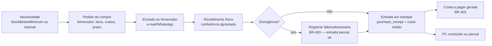

# 11 — Compras

> **Status:** Em revisão · **Última atualização:** 2026-07-03 · **Responsável:** business-analyst (até especialista dedicado)
> **Regras:** BR-401…BR-403 · **Fase:** Gate 03

## 1. Objetivo

Controlar o abastecimento de matéria-prima (gesso, tintas, vernizes), embalagens e itens de revenda: do pedido ao fornecedor até a entrada em estoque com custo correto e conta a pagar gerada.

## 2. Responsabilidades

- **Faz:** fornecedores, pedidos de compra (PC), recebimento com conferência, divergências, vínculo com contas a pagar e custo médio.
- **Não faz:** movimento de estoque direto (via módulo Estoque), pagamento (Financeiro executa a baixa).

## 3. Fluxo

- Recebimento referencia o PC; recebimentos parciais múltiplos são normais.
- Nota fiscal de entrada do fornecedor: fase 3 registra número/valor para conferência; **manifestação do destinatário e importação de XML de compra** são evolução (fase 5–6, junto do módulo fiscal).

## 4. Dados essenciais

Fornecedor: CNPJ único, contatos, prazo médio de entrega (lead time alimenta sugestão de compra), condições de pagamento habituais. PC: itens com custo negociado, frete embutido ou destacado (compõe custo médio — decidir com contador se frete entra no custo: pergunta aberta).

## 5. Dependências

Estoque (entrada/custo), Financeiro (payable), Catálogo (itens `kind=raw_material/packaging/resale`). A sugestão de reposição depende de `min_stock` + lead time do fornecedor.

## 6. Boas práticas

- Cadastro de MP com unidade de compra ≠ unidade de consumo quando necessário (saco de 40 kg → consumo em kg): fator de conversão no produto.
- Todo recebimento exige conferente identificado; divergência não bloqueia entrada do que chegou certo.

## 7. Riscos

| Risco | Mitigação |
|---|---|
| Compra informal (WhatsApp, sem PC) contornar o sistema | Permitir PC retroativo simplificado — melhor registrado depois do que nunca |
| Custo médio distorcido por frete/impostos mal alocados | Pergunta aberta com contador antes do Gate 03 |

## 8. Evoluções futuras

- Cotações comparativas multi-fornecedor (fase 6).
- Importação do XML da NF-e de compra para conferência automática (fase 6).
- Contratos de fornecimento recorrentes (se volume justificar).
