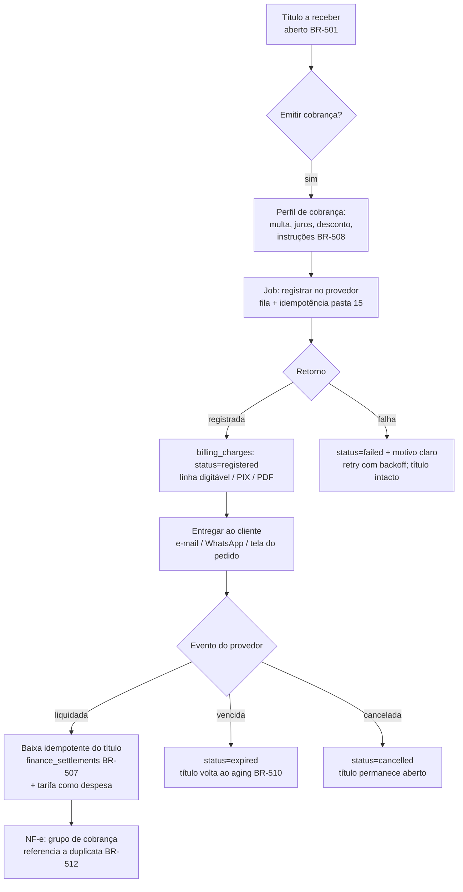

# 01 — Cobrança (boleto e PIX com vencimento)

> **Status:** 🔧 Implementado (Mercado Pago, [ADR-0018](../27-ADR/ADR-0018-cobranca-boleto.md), 2026-08-12) — falta só o Access Token de produção · **Última atualização:** 2026-08-12 · **Responsável:** financial-specialist
> **ADRs relacionados:** [ADR-0018](../27-ADR/ADR-0018-cobranca-boleto.md), [ADR-0007](../27-ADR/ADR-0007-sync-assincrona.md), [ADR-0013](../27-ADR/ADR-0013-dinheiro-decimal.md) · **Regras relacionadas:** BR-505…BR-512, BR-501, BR-502, BR-504
> **Fase:** Gate 04 — Fase C do plano de Financeiro (núcleo BR-501…504 já em produção)

## 1. Objetivo

Permitir que o ERP **emita e concilie cobranças registradas** — boleto e PIX com vencimento — a partir dos títulos a receber, de modo que o dinheiro que entra baixe o título sozinho, sem digitação e sem conferência manual de extrato.

O ganho real não é "gerar um PDF de boleto": é **fechar o ciclo** venda → título → cobrança → liquidação → baixa, com trilha auditável ponta a ponta.

## 2. Responsabilidades

- **Faz:** emitir cobrança a partir de um título a receber; cancelar e reemitir; receber a confirmação de liquidação do provedor e baixar o título de forma idempotente; entregar o documento ao cliente (linha digitável, código de barras, PIX copia-e-cola, PDF); registrar tarifas bancárias como despesa; reconciliar periodicamente cobranças abertas contra o provedor.
- **Não faz:** criar títulos (isso é [BR-501](../01-Regras-de-Negocio/01-registro-de-regras.md), do próprio Financeiro) · decidir regra tributária ou emitir NF-e (pastas 13/14) · cobrar ativamente o inadimplente — régua de cobrança, protesto e negativação são **fora de escopo** e exigiriam ADR próprio · processar cartão de crédito (fase 7).

## 3. Fluxo

### Fluxos de exceção que precisam existir desde a v1

| Situação | Comportamento |
|---|---|
| **Pagamento a menor** | Baixa **parcial** ([BR-502](../01-Regras-de-Negocio/01-registro-de-regras.md)); saldo continua aberto. Nunca baixar o título inteiro ([BR-509](../01-Regras-de-Negocio/01-registro-de-regras.md)) |
| **Pagamento a maior** (juros/multa cobrados pelo banco) | Baixa total + o excedente vira receita de juros na categoria própria |
| **Pagamento em duplicidade** | Segunda liquidação não gera segunda baixa; gera alerta para devolução manual |
| **Webhook duplicado ou fora de ordem** | Idempotência pelo ID da cobrança no provedor ([BR-507](../01-Regras-de-Negocio/01-registro-de-regras.md)); evento reprocessado não duplica baixa |
| **Webhook nunca chega** | Job de reconciliação diário consulta o provedor pelas cobranças abertas — o webhook é otimização, **a consulta é a garantia** |
| **Mudança de valor/vencimento** | Cancela a cobrança e emite outra ([BR-506](../01-Regras-de-Negocio/01-registro-de-regras.md)); o título permanece o mesmo |
| **Cliente paga por fora** (PIX direto, dinheiro) | Baixa manual do título + cancelamento da cobrança pendente, para não receber duas vezes |
| **Estorno** | Contrapartida auditada, nunca exclusão ([BR-504](../01-Regras-de-Negocio/01-registro-de-regras.md)) |

## 4. Modelo de dados (proposto — fecha no Gate 04)

Acrescenta ao [modelo conceitual](../04-Banco-de-Dados/01-modelo-conceitual.md):

| Tabela | Campos principais | Observações |
|---|---|---|
| `billing_profiles` | nome, `fine_pct`, `interest_pct_month`, `discount_rule`, `days_to_due`, instruções, `valid_from`/`valid_to` | Versionado por vigência ([BR-508](../01-Regras-de-Negocio/01-registro-de-regras.md)) |
| `billing_charges` | `receivable_id`, `provider` (banco/gateway), **`provider_charge_id` UNIQUE**, `type` (boleto/pix), `our_number`, `amount` DECIMAL(15,2), `due_date`, `status` (pending/registered/paid/partially_paid/cancelled/expired/failed), `digitable_line`, `barcode`, `pix_payload`, `pdf_path`, `fee_amount`, `paid_amount`, `paid_at`, `profile_id` | Uma cobrança pertence a **um** título ([BR-505](../01-Regras-de-Negocio/01-registro-de-regras.md)); imutável após registrada ([BR-506](../01-Regras-de-Negocio/01-registro-de-regras.md)) |
| `billing_charge_events` | `charge_id`, `type`, payload, `provider_event_id` UNIQUE, `processed_at` | Trilha do provedor; idempotência ([BR-507](../01-Regras-de-Negocio/01-registro-de-regras.md)). Complementa `incoming_webhooks` da pasta 15 |

Credenciais do provedor vivem em `integration_settings` **cifradas** (padrão já definido na [pasta 15](../15-Integracoes/README.md)) — nunca em `.env` versionado, nunca no repositório.

## 5. Dependências

| Depende de | Motivo |
|---|---|
| **Títulos a receber (Gate 04)** | Cobrança sem título não existe ([BR-505](../01-Regras-de-Negocio/01-registro-de-regras.md)). É o pré-requisito estrutural |
| **Convênio de cobrança com o banco** | Carteira, código do beneficiário, faixa de nosso número, credenciais. **Lead time de semanas — caminho crítico** |
| [ADR-0018](../27-ADR/ADR-0018-cobranca-boleto.md) | Define a interface e o critério de escolha do provedor |
| [Framework de integrações (15)](../15-Integracoes/README.md) | Fila, idempotência, mapeamento, reconciliação, painel |
| [Segurança (25)](../25-Seguranca/README.md) | Guarda de credenciais bancárias — risco superior ao do certificado A1 |
| [NF-e (14)](../14-NFe/README.md) | Grupo de cobrança/duplicatas na nota ([BR-512](../01-Regras-de-Negocio/01-registro-de-regras.md)) — confirmar com o contador (G-02 da [pauta](../13-Fiscal/01-pauta-validacao-contador.md)) |

**Quem depende deste módulo:** Vendas (pedido de atacado a prazo), Dashboards (aging e previsão de caixa), Relatórios (títulos vencidos).

## 6. Boas práticas

- **A consulta periódica é a fonte de verdade, não o webhook.** Webhook é latência baixa; reconciliação diária é garantia. Todo provedor eventualmente perde um evento.
- **Idempotência pelo ID do provedor**, nunca por valor+data — dois títulos do mesmo cliente, mesmo valor e mesmo dia existem e são comuns no atacado.
- **Tarifa bancária é despesa registrada na baixa**, com categoria própria. Tarifa invisível distorce margem exatamente como as taxas de gateway já distorcem hoje ([31/08](../31-Inventario-Legado/08-formas-pagamento.md)).
- **Credencial de escopo mínimo:** somente cobrança. Uma credencial que também autoriza pagamento ou transferência jamais deve ser instalada no ERP ([BR-511](../01-Regras-de-Negocio/01-registro-de-regras.md)).
- **Ambiente de homologação (sandbox) permanente**, como já é regra para a NF-e ([BR-605](../01-Regras-de-Negocio/01-registro-de-regras.md)). Nunca testar cobrança em produção.
- **Toda mensagem de erro do provedor traduzida para ação clara** ("CEP do pagador inválido — corrija o endereço do cliente X"), no mesmo padrão adotado para as rejeições da SEFAZ.
- **Nunca gerar o boleto localmente** (código de barras, nosso número, dígito verificador). O documento válido é o que o banco registra e devolve.

## 7. Riscos

| Risco | Prob. | Impacto | Mitigação |
|---|---|---|---|
| Convênio bancário demorar mais que o desenvolvimento | **Alta** | Alto | Iniciar o convênio **hoje**, em paralelo; usar emissão manual pelo internet banking como estado do dia 1 (Alternativa D do ADR-0018) |
| Credencial bancária vazar | Baixa | **Crítico** | Escopo mínimo, cifrada, fora do repositório, rotação documentada, acesso restrito por RBAC ([pasta 25](../25-Seguranca/README.md)) |
| Baixa duplicada por webhook reprocessado | Média | Alto | UNIQUE em `provider_event_id` + baixa idempotente ([BR-507](../01-Regras-de-Negocio/01-registro-de-regras.md)); teste de feature obrigatório |
| Cliente paga por fora e recebe cobrança depois | **Alta** | Médio | Cancelar cobranças pendentes na baixa manual; alerta de título com cobrança ativa |
| Investir 80–120 h num canal que responde por ~6% dos pedidos | Média | Alto | Confirmar **por que** o cliente quer boleto antes de codar; PIX-cobrança pode resolver a mesma dor mais barato (ADR-0018 §Decisão) |
| Trocar de banco depois exigir reescrita | Média | Médio | `CobrancaGatewayInterface` isola o domínio (ADR-0018) |
| Régua de cobrança/inadimplência virar demanda implícita | Alta | Médio | Explicitamente fora de escopo; entra por ADR novo, com prazo e preço próprios |

## 8. Evoluções futuras

| Evolução | Fase sugerida |
|---|---|
| Régua de cobrança automatizada (lembrete pré-vencimento, aviso de atraso) por e-mail/WhatsApp | 6 |
| Conciliação bancária por OFX cruzando com cobranças liquidadas | 6 |
| Link de pagamento e cartão de crédito (gateway completo) | 7 |
| Protesto / negativação | 7, com ADR próprio |
| PIX Automático para clientes de atacado recorrentes | 7 |
| Split de pagamento (se surgirem parceiros/consignação) | 7 |

## 9. Perguntas em aberto

**Resolvidas em 2026-08-11:**
- ~~Qual banco/conta a empresa usa~~ → Mercado Pago, o mesmo do checkout do site (resolve
  autenticação sem convênio bancário novo — só falta o Access Token de produção).
- ~~Por que boleto vs. PIX~~ → decisão do dono: suportar os dois sob a mesma interface desde a
  v1 (§2 do ADR-0018), sem esperar confirmação de demanda por canal.

**Ainda em aberto (não bloqueiam o código, ajustam parâmetro depois):**
- Volume estimado de cobranças por mês (referência para o gatilho de revisão do ADR-0018 — 200/mês).
- Prazo praticado no atacado (30/60 dias)? Parcelamento?
- Quem opera a cobrança hoje e como a baixa é conferida?
- O envio ao cliente deve ser por e-mail, WhatsApp, ou ambos? (v1: a tela do título mostra o
  link/QR/linha digitável para o operador copiar; envio automatizado fica para a régua de
  cobrança, fase 6).

**Para o contador** (já incorporadas ao Bloco G da [pauta](../13-Fiscal/01-pauta-validacao-contador.md)):
- Multa, juros e desconto padrão a aplicar.
- A NF-e de venda a prazo deve trazer o grupo de duplicatas sempre que houver cobrança?
- A nota sai antes do pagamento do boleto ou só após a compensação?

**Para o dono:**
- Aprovar a mudança de escopo (fase 7 → Gate 04) e o orçamento de 80–120 h.
- Aceitar o custo recorrente por boleto no [modelo de custos](../00-Visao-Geral/05-modelo-de-custos.md).
