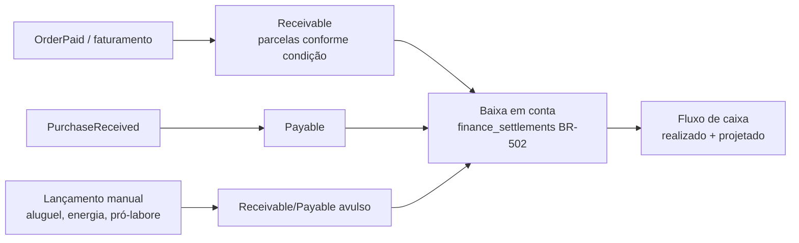

# 12 — Financeiro

> **Status:** Em revisão · **Última atualização:** 2026-07-03 · **Responsável:** financial-specialist
> **Regras:** BR-501…BR-504 · **Fase:** Gate 04

## 1. Objetivo

Dar ao dono a visão financeira consolidada que hoje não existe: contas a receber e a pagar integradas às vendas e compras, fluxo de caixa projetado e realizado, categorização gerencial. **Financeiro gerencial, não contabilidade formal** (fora de escopo — pasta 00/01): o contador continua responsável pela contabilidade oficial e recebe exportações.

## 2. Responsabilidades

- **Faz:** títulos (receivables/payables), baixas totais/parciais, contas financeiras (caixa, banco, PIX), categorias gerenciais em árvore, fluxo de caixa, estornos por contrapartida.
- **Não faz:** lançamentos contábeis/SPED, conciliação bancária automática (evolução), folha.

## 3. Fluxos

### Origem automática dos títulos (BR-501)

- Venda balcão à vista: título já nasce baixado (atalho de UX, mas o título existe — trilha completa).
- Pedido Woo: título nasce conforme status de pagamento do canal (pago no gateway do site → baixado na conta "Gateway Woo", com taxa registrada como despesa — mapa na pasta 16).
- Estorno **nunca** apaga: contrapartida auditada (BR-504).

### Fluxo de caixa
Projetado = títulos abertos por vencimento; realizado = baixas por data. Visões 30/60/90 dias no dashboard (pasta 21). Saldo por conta conferível contra extrato bancário manualmente (v1).

## 4. Plano de categorias gerencial (BR-503)

Árvore inicial proposta (validar com o dono no Gate 04): Receitas (Vendas Site, Vendas Balcão, Vendas Atacado, Fretes cobrados) · Custos (Matéria-prima, Embalagens, Frete pago) · Despesas (Marketing, Taxas de gateway/marketplace, Hospedagem/Software, Pró-labore, Energia/Água, Outros) · Investimentos (Moldes, Equipamentos).

## 5. Dependências

Vendas e Compras (origem dos títulos), Fiscal (NF-e ↔ faturamento), Relatórios/Dashboards (consumo). Exportações mensais para o contador: relatório de vendas + XMLs (pasta 14).

## 6. Boas práticas

- Toda tela financeira mostra visão de competência (data do fato) e de caixa (data da baixa) — evita brigas de interpretação.
- Títulos vencidos com aging (1–15, 16–30, 30+) e ação rápida de cobrança (fase 6: lembrete por e-mail/WhatsApp).
- Baixa em lote para dias de movimento (feiras).

## 7. Riscos

| Risco | Prob. | Impacto | Mitigação |
|---|---|---|---|
| Uso parcial (só olhar saldo do banco) esvaziar o módulo | Média | Alto | Títulos nascem automáticos das operações; esforço manual mínimo |
| Mistura PF/PJ nas contas do dono | Alta | Médio | Contas separadas + categoria pró-labore; conversa franca no Gate 04 |
| Taxas de gateway/marketplace invisíveis distorcerem margem | Média | Médio | Registro automático da taxa na baixa de pedidos de canal |

## 8. Evoluções futuras

- Conciliação bancária por OFX (fase 6).
- Boleto/PIX cobrança integrada a gateway (fase 7, para atacado).
- DRE gerencial mensal automatizada (pasta 20, fase 6).
