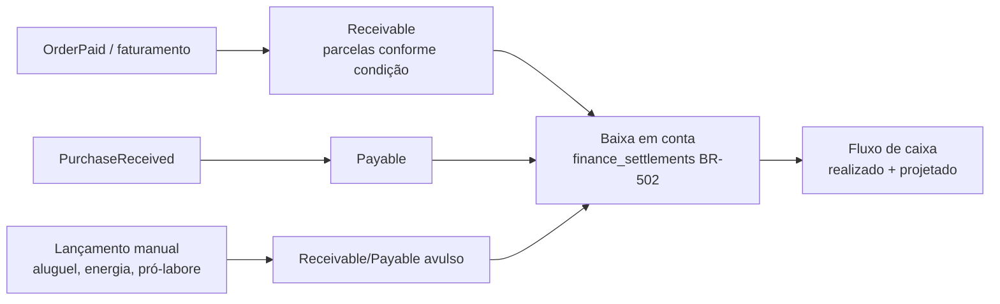

# 12 — Financeiro

> **Status:** Núcleo + cobrança implementados · **Última atualização:** 2026-08-12 · **Responsável:** financial-specialist
> **Regras:** BR-501…BR-512 · **Fase:** Gate 04
> **Documentos:** [Cobrança (boleto e PIX com vencimento)](01-cobranca-e-boletos.md) — 🔧 implementado, falta só a credencial de produção ([ADR-0018](../27-ADR/ADR-0018-cobranca-boleto.md))

> 🔧 **Núcleo implementado em 2026-08-11** (BR-501/BR-502/BR-503/BR-504):
> `Receivable`, `Payable`, baixa (total/parcial, `finance_settlements`),
> `FinanceAccount` (sem coluna de saldo — soma das baixas, mesmo princípio
> do saldo de estoque, ADR-0008), estorno por contrapartida (nunca
> `DELETE`), plano de categorias completo (árvore da §4, seedada como
> default editável). Pedido confirmado gera título a receber
> automaticamente (`RegistrarRecebivelAoConfirmarPedido`, ouve `Sales\
> Events\OrderConfirmed`) — se o pedido já nasceu pago (balcão à vista, ou
> `processing`/`completed` do Woo), o título nasce **já baixado**, sem
> passo manual.
>
> 🔧 **Cobrança implementada em 2026-08-12** (BR-505/506/507/509/510, ADR-0018):
> `CobrancaGatewayInterface` + `NullCobrancaGateway` (padrão até a
> credencial de produção existir, mesmo desenho do `NfeGatewayInterface`),
> `billing_profiles`/`billing_charges`/`billing_charge_events`, emissão e
> cancelamento assíncronos via job (`ProcessarEmissaoCobranca`/
> `ProcessarCancelamentoCobranca` — nunca travam a tela), notificação do
> provedor idempotente (`ProcessarNotificacaoCobrancaService`, UNIQUE em
> `provider_event_id`) que baixa o título e registra a tarifa como despesa
> já baixada. Tela integrada em `/financeiro` (aba "A receber"): emitir,
> copiar PIX, abrir boleto, cancelar. Adapter `Integrations\MercadoPago`
> completo (`Client`, `StatusMap`, verificação de assinatura, webhook,
> reconciliação horária) — rebind automático quando
> `integrations.mercadopago.enabled` estiver ligado. **Falta apenas**: o
> Access Token de produção real (`.env`, nunca no repo); sem ele, o
> `NullCobrancaGateway` continua ativo e toda emissão vira `failed` com
> motivo claro, sem fingir sucesso (mesmo princípio do `NullNfeGateway`).

## 1. Objetivo

Dar ao dono a visão financeira consolidada que hoje não existe: contas a receber e a pagar integradas às vendas e compras, fluxo de caixa projetado e realizado, categorização gerencial. **Financeiro gerencial, não contabilidade formal** (fora de escopo — pasta 00/01): o contador continua responsável pela contabilidade oficial e recebe exportações.

## 2. Responsabilidades

- **Faz:** títulos (receivables/payables), baixas totais/parciais, contas financeiras (caixa, banco, PIX), categorias gerenciais em árvore, fluxo de caixa, estornos por contrapartida.
- **Não faz:** lançamentos contábeis/SPED, conciliação bancária automática (evolução), folha.

## 3. Fluxos

### Origem automática dos títulos (BR-501)

- ✅ Venda balcão à vista: título já nasce baixado (atalho de UX, mas o título existe — trilha completa).
- ✅ Pedido Woo: título nasce conforme status de pagamento do canal — `processing`/`completed` (o Woo já considera pago) baixa direto; `on-hold` fica aberto. A conta usada hoje é sempre "Conta padrão" — separar por canal (ex.: "Gateway Mercado Pago" com taxa registrada como despesa) é trabalho da Fase C (cobrança).
- ✅ Estorno **nunca** apaga: contrapartida auditada (BR-504).
- Se a categoria padrão ou a conta padrão não existirem quando o pedido confirma, o listener registra aviso no log e **nunca** desfaz a confirmação — cadastro financeiro incompleto não pode derrubar uma venda.

### Fluxo de caixa
Projetado = títulos abertos por vencimento; realizado = baixas por data. Visões 30/60/90 dias no dashboard (pasta 21). Saldo por conta conferível contra extrato bancário manualmente (v1).

## 4. Plano de categorias gerencial (BR-503)

Árvore inicial proposta (validar com o dono no Gate 04): Receitas (Vendas Site, Vendas Balcão, Vendas Atacado, Fretes cobrados) · Custos (Matéria-prima, Embalagens, Frete pago) · Despesas (Marketing, Taxas de gateway/marketplace, Hospedagem/Software, Pró-labore, Energia/Água, Outros) · Investimentos (Equipamentos, Ateliê/bancada).

## 5. Dependências

Vendas e Compras (origem dos títulos), Fiscal (NF-e ↔ faturamento), Relatórios/Dashboards (consumo). Exportações mensais para o contador: relatório de vendas + XMLs (pasta 14).

## 6. Boas práticas

- Toda tela financeira mostra visão de competência (data do fato) e de caixa (data da baixa) — evita brigas de interpretação.
- Títulos vencidos com aging (1–15, 16–30, 30+) e ação rápida de cobrança (fase 6: lembrete por e-mail/WhatsApp).
- Baixa em lote para dias de movimento (feiras).

## 7. Riscos

| Risco | Prob. | Impacto | Mitigação |
|---|---|---|---|
| Uso parcial (só olhar saldo do banco) esvaziar o módulo | Média | Alto | Títulos nascem automáticos das operações; esforço manual mínimo |
| Mistura PF/PJ nas contas do dono | Alta | Médio | Contas separadas + categoria pró-labore; conversa franca no Gate 04 |
| Taxas de gateway/marketplace invisíveis distorcerem margem | Média | Médio | Registro automático da taxa na baixa de pedidos de canal |

## 8. Evoluções futuras

- Conciliação bancária por OFX (fase 6).
- ~~Boleto/PIX cobrança integrada a gateway (fase 7, para atacado).~~ → **Solicitado pelo cliente em 2026-07-22**; desenhado em [01-cobranca-e-boletos.md](01-cobranca-e-boletos.md) e [ADR-0018](../27-ADR/ADR-0018-cobranca-boleto.md). Aguarda decisão do dono sobre entrar no Gate 04 ([M-01 do roadmap](../28-Roadmap/README.md#mudanças-de-escopo-solicitadas)).
- DRE gerencial mensal automatizada (pasta 20, fase 6).
- Régua de cobrança, protesto e negativação (fase 7, ADR próprio).
