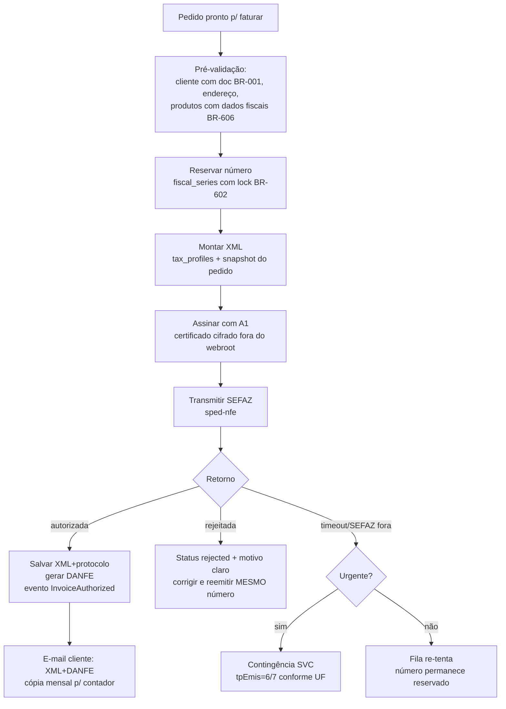

# 14 — NF-e (Emissão Eletrônica)

> **Status:** Em revisão · **Última atualização:** 2026-07-03 · **Responsável:** nfe-specialist
> **Regras:** BR-601…BR-606 · **Fase:** Gate 05 · **ADR:** [0009 (sped-nfe vs API gerenciada)](../27-ADR/ADR-0009-emissao-nfe.md)

## 1. Objetivo

Emitir, gerir e guardar NF-e modelo 55 com certificado A1: do pedido faturado ao XML autorizado + DANFE entregues ao cliente e ao contador — com contingência, eventos (cancelamento, CC-e, inutilização) e guarda legal de 5 anos.

## 2. Responsabilidades

- **Faz:** montagem do XML a partir de pedido + perfis fiscais (pasta 13), assinatura (A1), transmissão/consulta SEFAZ, DANFE PDF, eventos, numeração por série, guarda e distribuição (e-mail cliente/contador).
- **Não faz:** decidir regra tributária (pasta 13), cobrar (Financeiro), expedir (Vendas — que depende daqui via BR-309).

## 3. Fluxo de emissão

Pontos críticos:

- **Numeração** (BR-602): `fiscal_series.next_number` com `SELECT ... FOR UPDATE`; rejeição **não** queima número (reemite com o mesmo); número abandonado → inutilização na SEFAZ.
- **Imutabilidade**: autorizada nunca muda; correção → CC-e (erros permitidos) ou cancelamento (BR-604, prazo 24 h sem circulação) ou devolução.
- **Homologação primeiro** (BR-605): ambiente 2 permanente, cliente "NF-E EMITIDA EM AMBIENTE DE HOMOLOGACAO..." — toda mudança fiscal é testada lá antes.
- **Contingência SVC**: chaveamento manual (decisão do operador) com runbook próprio (pasta 24); notas em contingência são retransmitidas quando a SEFAZ normaliza.

## 4. Certificado A1 (segurança — detalha na pasta 25)

Arquivo `.pfx` armazenado **fora do webroot**, cifrado (senha no cofre de configuração, nunca no repositório), permissão restrita. **Monitorar validade**: alertas 30/15/7 dias antes do vencimento (health check — pasta 24). Renovação anual é operação planejada com runbook.

## 5. Guarda e distribuição (BR-603)

XML autorizado + eventos: storage da aplicação com backup diário + cópia mensal exportada (zip por competência) para storage externo. Retenção ≥ 5 anos. DANFE é re-gerável a partir do XML (não precisa da mesma garantia). Painel fiscal: busca por chave/número/cliente/período com download em lote (perfil do contador — BR-803).

## 6. Dependências

| Depende de | Motivo |
|---|---|
| 13-Fiscal | perfis tributários validados pelo contador |
| Certificado A1 válido | assinatura |
| `nfephp-org/sped-nfe` | biblioteca de emissão (ADR-0009) |
| Extensões PHP: openssl, soap, curl, dom | verificar no ambiente ANTES do Gate 05 (ADR-0016) |
| Vendas | dados do pedido; expedição espera autorização (BR-309) |

## 7. Boas práticas

- Toda mensagem de rejeição SEFAZ é traduzida para ação clara no ERP ("Rejeição 778: NCM inexistente — corrija o NCM do produto X").
- Emissão é **assíncrona** (job) com feedback em tela via polling/refresh — nunca travar a UI esperando SEFAZ.
- Log completo de request/response SOAP (sem dados do certificado) por 90 dias para suporte.
- Dry-run mensal em homologação como teste de fumaça do canal fiscal.

## 8. Riscos

| Risco | Prob. | Impacto | Mitigação |
|---|---|---|---|
| Shared hosting sem extensão/CPU para assinar+transmitir | Média | Crítico | Validar ambiente antes do Gate 05; ADR-0016 (VPS) resolve na raiz |
| NTs da reforma tributária exigirem atualização rápida da lib | Alta | Alto | Acompanhar releases sped-nfe; plano B = API fiscal gerenciada (ADR-0009, gatilhos definidos) |
| Perda de XML | Baixa | Crítico (multa) | Guarda redundante + teste de restore trimestral |
| Certificado vencer sem aviso | Média | Crítico | Alertas automatizados 30/15/7 dias |

## 9. Evoluções futuras

- NFC-e se abrir varejo presencial com volume (novo ADR).
- Importação de NF-e de fornecedores + manifestação (fase 6).
- CT-e/MDF-e apenas se logística própria surgir (improvável).
