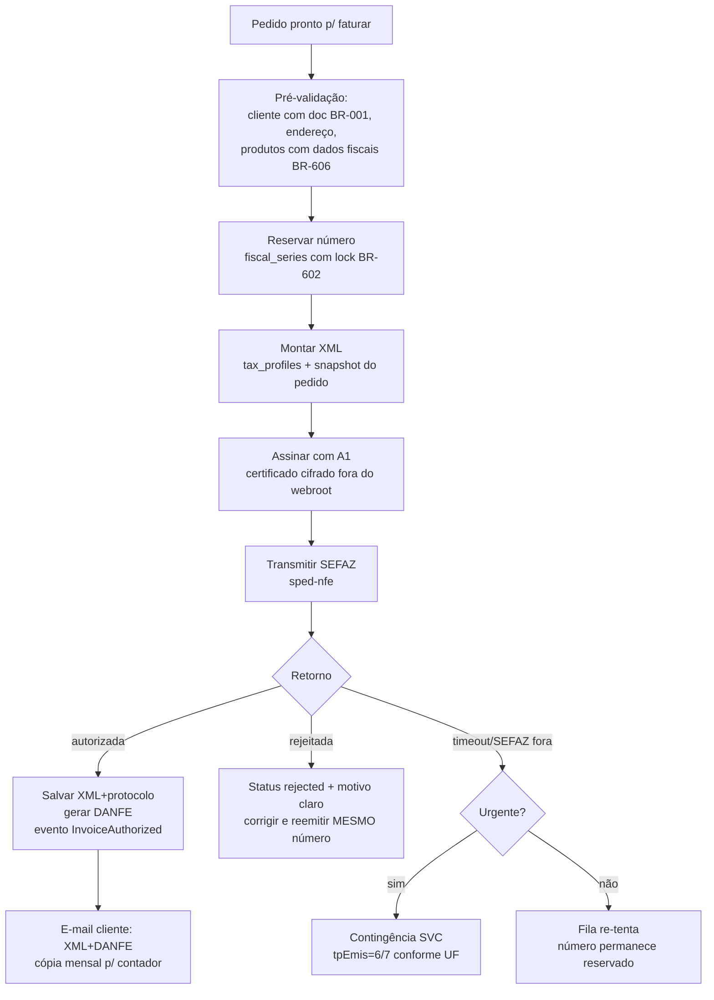

# 14 — NF-e (Emissão Eletrônica)

> **Status:** Em revisão · **Última atualização:** 2026-08-11 · **Responsável:** nfe-specialist
> **Regras:** BR-601…BR-608 · **Fase:** Gate 05 · **ADR:** [0009 (sped-nfe vs API gerenciada)](../27-ADR/ADR-0009-emissao-nfe.md), [0027 (grupo IBSCBS e pacote de schema)](../27-ADR/ADR-0027-grupo-ibscbs-e-schema-pl010.md)

## 1. Objetivo

Emitir, gerir e guardar NF-e modelo 55 com certificado A1: do pedido faturado ao XML autorizado + DANFE entregues ao cliente e ao contador — com contingência, eventos (cancelamento, CC-e, inutilização) e guarda legal de 5 anos.

## 2. Responsabilidades

- **Faz:** montagem do XML a partir de pedido + perfis fiscais (pasta 13), assinatura (A1), transmissão/consulta SEFAZ, DANFE PDF, eventos, numeração por série, guarda e distribuição (e-mail cliente/contador).
- **Não faz:** decidir regra tributária (pasta 13), cobrar (Financeiro), expedir (Vendas — que depende daqui via BR-309).

## 3. Fluxo de emissão

> Gatilho automático (pedido confirmado do site → emissão), organização do
> módulo (`Fiscal` único, perfis + emissão) e o gate de produção (flag
> homologação/produção até validação do contador) estão desenhados no
> [ADR-0025](../27-ADR/ADR-0025-emissao-automatica-nfe.md).

### 3.1 O que já existe em código (2026-08-10)

| Etapa do fluxo | Onde | Estado |
|---|---|---|
| Pré-validação + numeração | `Fiscal\Services\BuildInvoiceFromOrder` | ✅ em produção (inerte) |
| Montagem do XML 4.00 | `Fiscal\Services\Gateways\MontarXmlNfe` | ✅ testado contra o XSD oficial |
| Certificado A1 + `Tools` | `Fiscal\Services\Gateways\CanalSefaz` | ✅ escrito; assinatura verificada com certificado autoassinado |
| Assinatura + transmissão + retorno | `Fiscal\Services\Gateways\SpedNfeGateway` | ⚠️ escrito, **não verificado** (sem A1 real) |
| Código IBGE do município do destinatário | `Sales\Services\ResolveIbgeCityCode` + `ibge_municipalities` | ✅ resolvido automaticamente, com escolha manual na tela quando não casa ([ADR-0026](../27-ADR/ADR-0026-codigo-ibge-municipio.md)) |
| DANFE, eventos, contingência, guarda em lote | — | ❌ não iniciados |

**O bind ativo continua sendo `NullNfeGateway`** (`FiscalServiceProvider`).
Trocar por `SpedNfeGateway` é uma linha, e só depois da bateria em
homologação que a BR-605 exige.

**Duas** coisas impedem a primeira emissão de verdade, nenhuma delas de
código:

1. **Certificado A1** — `NFE_CERT_PATH`/`NFE_CERT_PASSWORD` (pasta 25).
2. **Dados do emitente e CST de PIS/COFINS** — `NFE_EMITENTE_*`,
   `NFE_PIS_CST`, `NFE_COFINS_CST`, todos vazios até a doc 13 sair de
   bloqueada. A emissão recusa nomeando a variável que falta; não chuta.

> ✅ **O terceiro bloqueio caiu em 2026-08-10.** O código IBGE do município
> do destinatário (`enderDest/cMun`) era o item 3 desta lista: obrigatório
> no layout 4.00 e sem coluna que o guardasse. Agora `customer_addresses`
> tem `city_code` (FK para `ibge_municipalities`, tabela semeada dos dados
> oficiais do IBGE), a resolução por cidade + UF é automática no cadastro,
> e `Sales\DTO\OrderInvoiceAddress::$cityCode` chega preenchido — ver
> [ADR-0026](../27-ADR/ADR-0026-codigo-ibge-municipio.md) e BR-607.
>
> O campo **continua nulável**, e a emissão continua parando quando ele
> falta: quando a grafia da cidade não bate com a oficial, a resolução
> recusa aproximar e o endereço fica com pendência visível até alguém
> escolher o município na tela do cliente. O que mudou é que agora isso é
> exceção rara, e não o caso de todo mundo. Endereços que já existiam:
> `php artisan erp:enderecos:resolver-ibge` (relata primeiro, grava só com
> `--gravar`).

Pontos críticos:

- **Numeração** (BR-602): `fiscal_series.next_number` com `SELECT ... FOR UPDATE`; rejeição **não** queima número (reemite com o mesmo); número abandonado → inutilização na SEFAZ.
- **Imutabilidade**: autorizada nunca muda; correção → CC-e (erros permitidos) ou cancelamento (BR-604, prazo 24 h sem circulação) ou devolução.
- **Homologação primeiro** (BR-605): ambiente 2 permanente, cliente "NF-E EMITIDA EM AMBIENTE DE HOMOLOGACAO..." — toda mudança fiscal é testada lá antes.
- **Contingência SVC**: chaveamento manual (decisão do operador) com runbook próprio (pasta 24); notas em contingência são retransmitidas quando a SEFAZ normaliza.

## 4. Certificado A1 (segurança — detalha na pasta 25)

Arquivo `.pfx` armazenado **fora do webroot**, cifrado (senha no cofre de configuração, nunca no repositório), permissão restrita. **Monitorar validade**: alertas 30/15/7 dias antes do vencimento (health check — pasta 24). Renovação anual é operação planejada com runbook.

## 5. Guarda e distribuição (BR-603)

XML autorizado + eventos: storage da aplicação com backup diário + cópia mensal exportada (zip por competência) para storage externo. Retenção ≥ 5 anos. DANFE é re-gerável a partir do XML (não precisa da mesma garantia). Painel fiscal: busca por chave/número/cliente/período com download em lote (perfil do contador — BR-803).

## 6. Dependências

| Depende de | Motivo |
|---|---|
| 13-Fiscal | perfis tributários validados pelo contador |
| Certificado A1 válido | assinatura |
| `nfephp-org/sped-nfe` | biblioteca de emissão (ADR-0009). ✅ **Instalada em 2026-08-10** (`^5.2`, v5.2.8) — sem conflito com a árvore existente; entram junto `sped-common`, `sped-gtin` e `justinrainbow/json-schema` |
| Extensões PHP: openssl, soap, curl, dom | ✅ verificadas nos dois SAPIs em 2026-08-10 (ver §8). `ext-soap` é exigida pelo `composer.json` da lib; o job `lint` do CI passou a instalá-la junto com `zip` para o `composer install` não reprovar |
| Pacote de schema (`CanalSefaz::SCHEMAS`) | ✅ **`PL_010_V1.30`, trocado em 2026-08-11** (era `PL_009_V4`) — ADR-0027. O pacote anterior é de antes da reforma tributária e não tem o elemento `IBSCBS` no XSD; a troca é aditiva (nenhum elemento existente foi removido entre os dois pacotes), confirmada rodando a suíte inteira do Fiscal contra o schema novo |
| Vendas | dados do pedido; expedição espera autorização (BR-309) |

## 7. Boas práticas

- Toda mensagem de rejeição SEFAZ é traduzida para ação clara no ERP ("Rejeição 778: NCM inexistente — corrija o NCM do produto X").
- Emissão é **assíncrona** (job) com feedback em tela via polling/refresh — nunca travar a UI esperando SEFAZ.
- Log completo de request/response SOAP (sem dados do certificado) por 90 dias para suporte.
- Dry-run mensal em homologação como teste de fumaça do canal fiscal.

## 8. Riscos

| Risco | Prob. | Impacto | Mitigação |
|---|---|---|---|
| Shared hosting sem extensão/CPU para assinar+transmitir | ✅ **Validado em 2026-08-10**: `openssl`, `soap`, `curl`, `dom`, `simplexml`, `zip`, `mbstring`, `bcmath`, `gd` presentes nos dois SAPIs (CLI **e** LiteSpeed/web — checados separadamente, é onde o P-16 mordeu antes). CPU sob carga real de assinatura+transmissão ainda não testada | — | ADR-0016 (VPS) continua a mitigação se a carga real não couber |
| NTs da reforma tributária exigirem atualização rápida da lib | Alta | Alto | Acompanhar releases sped-nfe; plano B = API fiscal gerenciada (ADR-0009, gatilhos definidos). 🔧 **Parcialmente mitigado em 2026-08-11**: a lib já suporta o grupo IBSCBS (`TraitTagDetIBSCBS`) e o pacote de schema foi trocado para `PL_010_V1.30` (ADR-0027) — falta só `tax_profiles` ganhar CST/cClassTrib/alíquotas reais, que dependem do contador (H-05/H-06 da pauta) |
| Perda de XML | Baixa | Crítico (multa) | Guarda redundante + teste de restore trimestral |
| Certificado vencer sem aviso | Média | Crítico | Alertas automatizados 30/15/7 dias |

## 9. Evoluções futuras

- NFC-e se abrir varejo presencial com volume (novo ADR).
- Importação de NF-e de fornecedores + manifestação (fase 6).
- CT-e/MDF-e apenas se logística própria surgir (improvável).
