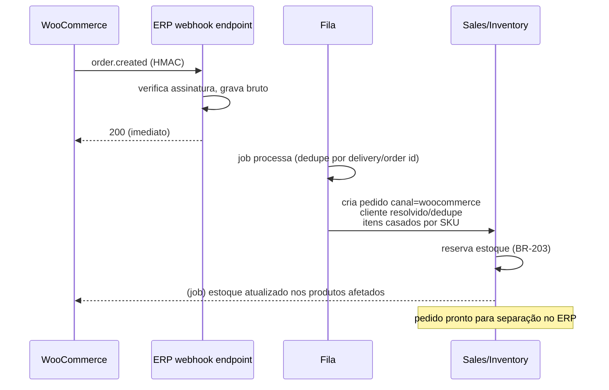

# 16 — Integração WooCommerce

> **Status:** Em revisão · **Última atualização:** 2026-07-03 · **Responsável:** woocommerce-specialist
> **Regras:** BR-204, BR-304, BR-701…BR-705 · **Fase:** Gate 02 · **Documentos:** [Mapeamento de campos](01-mapeamento-de-campos.md)
> Segue o framework da [pasta 15](../15-Integracoes/README.md); migração inicial é assunto da [pasta 17](../17-Migracao/README.md).

## 1. Objetivo

Manter o e-commerce operando normalmente enquanto o ERP passa a ser o mestre: catálogo, preços e estoque fluem ERP→Woo; pedidos e clientes novos fluem Woo→ERP; status de fulfillment e rastreio voltam ERP→Woo. **Nunca** acesso ao banco do WordPress.

## 2. Contrato técnico

- **API:** WooCommerce REST API v3 (`/wp-json/wc/v3/`), autenticação por consumer key/secret sobre HTTPS. Chaves com escopo read/write guardadas cifradas.
- **Webhooks Woo → ERP:** `order.created`, `order.updated`, `customer.created`, `customer.updated` — assinados (secret HMAC-SHA256 verificado; BR-701).
- **Rate limit:** Woo em shared hosting degrada com rajadas — jobs de push trabalham em lotes de ~20 com espaçamento; reconciliação em horário de baixa (madrugada).
- **Ambiente de teste:** clone staging do WordPress (obrigatório antes do Gate 02 — ver riscos).

## 3. Direções de sincronização e resolução de conflito

| Entidade | Direção | Gatilho | Conflito: quem vence |
|---|---|---|---|
| Produto (dados, preço varejo, imagens*, categorias) | ERP → Woo | eventos `ProductUpdated`/`PriceChanged` | **ERP** (BR-702: edição no wp-admin é proibida por política; reconciliação sobrescreve e alerta) |
| Estoque publicado | ERP → Woo | `StockMovementRecorded`/`StockReserved` | **ERP** (fórmula BR-204: disponível − buffer) |
| Pedido | Woo → ERP | webhook `order.created/updated` | **Woo é a origem do fato** (BR-703); fulfillment depois é do ERP |
| Status de pedido + rastreio | ERP → Woo | `OrderShipped` etc. | ERP |
| Cliente | Woo → ERP (novos) · ERP → Woo (correções) | webhooks / manual | dedupe por e-mail+doc; correções cadastrais: ERP |

\* Imagens conforme ADR-0017 (fase 1: mídia permanece no Woo; ERP guarda referência).

## 4. Fluxo do pedido (o caminho crítico)

Casos de borda documentados no [mapeamento](01-mapeamento-de-campos.md): item com SKU desconhecido (pedido entra com item "não mapeado" + alerta — nunca se perde venda), pedido editado no Woo após importado, reembolso/cancelamento no gateway, cliente convidado (sem conta).

## 5. Reconciliação (rede de segurança)

Job diário (madrugada): compara por checksum produtos/estoques/últimos 7 dias de pedidos entre ERP e Woo → corrige divergência conforme tabela de conflito → relatório no painel de integrações; divergência recorrente = investigação (bug ou alguém editando no wp-admin — BR-702).

## 6. Dependências

Chaves REST do Woo e acesso admin (criar webhooks) · Estoque/Vendas/Catálogo operacionais no ERP (Gate 01) · Migração inicial concluída (pasta 17) — a sync começa **depois** do cutover.

## 7. Riscos

| Risco | Prob. | Impacto | Mitigação |
|---|---|---|---|
| Plugin do Woo alterar payload/comportamento em update do WP | Alta | Alto | Staging Woo testa updates ANTES da produção; DTOs tipados falham cedo |
| Equipe continuar editando produto no wp-admin | Alta | Médio | BR-702: política + reconciliação sobrescreve + alerta nominal |
| Webhook perdido (site fora, deploy) | Certa (eventual) | Médio | Reconciliação diária + puxada incremental por `modified_after` |
| Estoque divergir no pico (Natal) | Média | Alto | Buffer por produto (BR-204) + sync < 2 min + monitor de fila |
| Woo lento derrubar jobs em rajada | Média | Baixo | Lotes espaçados, retry com backoff |

## 8. Evoluções futuras

- Sync de avaliações/reviews para o ERP (fase 7, CRM).
- Preço promocional agendado ERP→Woo (fase 6).
- Se um dia o e-commerce migrar de plataforma: só o adapter muda — o domínio não sabe que o Woo existe.
