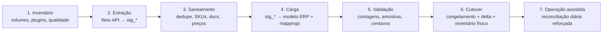

# 17 — Migração de Dados

> **Status:** Em revisão · **Última atualização:** 2026-07-03 · **Responsável:** migration-specialist
> **Regras:** BR-706 · **Fase:** Gate 01 (executada antes do Gate 02) · **ADR:** [0010](../27-ADR/ADR-0010-migracao-etl.md) · **Documentos:** [Plano de cutover](01-plano-de-cutover.md)

## 1. Objetivo

Levar para o ERP o patrimônio de dados da empresa — produtos, categorias, clientes, pedidos históricos, imagens (referências), estoque — **a partir de uma única fonte: o WooCommerce** (via REST API). Após o cutover, o ERP controla os dados e o Woo apenas sincroniza.

> 📌 **Corrigido em 2026-07-25.** Este documento dizia "**duas fontes**:
> WooCommerce e banco MySQL do sistema desktop legado". O dono esclareceu
> que **o desktop nunca chegou a ser alimentado** — nunca entrou em
> operação, e não há dado algum nele. O que existe no repositório é o
> *código* do sistema, útil como referência de regras de negócio
> pretendidas, não como origem de dados.
>
> A migração fica **mais simples** do que o planejado: uma fonte, sem
> deduplicação cruzada entre sistemas e sem reconciliação de códigos. Em
> compensação, tudo que só existiria no desktop — clientes de balcão,
> pedidos de atacado, preços de atacado — **não existe em lugar nenhum**
> e terá de ser cadastrado do zero, se a empresa o praticar.

## 2. Princípios (BR-706, ADR-0010)

1. **Idempotente e re-executável**: rodar duas vezes não duplica nada (upsert por chave natural + `integration_mappings`).
2. **Staging isolado**: dados brutos caem em tabelas `stg_*`; só entram no modelo definitivo após saneamento validado.
3. **Dry-run em tudo**: todo comando tem `--dry-run` com relatório do que faria.
4. **Rejeição explícita**: registro que não passa nas regras vai para relatório de rejeições com motivo — nada é descartado silenciosamente.
5. **Auditável**: cada lote tem `import_batch` rastreável; números de controle conferidos (contagens origem × destino).

## 3. Fases



### F1 — Inventário (pré-requisito de tudo)
Contagens (produtos, variações, clientes, pedidos por ano), plugins do Woo (mapeamento pasta 16), qualidade: % produtos sem SKU, clientes duplicados por e-mail/doc, pedidos órfãos. Saída: relatório que **recalibra os NFRs** (pasta 03) e dimensiona o esforço de saneamento.

### F2 — Extração ✅ *catálogo implementado em 2026-07-25*
- Woo: paginação via REST (products, categories, customers, orders com `after`), incremental por `modified_after` nas re-execuções.

**Estado:** produtos e categorias prontos —
`php artisan erp:migrate:extract {produtos|categorias|tudo} [--dry-run] [--pagina=N]`.
Clientes e pedidos ficam para quando os módulos correspondentes
existirem. Código em `app/Modules/Integrations/WooCommerce/`.

Três coisas que a implementação obrigou a decidir:

- **As variações não vêm em `/products`.** O Woo as expõe por produto
  pai (`/products/{id}/variations`), então a extração faz uma chamada
  extra por produto variável — 39 no catálogo atual. Sem isso perderíamos
  as 77 variações, que pelo [ADR-0022](../27-ADR/ADR-0022-modelo-de-produto-e-sku.md)
  são produtos de pleno direito no ERP.
- **SKU vazio vira NULL** no staging. A origem manda string vazia em 716
  de 716; guardar como veio faria a triagem contar com `where('sku','')`,
  que é a pergunta certa escrita do jeito errado.
- **Trava de paginação.** A parada normal é a página vir incompleta, o
  que confia no servidor se comportar — e do outro lado há um WordPress
  com plugins não auditados. Um endpoint que ignore `page` giraria até
  estourar a memória; o limite (`WOO_MAX_PAGES`, mil por padrão) falha com
  mensagem em vez de travar. Não é hipótese: aconteceu no desenvolvimento
  e derrubou a suíte de testes.

**Credenciais:** `WOO_ENABLED`, `WOO_URL`, `WOO_KEY`, `WOO_SECRET` no
`.env` (ver `.env.example`). Permissão de **leitura** basta. A integração
nasce desligada de propósito.

#### Resultado da primeira extração real — 2026-07-27, produção

Rodada em produção (é lá que a carga vai acontecer, então é lá que o
staging precisa estar). 15 páginas de produtos, sem falha, precedida de
`--dry-run` com os mesmos números.

| Métrica | [Inventário](../31-Inventario-Legado/02-produtos.md) | Extraído | |
|---|---:|---:|:-:|
| `simple` | 677 | 677 | ✅ |
| `variable` | 39 | 39 | ✅ |
| `variation` | 77 | 77 | ✅ |
| **Total no staging** | — | **793** | |
| Sem SKU | 716 de 716 | 793 de 793 | ✅ |
| Sem peso | 46 | 46 | ✅ |
| Categorias | — | **48** | 🆕 |

**A conferência bateu em todas as linhas.** É a validação da F5 feita já
na F2: se a extração fosse infiel, seria aqui que apareceria.

**754 dos 793 têm preço** — e esse número não é coincidência. Os 39
`variable` são invólucros: no Woo o preço mora nas variações, não no pai.
Ou seja, os itens com preço são exatamente os que viram produto no ERP
(677 simples + 77 variações = **754**), e os 39 pais são descartados na
carga por não terem correspondente no nosso modelo
([ADR-0022](../27-ADR/ADR-0022-modelo-de-produto-e-sku.md)).

> 📌 **Correção de número:** o ADR-0022 estimou "aproximadamente 793
> linhas" para o catálogo do ERP, mas a fórmula que ele mesmo enuncia
> (716 − 39 + 77) dá **754** — e a medição confirma 754. O 793 é o total
> do *staging*, que guarda também os 39 invólucros. A decisão não muda;
> só o tamanho esperado do catálogo, para menos.
- ~~Legado: leitura direta do MySQL do desktop → `stg_legacy_*`~~ — **não se aplica** (2026-07-25): o desktop nunca foi alimentado. Não há `stg_legacy_*`, nem a exceção ao BR-701 que este item abria.

### F3 — Saneamento (onde a migração é ganha ou perdida)

> ✅ **Catálogo triado em 2026-07-27** —
> `php artisan erp:migrate:triage [--duplicados]`. Classifica o staging e
> propõe SKU e nome. **Nada é carregado**: a F4 só aceita o que estiver
> aprovado, porque a BR-002 torna o código imutável e errar ali é errar
> para sempre.

#### O que os dados contrariaram

A pasta 31 §04 diz que o eixo de variação é **cor e altura**. **Não é.**
Das 77 variações: **56 são composição de kit** (`pa_peca-kit-1`, com
preços e pesos próprios — 89,90 / 99,90 / 169,90) e **21 estão vazias**,
de anúncios que declaram cor como eixo e nunca materializaram as
variações. **Zero variações por cor.**

A cor existe, mas como atributo do próprio produto: 614 dos 716 a
declaram, quase todos com uma cor só — e esses já são "um produto, uma
cor", que é o que o [ADR-0022](../27-ADR/ADR-0022-modelo-de-produto-e-sku.md)
queria. O problema está nos ~20 anúncios "várias cores", que listam de 2
a 5 num produto só.

**Decisão do dono (2026-07-27):** nesses anúncios, **um anúncio vira um
produto**, com a cor como texto. Expandir cada cor em produto próprio só
faria sentido se a operação mantivesse peças pintadas em estoque.

#### A classificação não é uniforme por tipo do Woo

| Origem | Destino | Qtd |
|---|---|---:|
| `simple` | produto | 677 |
| `variable` cuja única variação é vazia | **o anúncio** vira produto | 21 |
| `variable` com variações reais | invólucro — descartado | 18 |
| `variation` com atributo | produto | 56 |
| `variation` vazia | descartada — o pai virou o produto | 21 |
| | **total no catálogo** | **754** |

Um `variable` vira produto **ou** é descartado conforme as variações dele
existirem de verdade. A regra da última linha existe porque é o pai que
carrega nome e anúncio; a variação vazia só empresta o preço.

#### Duas correções que só apareceram ao rodar

- **As variações de kit não herdam o nome do pai** — recebem o rótulo da
  opção. Carregado como veio, o catálogo teria 18 produtos chamados "KIT
  COMPLETO" e 11 "BUDA SIDARTA", cada um de um kit diferente, e a tela de
  venda mostraria linhas idênticas. A triagem compõe:
  `<peça> — KIT COMPLETO`, com as duas partes vindas da origem.
- **O relatório inflava o trabalho manual**, contando essas variações
  como títulos repetidos: acusava 88 produtos em 21 grupos quando a
  duplicata real são **37 em 14** — o mesmo número que o inventário
  achara por conta própria. Relatório que pede decisão humana onde não há
  destrói a confiança na ferramenta.

#### O que ainda espera decisão

| Pendência | Itens |
|---|---:|
| Anúncios repetidos (mesma peça recriada com cores diferentes) | 37 em 14 grupos |
| Sem peso | 35 |
| Sem preço | 21 |

SKUs propostos: `DA-0001` … `DA-0754`, em ordem estável de `woo_id` —
rodar a triagem de novo propõe os mesmos códigos, senão a conferência já
feita viraria lixo.
| Problema esperado | Tratamento |
|---|---|
| Produto sem SKU no Woo | gerar SKU proposto → **aprovação humana** em lote |
| Mesmo produto nas duas fontes | casar por SKU/nome; legado ganha em dados físicos (dimensões/embalagem), Woo em conteúdo (descrição/imagens) |
| Cliente duplicado (e-mail/doc) | merge com regra: doc válido > e-mail > mais recente; histórico consolidado |
| CPF/CNPJ inválido | manter cliente, marcar pendência fiscal (bloqueia NF-e futura, não a migração) |
| Preço float com dízima | arredondamento + relatório de diferenças > R$ 0,01 |
| Categoria órfã/duplicada | árvore consolidada com de-para |

### F4 — Carga ✅ *catálogo carregado em 2026-07-27, produção*

`erp:migrate:approve [--completos] [--sku=] [--desfazer]` → `erp:migrate:load`.
Idempotente por `integration_mappings` (BR-704/BR-706): recarregar
atualiza, então corrigir o staging não exige limpar o catálogo.

| Resultado | |
|---|---:|
| Produtos no catálogo | **754** |
| Categorias | 48 |
| Preços de varejo | 733 |
| Sem peso | 38 |
| Sem preço de varejo | 21 |
| Sem preço de atacado | 754 |

Os 754 SKUs `DA-0001 … DA-0754` foram aprovados pelo dono antes da carga
e são **imutáveis** a partir daqui (BR-002).

#### Três conversões que os dados obrigaram

- **Peso: quilos → gramas.** O Woo guarda em kg, o ERP em g. Sem
  converter, uma peça de 450 g entraria pesando meio grama.
- **Peso implausível recusado.** Três produtos trazem `970` num campo em
  quilos — gramas digitadas no lugar errado. Carregar 970 kg produziria
  frete absurdo **em silêncio**; o peso fica nulo e o produto aparece no
  relatório de cadastro incompleto. Daí 38 sem peso, e não 35: 35 vieram
  vazios da origem e 3 foram recusados aqui.
- **Cor vem em dois formatos.** O produto lista as possíveis em `options`
  (plural); a variação traz a escolhida em `option` (singular). Ler só um
  perderia metade dos casos.

#### O que o catálogo herdou, e é decisão humana resolver

Os 37 anúncios repetidos entraram como 37 produtos, conforme a decisão de
2026-07-27 (um anúncio, um produto). O par mais próximo é `DA-0001` e
`DA-0008` — o mesmo trio, na mesma cor (*rosa e capuccino*), na mesma
categoria `Trio da Sabedoria`. Fundir é arquivar o repetido, e o
relatório "produtos com nome repetido" ([pasta 20 §3.1](../20-Relatorios/README.md))
existe para achá-los.

> 📌 **Correção de 2026-07-27.** Este parágrafo dizia `DA-0001` e
> `DA-0002`, "em categorias diferentes". Os dois números estavam errados:
> `DA-0002` é o mesmo trio em **outra cor** (*rosa e preto*), não uma
> duplicata, e a duplicata real de `DA-0001` está na **mesma** categoria.
> Os SKUs saem em ordem de `woo_id`, e os dois anúncios repetidos são
> 1177 e 1201 — oito posições de distância, não uma.

Onde a duplicata se concentra, medido na origem:

| Categoria | Grupos | Produtos |
|---|---:|---:|
| Trio da Sabedoria | 7 | 16 |
| Incensários Cascata | 4 | 13 |
| Incensários Vareta | 1 | 3 |
| BUDAS | 1 | 3 |
| ELEFANTES | 1 | 2 |
| **total** | **14** | **37** |

**Todos os 14 grupos duplicam dentro da mesma categoria** — nenhum está
partido entre duas, o que torna a conferência uma comparação de fotos
lado a lado dentro de uma lista só.

#### A categoria canônica saiu errada em 34 produtos — corrigido em 2026-07-27

A primeira carga tomava a **primeira** categoria que a API listasse, e a
API não ordena por relevância. Medido em produção depois da carga:

| Categoria no ERP | Produtos | O que ela é de verdade |
|---|---:|---|
| DIA DAS MÃES | 15 | campanha sazonal |
| Home Kits | 8 | bloco da home |
| Home Trios Da Sabedoria | 8 | bloco da home |
| Home Lançamentos | 2 | bloco da home |
| HOME SITE | 1 | raiz da vitrine |
| **total** | **34** | |

É o [RC-06](../31-Inventario-Legado/15-recomendacoes.md) entrando pela
porta dos fundos: o inventário previu que merchandising contaminaria a
árvore, e a carga não filtrou. A regra de escolha passou a ser a da
[pasta 32 §3.4](../32-Catalogo/README.md) — descarta vitrine, prefere a
mais profunda. Nenhum dos 34 fica órfão: todos têm categoria temática
disponível na origem.

### F4 — Carga (planejamento original)
Ordem por dependência: categorias → produtos+imagens(refs)+preços → clientes+endereços → pedidos históricos (com snapshot de preço original; itens de produto extinto apontam para produto `archived`) → financeiro histórico **não** é migrado (somente pedidos; saldo financeiro abre zerado no Gate 04 — decisão registrada).

### F5 — Validação ✅ *ferramenta pronta em 2026-07-27*

`php artisan erp:migrate:validate [--amostra=30]`. Confere o catálogo
contra a origem em duas frentes e **sai com erro** se algo divergir, para
não passar batido:

1. **Contagens** — aprovados na triagem × mapeados no catálogo. Têm de
   ser iguais.
2. **Amostra estável, campo a campo** — nome, preço de varejo, peso, cor
   e categoria. O esperado é **re-derivado da origem por uma
   implementação independente** da carga: se a validação chamasse os
   mesmos métodos de `LoadWooCatalog`, um bug de conversão passaria nos
   dois lados e a conferência daria verde sobre erro. Cada linha traz o
   `woo #id` para conferência a olho no site.

A amostra é **determinística** (espaçada por SKU): rodar de novo devolve
os mesmos produtos — conferência assinada não depende de sorteio.

> **Cobertura da amostra:** o comando confere o que a carga transformou
> (kg→g, preço, cor, categoria canônica). A conferência de **clientes** e
> **pedidos** (30/20/20 do plano original) fica para quando esses forem
> migrados — hoje só o catálogo entrou. Σ de pedidos por ano idem.

#### ✅ F5 executada e assinada — 2026-07-28, produção

```
aprovados na triagem ... 754
mapeados no catálogo ... 754   → contagens batem
Amostra estável de 30 produtos, conferida campo a campo:
  30 ✓  ·  0 divergências
```

**Assinada pelo dono (Diego) em 2026-07-28.** A amostra determinística
cobriu os três casos que a triagem criou — produto simples, variação de
kit (`DA-0426 … — KIT COMPLETO`, `DA-0526 … — BUDA SIDARTA`, nome composto
como manda a F3) e anúncio "várias cores" (`DA-0251`) — e nenhum divergiu
da origem. É o **último critério de saída do Gate 01**: dados migrados
validados e assinados.

A fidelidade da extração já fora conferida na F2 (contagens bateram com o
inventário linha a linha); esta foi a conferência humana por cima.

*Critérios originais:* contagens batem (origem × stg × destino) · amostra
conferida manualmente · Σ totais de pedidos por ano batem com relatório
Woo · zero rejeições não-triadas.

### F6 — Cutover → [plano detalhado](01-plano-de-cutover.md)
Inclui **inventário físico completo** para o estoque inicial (nem legado nem Woo são confiáveis — pasta 09) e ativação da sincronização (pasta 16).

## 4. Ferramental

Comandos Artisan (`erp:migrate:inventory-report`, `erp:migrate:extract {fonte}`, `erp:migrate:load {entidade} [--dry-run]`, `erp:migrate:validate`) — documentados pela skill `importador-woocommerce`. Execução em lotes pequenos retomáveis (limites de shared hosting, pasta 03).

## 5. Riscos

| Risco | Prob. | Impacto | Mitigação |
|---|---|---|---|
| Qualidade dos dados pior que o esperado | Alta | Alto | F1 mede antes; saneamento com aprovação humana; prazo do Gate 01 assume folga |
| Migrar estoque errado | Certa (se confiar nas fontes) | Alto | Inventário físico no cutover — inegociável |
| Pedidos históricos com produtos deletados no Woo | Alta | Baixo | produto `archived` placeholder preserva o histórico |
| Re-execução duplicar dados | Baixa | Alto | idempotência testada com teste automatizado (rodar 2× no CI) |

## 6. Evoluções futuras

- O mesmo pipeline (stg_* + upsert + relatórios) é reutilizado para futuras importações em massa (tabela de preços, catálogo de marketplace).
