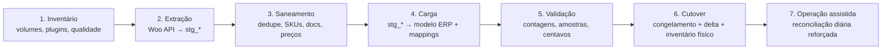

# 17 — Migração de Dados

> **Status:** Em revisão · **Última atualização:** 2026-07-03 · **Responsável:** migration-specialist
> **Regras:** BR-706 · **Fase:** Gate 01 (executada antes do Gate 02) · **ADR:** [0010](../27-ADR/ADR-0010-migracao-etl.md) · **Documentos:** [Plano de cutover](01-plano-de-cutover.md)

## 1. Objetivo

Levar para o ERP o patrimônio de dados da empresa — produtos, categorias, clientes, pedidos históricos, imagens (referências), estoque — **a partir de uma única fonte: o WooCommerce** (via REST API). Após o cutover, o ERP controla os dados e o Woo apenas sincroniza.

> 📌 **Corrigido em 2026-07-25.** Este documento dizia "**duas fontes**:
> WooCommerce e banco MySQL do sistema desktop legado". O dono esclareceu
> que **o desktop nunca chegou a ser alimentado** — nunca entrou em
> operação, e não há dado algum nele. O que existe no repositório é o
> *código* do sistema, útil como referência de regras de negócio
> pretendidas, não como origem de dados.
>
> A migração fica **mais simples** do que o planejado: uma fonte, sem
> deduplicação cruzada entre sistemas e sem reconciliação de códigos. Em
> compensação, tudo que só existiria no desktop — clientes de balcão,
> pedidos de atacado, preços de atacado — **não existe em lugar nenhum**
> e terá de ser cadastrado do zero, se a empresa o praticar.

## 2. Princípios (BR-706, ADR-0010)

1. **Idempotente e re-executável**: rodar duas vezes não duplica nada (upsert por chave natural + `integration_mappings`).
2. **Staging isolado**: dados brutos caem em tabelas `stg_*`; só entram no modelo definitivo após saneamento validado.
3. **Dry-run em tudo**: todo comando tem `--dry-run` com relatório do que faria.
4. **Rejeição explícita**: registro que não passa nas regras vai para relatório de rejeições com motivo — nada é descartado silenciosamente.
5. **Auditável**: cada lote tem `import_batch` rastreável; números de controle conferidos (contagens origem × destino).

## 3. Fases

### F1 — Inventário (pré-requisito de tudo)
Contagens (produtos, variações, clientes, pedidos por ano), plugins do Woo (mapeamento pasta 16), qualidade: % produtos sem SKU, clientes duplicados por e-mail/doc, pedidos órfãos. Saída: relatório que **recalibra os NFRs** (pasta 03) e dimensiona o esforço de saneamento.

### F2 — Extração ✅ *catálogo implementado em 2026-07-25*
- Woo: paginação via REST (products, categories, customers, orders com `after`), incremental por `modified_after` nas re-execuções.

**Estado:** produtos e categorias prontos —
`php artisan erp:migrate:extract {produtos|categorias|tudo} [--dry-run] [--pagina=N]`.
Clientes e pedidos ficam para quando os módulos correspondentes
existirem. Código em `app/Modules/Integrations/WooCommerce/`.

Três coisas que a implementação obrigou a decidir:

- **As variações não vêm em `/products`.** O Woo as expõe por produto
  pai (`/products/{id}/variations`), então a extração faz uma chamada
  extra por produto variável — 39 no catálogo atual. Sem isso perderíamos
  as 77 variações, que pelo [ADR-0022](../27-ADR/ADR-0022-modelo-de-produto-e-sku.md)
  são produtos de pleno direito no ERP.
- **SKU vazio vira NULL** no staging. A origem manda string vazia em 716
  de 716; guardar como veio faria a triagem contar com `where('sku','')`,
  que é a pergunta certa escrita do jeito errado.
- **Trava de paginação.** A parada normal é a página vir incompleta, o
  que confia no servidor se comportar — e do outro lado há um WordPress
  com plugins não auditados. Um endpoint que ignore `page` giraria até
  estourar a memória; o limite (`WOO_MAX_PAGES`, mil por padrão) falha com
  mensagem em vez de travar. Não é hipótese: aconteceu no desenvolvimento
  e derrubou a suíte de testes.

**Credenciais:** `WOO_ENABLED`, `WOO_URL`, `WOO_KEY`, `WOO_SECRET` no
`.env` (ver `.env.example`). Permissão de **leitura** basta. A integração
nasce desligada de propósito.
- ~~Legado: leitura direta do MySQL do desktop → `stg_legacy_*`~~ — **não se aplica** (2026-07-25): o desktop nunca foi alimentado. Não há `stg_legacy_*`, nem a exceção ao BR-701 que este item abria.

### F3 — Saneamento (onde a migração é ganha ou perdida)
| Problema esperado | Tratamento |
|---|---|
| Produto sem SKU no Woo | gerar SKU proposto → **aprovação humana** em lote |
| Mesmo produto nas duas fontes | casar por SKU/nome; legado ganha em dados físicos (dimensões/embalagem), Woo em conteúdo (descrição/imagens) |
| Cliente duplicado (e-mail/doc) | merge com regra: doc válido > e-mail > mais recente; histórico consolidado |
| CPF/CNPJ inválido | manter cliente, marcar pendência fiscal (bloqueia NF-e futura, não a migração) |
| Preço float com dízima | arredondamento + relatório de diferenças > R$ 0,01 |
| Categoria órfã/duplicada | árvore consolidada com de-para |

### F4 — Carga
Ordem por dependência: categorias → produtos+imagens(refs)+preços → clientes+endereços → pedidos históricos (com snapshot de preço original; itens de produto extinto apontam para produto `archived`) → financeiro histórico **não** é migrado (somente pedidos; saldo financeiro abre zerado no Gate 04 — decisão registrada).

### F5 — Validação
Contagens batem (origem × stg × destino) · amostra de 30 produtos/20 clientes/20 pedidos conferida manualmente · Σ totais de pedidos por ano batem com relatório Woo (tolerância de centavos documentada) · zero rejeições não-triadas.

### F6 — Cutover → [plano detalhado](01-plano-de-cutover.md)
Inclui **inventário físico completo** para o estoque inicial (nem legado nem Woo são confiáveis — pasta 09) e ativação da sincronização (pasta 16).

## 4. Ferramental

Comandos Artisan (`erp:migrate:inventory-report`, `erp:migrate:extract {fonte}`, `erp:migrate:load {entidade} [--dry-run]`, `erp:migrate:validate`) — documentados pela skill `importador-woocommerce`. Execução em lotes pequenos retomáveis (limites de shared hosting, pasta 03).

## 5. Riscos

| Risco | Prob. | Impacto | Mitigação |
|---|---|---|---|
| Qualidade dos dados pior que o esperado | Alta | Alto | F1 mede antes; saneamento com aprovação humana; prazo do Gate 01 assume folga |
| Migrar estoque errado | Certa (se confiar nas fontes) | Alto | Inventário físico no cutover — inegociável |
| Pedidos históricos com produtos deletados no Woo | Alta | Baixo | produto `archived` placeholder preserva o histórico |
| Re-execução duplicar dados | Baixa | Alto | idempotência testada com teste automatizado (rodar 2× no CI) |

## 6. Evoluções futuras

- O mesmo pipeline (stg_* + upsert + relatórios) é reutilizado para futuras importações em massa (tabela de preços, catálogo de marketplace).
