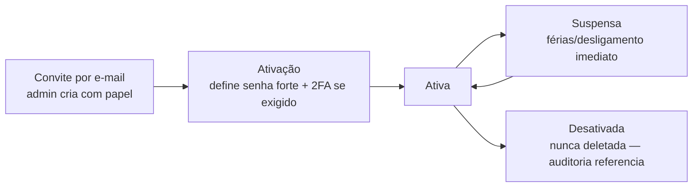

# 18 — Usuários

> **Status:** ✅ **Implementado** — model, ciclo de vida, telas de gestão, middlewares, política de senha, trilha de segurança, 2FA TOTP e convite por e-mail com ativação · **Última atualização:** 2026-07-24 · **Responsável:** security-specialist
> **Fase:** Gate 01 · **ADR:** 0005 (Sanctum), [0021](../27-ADR/ADR-0021-2fa-totp.md) (2FA TOTP) · Permissões: [pasta 19](../19-Permissoes/README.md)
> **Código:** `app/Modules/Identity/` · telas em `resources/js/pages/identity/` · testes em `tests/Feature/Identity/`

## 1. Objetivo

Definir personas, ciclo de vida de contas e autenticação do ERP — quem usa o sistema, como entra e como perde acesso.

## 2. Personas

| Persona | Papel (pasta 19) | Usa principalmente | Particularidades |
|---|---|---|---|
| Dono/Gestão (Diego) | `admin` | tudo + dashboards | 2FA obrigatório (BR-804) |
| Produção (artesãs/pintoras) | `production` | apontamento de OPs, tablet no ateliê | login simples, sessão longa no dispositivo do ateliê, UI de toque |
| Vendas/Atendimento | `sales` | pedidos, clientes, separação | balcão: velocidade |
| Expedição | `fulfillment` | separação, embalagem, etiquetas, rastreio | pode ser a mesma pessoa de vendas (papéis acumuláveis) |
| Financeiro | `finance` | títulos, baixas, fluxo de caixa | 2FA obrigatório |
| Contador (externo) | `accountant` | fiscal/relatórios **somente leitura** (BR-803) | conta nominal, expira anualmente, sem dados além do fiscal |

## 3. Ciclo de vida da conta

### 3.1 Estado implementado (2026-07-23)

O enum `UserStatus` materializa o diagrama acima e **é ele que decide o
login**: `canAuthenticate()` só é verdadeiro em `Active`. Suspender
alguém precisa barrar a entrada, não apenas sinalizar na tela.

| Estado | Autentica? | Vai para |
|---|:-:|---|
| `invited` — criada, senha ainda não definida | ❌ | `active`, `disabled` |
| `active` | ✅ | `suspended`, `disabled` |
| `suspended` — férias, afastamento | ❌ | `active`, `disabled` |
| `disabled` — desligamento | ❌ | **nenhum (terminal)** |

`disabled` é terminal por decisão: reativar uma conta desligada
ressuscitaria um acesso que alguém decidiu encerrar. Quem volta à
empresa recebe conta nova — a antiga permanece para a auditoria
referenciar (BR-008).

Campos acrescentados a `users` na mesma migration: `public_id` (ULID, é
o route key — o `id` sequencial não sai daqui), `two_factor_secret` e
`two_factor_recovery_codes` (cifrados em repouso, **fora de `$fillable`**
para que nenhum campo escondido de formulário os alcance),
`two_factor_confirmed_at`, `password_changed_at`, `must_change_password`
e `last_login_at`.

### 3.2 Convite e ativação (implementado em 2026-07-24)

1. Um admin cria a conta pela tela de usuários. Ela nasce `invited`, com
   **senha aleatória que ninguém conhece** — senha nunca transita por
   e-mail, console ou conversa.
2. A notificação `ConviteDeAcesso` sai **pela fila** com um link de
   definição de senha. O token é o do mesmo mecanismo de "esqueci minha
   senha": uso único e com prazo, já existente e já testado. Inventar um
   token de convite paralelo seria uma segunda chance de errar o mesmo
   problema.
3. A pessoa define a senha (política completa da §3.5 — 12 caracteres e
   checagem de vazamento).
4. **Definir a senha é a ativação**: `invited → active`, pelo
   `ChangeUserStatusService`, o que valida a transição e deixa
   `user.status_changed` na trilha da pasta 26.
5. Se o papel exigir 2FA (BR-804), o middleware `2fa.confirmado` conduz à
   configuração no primeiro acesso.

> **O elo que faltava.** Até 2026-07-24 os passos 2 e 4 não existiam. O
> efeito não era "o convite não chega": era um **laço fechado**. A pessoa
> definia a senha, tentava entrar, e o middleware `conta.ativa` a
> expulsava com "Esta conta ainda não foi ativada. Verifique o convite
> enviado por e-mail" — mandando-a justamente ao e-mail que não resolvia
> nada. Só um admin, mudando o status à mão, destravava. O diagrama acima
> sempre descreveu a ativação ao definir a senha; faltava alguém
> executá-la.

**Redefinição de senha não reativa conta suspensa.** Só `invited` é
promovido. Quem foi suspenso não volta pedindo "esqueci minha senha" —
reativar é decisão de quem administra, e o enum recusaria a transição de
qualquer forma.

**Pré-requisitos de produção:** SMTP configurado (`MAIL_*`) e o worker de
fila agendado — ver [runbook 04](../23-Deploy/04-atualizar-producao.md).
Sem o worker, a notificação fica parada na tabela `jobs` em silêncio, e o
primeiro sintoma seria alguém perguntando por que o convite nunca chegou.

### 3.2 Os dois middlewares que fazem as regras valerem

Sem eles, `status` e `must_change_password` seriam colunas escritas por
quem cria a conta e lidas por ninguém.

| Alias | Classe | O que garante |
|---|---|---|
| `conta.ativa` | `EnsureAccountIsActive` | Só `active` opera. **Derruba a sessão já aberta** de quem foi suspenso — uma checagem apenas no login deixaria a pessoa desligada trabalhando até o cookie expirar, que é exatamente o cenário que a suspensão existe para impedir |
| `senha.trocada` | `EnsurePasswordIsChanged` | Prende na tela de troca quem ainda usa a senha provisória. Só `logout` e a própria tela de troca escapam, senão o redirecionamento seria circular |

Aplicados a **todas** as rotas autenticadas — dashboard, configurações e
as do próprio módulo.

### 3.3 A política de senha, em um lugar só (2026-07-24)

Mínimo de **12 caracteres** e recusa de senha que já apareceu em
vazamento — `Password::min(12)->uncompromised()`, que consulta o
HaveIBeenPwned por k-anonymity (só os cinco primeiros caracteres do hash
SHA-1 saem daqui, nunca a senha).

A regra vive em `App\Modules\Identity\Rules\PasswordPolicy` porque **ela
estava valendo pela metade**: a troca obrigatória exigia os 12 com
verificação, e a tela de configurações do starter kit aceitava o
`Password::defaults()` — 8 caracteres, sem checagem. Quem trocasse a
senha por configurações escapava da regra que este documento afirma, e
nada reprovava. Na mesma correção, aquele caminho passou a preencher
`password_changed_at`, que ficava mentindo sobre há quanto tempo a senha
era a mesma.

Toda troca dispara `PasswordChanged` e vira linha na trilha da
[pasta 26](../26-Auditoria/README.md): `password` está em `$auditExclude`
— e deve continuar —, então sem esse evento a troca de senha não deixaria
rastro em lugar nenhum.

### 3.4 Não existe autoexclusão de conta (2026-07-24)

O starter kit trazia "excluir minha conta" nas configurações. **Foi
removida** — rota, controller, componente e tela.

O diagrama acima não tem estado "excluído": conta se encerra em
`disabled`, que é terminal, e a decisão é de um admin. Autoexclusão
contradiz isso de duas formas — dá ao próprio usuário o poder de encerrar
o que a pasta 19 reserva a `users.manage`, e apaga a linha que a
auditoria referencia (BR-008).

Foi a trilha de segurança que reprovou a funcionalidade, não uma revisão:
a FK de `security_events` para `users` é `RESTRICT`, e o teste do starter
kit quebrou ao tentar apagar um usuário que já tinha eventos. O teste que
o substituiu prova que a rota **não voltou** — uma atualização do starter
kit poderia trazê-la de volta em silêncio.

### 3.5 Proteção do próprio autor

Ninguém altera os próprios papéis nem a própria situação. Sem isso,
qualquer pessoa com `users.manage` poderia se promover a admin — e a
permissão deixaria de ser fronteira — ou se suspender, trancando-se do
lado de fora num sistema onde `users.manage` pode estar com uma só
pessoa.

Isso exigiu excluir `changeStatus` e `assignRoles` do atalho
`Gate::before` do admin (ver [pasta 19 §5.1](../19-Permissoes/README.md)):
o atalho roda **antes** das Policies e curto-circuitaria a decisão.

- Contas são **nominais e individuais** — proibido usuário compartilhado "producao" (auditoria sem valor caso contrário). Tablet do ateliê: cada artesã tem PIN/troca rápida de usuário (fase 3 avalia UX específica).
- Desligamento: suspensão imediata via painel (runbook de offboarding: suspender conta + revogar tokens + trocar segredos compartilhados se houver).
- Senhas: mínimo 12 caracteres, verificação contra vazadas (validação `uncompromised`), armazenadas com Argon2id. Reset por e-mail com token de uso único. **Sem regra de composição obrigatória** (maiúscula + minúscula + número + especial) — e isso é deliberado, não esquecimento: o NIST SP 800-63B desaconselha composição justamente porque ela empurra todo mundo para o mesmo padrão previsível (`Nome123!`), sem ganho real de entropia, enquanto o comprimento entrega o ganho de verdade. Reduzir para 8 **com** composição seria uma senha mais fraca com aparência de mais rigorosa. Confirmado pelo dono em 2026-07-24, depois de considerar a troca. O controle que nenhuma regra de composição substitui é o `uncompromised`: senha já vazada é senha pública, por mais bem-formada que seja.
- 2FA: TOTP (app autenticador) para `admin`/`finance` (BR-804); recomendado aos demais — implementado, ver §3.6. **Nunca por e-mail**, nem como alternativa ao TOTP: o e-mail já é o canal de recuperação de senha, então um OTP por e-mail colocaria os dois fatores no mesmo inbox — quem comprometesse a caixa postal teria a senha (via reset) e o "segundo fator" pelo mesmo caminho, e o segundo fator deixaria de ser um segundo fator. Vale mesmo com SMTP disponível: ter o canal funcionando (a partir de 2026-07-24) não muda o raciocínio, só torna a tentação maior. Decidido no [ADR-0021](../27-ADR/ADR-0021-2fa-totp.md) e reconfirmado pelo dono na mesma data.
- Sessões: cookie Sanctum SameSite=Lax, expiração 12 h (renovável), logout em todos os dispositivos disponível ao usuário e ao admin.

### 3.6 Segundo fator TOTP (implementado em 2026-07-24)

Decisão e alternativas no [ADR-0021](../27-ADR/ADR-0021-2fa-totp.md).
Código em `app/Modules/Identity/`, telas em
`resources/js/pages/identity/two-factor*.tsx`, testes em
`tests/Feature/Identity/DoisFatoresTest.php`.

**Configurar** (`/dois-fatores`): gerar o segredo abre o QR mas **não
ativa nada** — só a confirmação com um código do aplicativo ativa. A
separação existe para que abrir a tela e desistir seja inofensivo; se
gerar já ativasse, fechar o navegador no meio trancaria a pessoa do lado
de fora, sem aplicativo configurado e com o 2FA já exigido. Os oito
códigos de recuperação (formato do Fortify: dois blocos de 10 caracteres
separados por hífen) aparecem **uma única vez**, logo após a confirmação.

**Obrigatoriedade** (BR-804): o middleware `2fa.confirmado` redireciona
para a configuração quem tem papel `admin`/`finance` e ainda não
confirmou. **Sem prazo de carência** — um prazo é o mecanismo clássico
pelo qual "2FA obrigatório" nunca chega a ser ativado. Não é lockout: a
tela de configuração fica sempre alcançável. A cadeia de middlewares é
`conta.ativa` → `senha.trocada` → `2fa.confirmado`; não se configura 2FA
ainda com a senha provisória.

**Entrar:** acertar a senha não abre sessão para quem usa 2FA — o id fica
num limbo de sessão por 5 minutos e a pessoa vai para `/entrar/dois-fatores`.
Só o segundo fator correto chama `Auth::login()`. É por isso que
`login.ok` na trilha (pasta 26) significa "entrou", e não "acertou a
senha". Cinco tentativas por minuto; estourar derruba o desafio pendente
e devolve ao login completo.

**Códigos de recuperação:** oito, uso único, repostos um a um (sempre
oito válidos). Renovar todos exige a senha atual, mesmo padrão da troca
de senha.

**Lembrar deste dispositivo por 30 dias:** oferecido **só** depois de um
TOTP válido — nunca depois de um código de recuperação, que é justamente
o caminho de "perdi o celular". Cookie `HttpOnly`/`Secure`/`SameSite=Lax`
com par `device_id|token`, e o banco guarda só o **hash** do token, em
`two_factor_remembered_devices`. Os 30 dias contam da confirmação, não do
último uso: renovar a cada acesso daria vida perpétua a um cookie
roubado.

> ⚠️ **O que isso custa, dito sem eufemismo** ([ADR-0021](../27-ADR/ADR-0021-2fa-totp.md),
> consequências negativas): um cookie destes, roubado, equivale a entrar
> sem segundo fator até vencer. A mitigação é **revogar**, não prevenir —
> por isso a confiança é apagada ao trocar a senha (por qualquer
> caminho, inclusive o reset por e-mail), ao desativar ou reconfigurar o
> 2FA, e pelo botão "esquecer todos os dispositivos". O prazo de 30 dias
> foi decidido pelo dono; mudá-lo é decisão dele.

## 4. Dependências

Pasta 19 (papéis/permissões) · pasta 25 (política de senhas/segredos) · pasta 26 (auditoria de login/ações). Eventos `UserLoggedIn`/`PermissionDenied` alimentam a trilha de segurança.

## 5. Boas práticas

- Primeira conta (admin) criada por seeder com troca de senha forçada.
  **Implementado** em `AdminInicialSeeder`: a senha vem de
  `ADMIN_INICIAL_SENHA` ou é sorteada e impressa uma única vez no console
  do deploy — nunca fica no código nem no log da aplicação. Reexecutar o
  seeder num banco que já tem admin não redefine a senha de ninguém.
- E-mails transacionais de segurança (novo login de dispositivo desconhecido — fase 2).
- Nunca logar senha/token em nenhum nível de log.

## 6. Riscos

| Risco | Mitigação |
|---|---|
| Conta compartilhada na prática | Troca rápida de usuário no tablet; auditoria exibe autor em toda tela (pressão social positiva) |
| Contador com acesso além do necessário | Papel `accountant` testado com testes de autorização (pasta 22) |

## 7. Evoluções futuras

- SSO/Passkeys (fase 7, se a equipe crescer).
- Portal do cliente atacado (consulta de pedidos) — fase 7, com escopo de auth separado.
