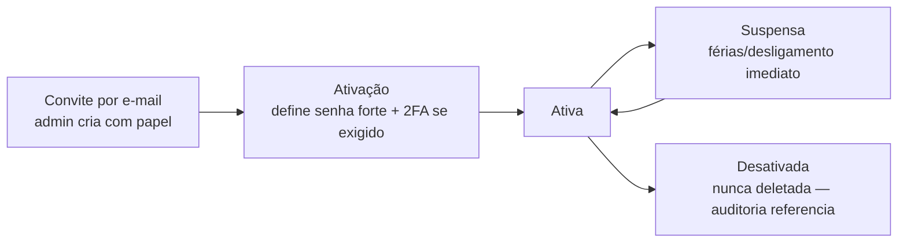

# 18 — Usuários

> **Status:** 🟡 **Parcialmente implementado** — model, ciclo de vida e admin inicial prontos; convite, 2FA e telas pendentes · **Última atualização:** 2026-07-23 · **Responsável:** security-specialist
> **Fase:** Gate 01 · **ADR:** 0005 (Sanctum) · Permissões: [pasta 19](../19-Permissoes/README.md)
> **Código:** `app/Modules/Identity/Models/User.php` · `app/Modules/Identity/Enums/UserStatus.php` · `database/seeders/Identity/AdminInicialSeeder.php`

## 1. Objetivo

Definir personas, ciclo de vida de contas e autenticação do ERP — quem usa o sistema, como entra e como perde acesso.

## 2. Personas

| Persona | Papel (pasta 19) | Usa principalmente | Particularidades |
|---|---|---|---|
| Dono/Gestão (Diego) | `admin` | tudo + dashboards | 2FA obrigatório (BR-804) |
| Produção (artesãs/pintoras) | `production` | apontamento de OPs, tablet no ateliê | login simples, sessão longa no dispositivo do ateliê, UI de toque |
| Vendas/Atendimento | `sales` | pedidos, clientes, separação | balcão: velocidade |
| Expedição | `fulfillment` | separação, embalagem, etiquetas, rastreio | pode ser a mesma pessoa de vendas (papéis acumuláveis) |
| Financeiro | `finance` | títulos, baixas, fluxo de caixa | 2FA obrigatório |
| Contador (externo) | `accountant` | fiscal/relatórios **somente leitura** (BR-803) | conta nominal, expira anualmente, sem dados além do fiscal |

## 3. Ciclo de vida da conta

### 3.1 Estado implementado (2026-07-23)

O enum `UserStatus` materializa o diagrama acima e **é ele que decide o
login**: `canAuthenticate()` só é verdadeiro em `Active`. Suspender
alguém precisa barrar a entrada, não apenas sinalizar na tela.

| Estado | Autentica? | Vai para |
|---|:-:|---|
| `invited` — criada, senha ainda não definida | ❌ | `active`, `disabled` |
| `active` | ✅ | `suspended`, `disabled` |
| `suspended` — férias, afastamento | ❌ | `active`, `disabled` |
| `disabled` — desligamento | ❌ | **nenhum (terminal)** |

`disabled` é terminal por decisão: reativar uma conta desligada
ressuscitaria um acesso que alguém decidiu encerrar. Quem volta à
empresa recebe conta nova — a antiga permanece para a auditoria
referenciar (BR-008).

Campos acrescentados a `users` na mesma migration: `public_id` (ULID, é
o route key — o `id` sequencial não sai daqui), `two_factor_secret` e
`two_factor_recovery_codes` (cifrados em repouso, **fora de `$fillable`**
para que nenhum campo escondido de formulário os alcance),
`two_factor_confirmed_at`, `password_changed_at`, `must_change_password`
e `last_login_at`.

- Contas são **nominais e individuais** — proibido usuário compartilhado "producao" (auditoria sem valor caso contrário). Tablet do ateliê: cada artesã tem PIN/troca rápida de usuário (fase 3 avalia UX específica).
- Desligamento: suspensão imediata via painel (runbook de offboarding: suspender conta + revogar tokens + trocar segredos compartilhados se houver).
- Senhas: mínimo 12 caracteres, verificação contra vazadas (validação `uncompromised`), armazenadas com Argon2id. Reset por e-mail com token de uso único.
- 2FA: TOTP (app autenticador) para `admin`/`finance` (BR-804); recomendado aos demais.
- Sessões: cookie Sanctum SameSite=Lax, expiração 12 h (renovável), logout em todos os dispositivos disponível ao usuário e ao admin.

## 4. Dependências

Pasta 19 (papéis/permissões) · pasta 25 (política de senhas/segredos) · pasta 26 (auditoria de login/ações). Eventos `UserLoggedIn`/`PermissionDenied` alimentam a trilha de segurança.

## 5. Boas práticas

- Primeira conta (admin) criada por seeder com troca de senha forçada.
  **Implementado** em `AdminInicialSeeder`: a senha vem de
  `ADMIN_INICIAL_SENHA` ou é sorteada e impressa uma única vez no console
  do deploy — nunca fica no código nem no log da aplicação. Reexecutar o
  seeder num banco que já tem admin não redefine a senha de ninguém.
- E-mails transacionais de segurança (novo login de dispositivo desconhecido — fase 2).
- Nunca logar senha/token em nenhum nível de log.

## 6. Riscos

| Risco | Mitigação |
|---|---|
| Conta compartilhada na prática | Troca rápida de usuário no tablet; auditoria exibe autor em toda tela (pressão social positiva) |
| Contador com acesso além do necessário | Papel `accountant` testado com testes de autorização (pasta 22) |

## 7. Evoluções futuras

- SSO/Passkeys (fase 7, se a equipe crescer).
- Portal do cliente atacado (consulta de pedidos) — fase 7, com escopo de auth separado.
