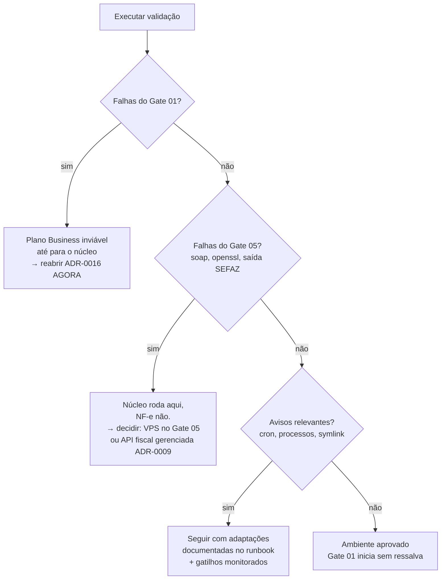

# 01 — Validação do Ambiente (plano Business)

> **Status:** Em revisão — **aguardando execução** · **Última atualização:** 2026-07-22 · **Responsável:** devops-specialist
> **ADRs relacionados:** [ADR-0016](../27-ADR/ADR-0016-hospedagem.md) (hospedagem — Plano B aceito), [ADR-0014](../27-ADR/ADR-0014-fila-database.md), [ADR-0009](../27-ADR/ADR-0009-emissao-nfe.md)
> **Quando:** **semana 1 do Gate 01** — antes de qualquer código · **Script:** [`validar-ambiente.php`](validar-ambiente.php)

## 1. Objetivo

Provar, **antes de escrever código**, que o plano Hostinger Business suporta os Gates 01 a 06 — em especial o Gate 05 (emissão de NF-e), que é de longe o mais exigente quanto a extensões, tempo de execução e conectividade de saída.

## 2. Por que isto virou urgente

O [ADR-0016](../27-ADR/ADR-0016-hospedagem.md) original agendava esta validação para *"antes do Gate 05"*. Duas decisões de 2026-07-22 anteciparam o prazo:

1. **O escopo contratado é o completo** (Gates 01–06) — a emissão de NF-e é entrega obrigatória, não opcional.
2. **A hospedagem escolhida é a compartilhada** — justamente a que o ADR classificou como ⚠️ para NF-e.

Somadas, essas duas escolhas criam um cenário simples de enunciar: **se este ambiente não puder assinar e transmitir uma NF-e, o contrato não pode ser cumprido nele.** Descobrir isso no Gate 05, com ~1.800 h investidas, seria catastrófico. Descobrir agora custa uma hora.

Não se trata de reabrir a decisão do dono — trata-se de **verificar a premissa em que ela se apoia**.

## 3. Como executar

1. Abrir [`validar-ambiente.php`](validar-ambiente.php) e trocar `$TOKEN` por um valor secreto.
2. Opcionalmente preencher o bloco `$db` para testar também a conexão com o MariaDB.
3. Enviar o arquivo ao servidor.
4. Executar de uma das formas:
   - **Via SSH (preferível):** `php validar-ambiente.php` — reflete melhor o ambiente dos jobs e do cron.
   - **Via navegador:** `https://SEU-DOMINIO/validar-ambiente.php?token=SEU_TOKEN`
5. Salvar a saída completa na §7 deste documento.
6. **Apagar o arquivo do servidor.**

> ⚠️ Rodar **pelos dois caminhos** (SSH e navegador) vale a pena: em hospedagem compartilhada é comum o PHP de CLI ter limites e extensões diferentes do PHP web. O que importa para fila e NF-e é o **CLI**.

## 4. Critérios de aprovação

### 4.1 Bloqueiam o Gate 01 (núcleo)

| Verificação | Critério |
|---|---|
| PHP | ≥ 8.2, 64 bits |
| Extensões | `mbstring`, `pdo_mysql`, `bcmath`, `ctype`, `fileinfo`, `json`, `tokenizer`, `openssl` |
| `proc_open` / `proc_close` | disponíveis — sem elas não há `artisan` nem worker de fila |
| InnoDB | disponível — transações são obrigatórias ([ADR-0008](../27-ADR/ADR-0008-ledger-estoque.md)) |
| Escrita em disco | diretório temporário e de aplicação graváveis |

### 4.2 Bloqueiam o Gate 05 (NF-e) — o ponto crítico

| Verificação | Critério | Se falhar |
|---|---|---|
| `soap` | presente | **Sem plano B neste host.** Reabre o ADR-0016 |
| `openssl` | presente | idem — sem assinatura não há NF-e |
| `dom`, `libxml`, `simplexml`, `xml` | presentes | idem |
| `curl` | presente | idem |
| `max_execution_time` | 0 (ilimitado) ou ≥ 60 s | Assinar + transmitir pode ultrapassar 30 s |
| Saída HTTPS para a SEFAZ | conexão bem-sucedida | Muitos planos compartilhados restringem saída. Sem isso, não há transmissão |
| `zip` | presente | Guarda de XML em lote (BR-603) |

### 4.3 Avisos (não bloqueiam, mas mudam o plano)

`intl`, `gd`, `iconv`, `opcache`, `symlink`, `set_time_limit`, espaço em disco, `memory_limit` < 256 MB.

Ausência de `symlink` significa **deploy sem troca atômica** — aceitável, mas o runbook de release muda (e o rollback fica mais lento).

## 5. Verificações manuais (o script não alcança)

| # | Verificar | Por quê | Resultado |
|---|---|---|---|
| M-1 | **Acesso SSH** e **Composer** disponíveis | sem eles, deploy e `artisan` viram upload manual de FTP | |
| M-2 | **Cron aceita execução a cada 1 minuto** | é como a fila roda sem worker persistente ([ADR-0014](../27-ADR/ADR-0014-fila-database.md)); cron de 5 em 5 min degrada a sync do Woo | |
| M-3 | **Limite de processos simultâneos** do plano | jobs concorrendo com o WordPress no mesmo plano | |
| M-4 | **Subdomínio `gestao.donaarteira.com.br` apontável para pasta própria**, com document root em `public/` | Laravel exige document root específico; sem isso, expõe-se o código-fonte | |
| M-5 | **Backup automatizado e acesso a dumps** | RPO documentado no ADR-0016 é de 24 h | |
| M-6 | **Versão do MariaDB** ≥ 10.6 | [ADR-0002](../27-ADR/ADR-0002-mariadb.md) | |
| M-7 | **Quantos bancos de dados** o plano permite criar | ERP + staging da migração + o WordPress já existente | |
| M-8 | Local fora do webroot para o **certificado A1** | [BR/pasta 25](../25-Seguranca/README.md) — o `.pfx` jamais pode ser acessível por URL | |

**M-4 e M-8 são silenciosamente perigosos:** se o document root não puder apontar para `public/`, todo o código (incluindo `.env` com senhas e o certificado) fica acessível pela web. Isso é impeditivo, não inconveniente.

## 6. Árvore de decisão pós-validação



**O caso mais provável é o D.** Se ele ocorrer, a boa notícia é que não há retrabalho: o Gate 05 já foi desenhado atrás de uma `NfeGatewayInterface` ([ADR-0009](../27-ADR/ADR-0009-emissao-nfe.md)) justamente para permitir trocar o emissor local por uma API fiscal gerenciada sem tocar no domínio. O custo seria de R$ 100–300/mês ([modelo de custos](../00-Visao-Geral/05-modelo-de-custos.md)), não de meses de reescrita.

## 7. Registro do resultado

| Campo | Valor |
|---|---|
| Data da execução | *a preencher* |
| Executado por | |
| Via SSH | ⏳ |
| Via navegador | ⏳ |
| Resumo (OK / avisos / falhas) | |
| Veredito | ⏳ aguardando |

```
(colar aqui a saída completa do script)
```

## 8. Dependências

| Depende de | Motivo |
|---|---|
| Acesso ao painel/SSH da Hostinger | executar o script e as verificações manuais |
| [ADR-0016](../27-ADR/ADR-0016-hospedagem.md) | define o ambiente a validar |

**Quem depende deste documento:** todo o Gate 01 (não começa sem veredito), o [ADR-0009](../27-ADR/ADR-0009-emissao-nfe.md) (pode ser reaberto pelo resultado) e o [modelo de custos](../00-Visao-Geral/05-modelo-de-custos.md).

## 9. Riscos

| Risco | Prob. | Impacto | Mitigação |
|---|---|---|---|
| `soap` ausente no plano compartilhado | **Média** | **Crítico** | Detectar agora; plano B = API fiscal gerenciada (ADR-0009), já previsto |
| Saída HTTPS para a SEFAZ bloqueada | Média | Crítico | idem |
| PHP do CLI diferir do PHP web | **Alta** | Médio | Rodar a validação pelos dois caminhos |
| Cron com granularidade > 1 min | Média | Alto | Degrada a sync do Woo; renegociar plano ou aceitar latência (gatilho do ADR-0016) |
| Document root não apontável para `public/` | Baixa | **Crítico** | Expõe `.env` e certificado; impeditivo — reabre o ADR-0016 |
| Validação ser adiada "para depois" | **Alta** | **Crítico** | É pré-requisito formal da primeira tarefa do Gate 01 |

## 10. Evoluções futuras

- Transformar o script em um comando `artisan` de health check permanente (pasta [24](../24-Monitoramento/README.md)), rodando as mesmas verificações periodicamente em produção.
- Incluir a checagem de validade do certificado A1 quando ele existir (alertas 30/15/7 dias).

## 11. Perguntas em aberto

- O plano Business atual é o mesmo que hospeda o WordPress? Se sim, os limites de processo são **compartilhados** entre os dois — o pico de tráfego do site afeta a fila do ERP.
- Há possibilidade de upgrade dentro da própria Hostinger (Business → Cloud) sem migrar, caso os limites apertem?
