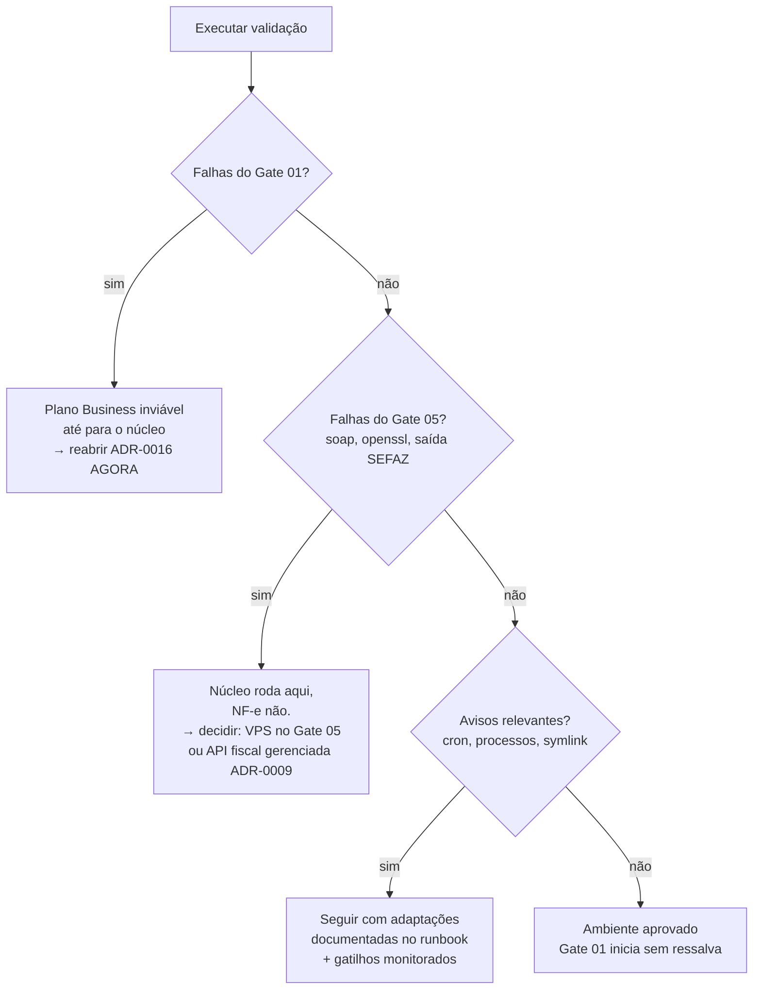

# 01 — Validação do Ambiente (plano Business)

> **Status:** ✅ **Executado em 2026-07-22 — aprovado com pendências** (ver [§7](#7-registro-do-resultado)) · **Última atualização:** 2026-07-22 · **Responsável:** devops-specialist
> **ADRs relacionados:** [ADR-0016](../27-ADR/ADR-0016-hospedagem.md) (hospedagem — Plano B aceito), [ADR-0014](../27-ADR/ADR-0014-fila-database.md), [ADR-0009](../27-ADR/ADR-0009-emissao-nfe.md)
> **Quando:** **semana 1 do Gate 01** — antes de qualquer código · **Script:** [`validar-ambiente.php`](validar-ambiente.php)

## 1. Objetivo

Provar, **antes de escrever código**, que o plano Hostinger Business suporta os Gates 01 a 06 — em especial o Gate 05 (emissão de NF-e), que é de longe o mais exigente quanto a extensões, tempo de execução e conectividade de saída.

## 2. Por que isto virou urgente

O [ADR-0016](../27-ADR/ADR-0016-hospedagem.md) original agendava esta validação para *"antes do Gate 05"*. Duas decisões de 2026-07-22 anteciparam o prazo:

1. **O escopo contratado é o completo** (Gates 01–06) — a emissão de NF-e é entrega obrigatória, não opcional.
2. **A hospedagem escolhida é a compartilhada** — justamente a que o ADR classificou como ⚠️ para NF-e.

Somadas, essas duas escolhas criam um cenário simples de enunciar: **se este ambiente não puder assinar e transmitir uma NF-e, o contrato não pode ser cumprido nele.** Descobrir isso no Gate 05, com ~1.800 h investidas, seria catastrófico. Descobrir agora custa uma hora.

Não se trata de reabrir a decisão do dono — trata-se de **verificar a premissa em que ela se apoia**.

## 3. Como executar

1. Abrir [`validar-ambiente.php`](validar-ambiente.php) e trocar `$TOKEN` por um valor secreto.
2. Opcionalmente preencher o bloco `$db` para testar também a conexão com o MariaDB.
3. Enviar o arquivo ao servidor.
4. Executar de uma das formas:
   - **Via SSH (preferível):** `php validar-ambiente.php` — reflete melhor o ambiente dos jobs e do cron.
   - **Via navegador:** `https://SEU-DOMINIO/validar-ambiente.php?token=SEU_TOKEN`
5. Salvar a saída completa na §7 deste documento.
6. **Apagar o arquivo do servidor.**

> ⚠️ Rodar **pelos dois caminhos** (SSH e navegador) vale a pena: em hospedagem compartilhada é comum o PHP de CLI ter limites e extensões diferentes do PHP web. O que importa para fila e NF-e é o **CLI**.

## 4. Critérios de aprovação

### 4.1 Bloqueiam o Gate 01 (núcleo)

| Verificação | Critério |
|---|---|
| PHP | ≥ 8.2, 64 bits |
| Extensões | `mbstring`, `pdo_mysql`, `bcmath`, `ctype`, `fileinfo`, `json`, `tokenizer`, `openssl` |
| `proc_open` / `proc_close` | disponíveis — sem elas não há `artisan` nem worker de fila |
| InnoDB | disponível — transações são obrigatórias ([ADR-0008](../27-ADR/ADR-0008-ledger-estoque.md)) |
| Escrita em disco | diretório temporário e de aplicação graváveis |

### 4.2 Bloqueiam o Gate 05 (NF-e) — o ponto crítico

| Verificação | Critério | Se falhar |
|---|---|---|
| `soap` | presente | **Sem plano B neste host.** Reabre o ADR-0016 |
| `openssl` | presente | idem — sem assinatura não há NF-e |
| `dom`, `libxml`, `simplexml`, `xml` | presentes | idem |
| `curl` | presente | idem |
| `max_execution_time` | 0 (ilimitado) ou ≥ 60 s | Assinar + transmitir pode ultrapassar 30 s |
| Saída HTTPS para a SEFAZ | conexão bem-sucedida | Muitos planos compartilhados restringem saída. Sem isso, não há transmissão |
| `zip` | presente | Guarda de XML em lote (BR-603) |

### 4.3 Avisos (não bloqueiam, mas mudam o plano)

`intl`, `gd`, `iconv`, `opcache`, `symlink`, `set_time_limit`, espaço em disco, `memory_limit` < 256 MB.

Ausência de `symlink` significa **deploy sem troca atômica** — aceitável, mas o runbook de release muda (e o rollback fica mais lento).

## 5. Verificações manuais (o script não alcança)

| # | Verificar | Por quê | Resultado |
|---|---|---|---|
| M-1 | **Acesso SSH** e **Composer** disponíveis | sem eles, deploy e `artisan` viram upload manual de FTP | ✅ SSH confirmado (`br-asc-web1076`) · ⏳ **Composer a confirmar** |
| M-2 | **Cron aceita execução a cada 1 minuto** | é como a fila roda sem worker persistente ([ADR-0014](../27-ADR/ADR-0014-fila-database.md)); cron de 5 em 5 min degrada a sync do Woo | ⏳ **pendente — a mais importante** |
| M-3 | **Limite de processos simultâneos** do plano | jobs concorrendo com o WordPress no mesmo plano | ✅ **120 processos / 60 PHP workers**; uso atual: 3 e 1 (§7.4) |
| M-4 | **Subdomínio `gestao.donaarteira.com.br` apontável para pasta própria**, com document root em `public/` | Laravel exige document root específico; sem isso, expõe-se o código-fonte | ⏳ **pendente — impeditiva se falhar.** A pasta `gestao/` já existe no servidor |
| M-5 | **Backup automatizado e acesso a dumps** | RPO documentado no ADR-0016 é de 24 h | ⏳ pendente |
| M-6 | **Versão do MariaDB** ≥ 10.6 | [ADR-0002](../27-ADR/ADR-0002-mariadb.md) | ✅ **11.8.8** com InnoDB |
| M-7 | **Quantos bancos de dados** o plano permite criar | ERP + staging da migração + o WordPress já existente | ⏳ pendente |
| M-8 | Local fora do webroot para o **certificado A1** | [BR/pasta 25](../25-Seguranca/README.md) — o `.pfx` jamais pode ser acessível por URL | ⏳ pendente (depende de M-4) |

**M-4 e M-8 são silenciosamente perigosos:** se o document root não puder apontar para `public/`, todo o código (incluindo `.env` com senhas e o certificado) fica acessível pela web. Isso é impeditivo, não inconveniente.

## 6. Árvore de decisão pós-validação



**O caso mais provável é o D.** Se ele ocorrer, a boa notícia é que não há retrabalho: o Gate 05 já foi desenhado atrás de uma `NfeGatewayInterface` ([ADR-0009](../27-ADR/ADR-0009-emissao-nfe.md)) justamente para permitir trocar o emissor local por uma API fiscal gerenciada sem tocar no domínio. O custo seria de R$ 100–300/mês ([modelo de custos](../00-Visao-Geral/05-modelo-de-custos.md)), não de meses de reescrita.

## 7. Registro do resultado

| Campo | Valor |
|---|---|
| Executado por | Diego |
| Via navegador (SAPI `litespeed`) | ✅ 2026-07-22 17:16 — 37 OK · 5 avisos · 2 falhas (ambas artefatos, §7.1) |
| Via SSH (SAPI `cli`) | ✅ 2026-07-22 17:30 — **39 OK · 9 avisos · 0 falhas** |
| Host | `br-asc-web1076`, Linux LVE (CloudLinux) |
| **Veredito** | ✅ **APROVADO para os Gates 01–06.** Nenhum impedimento técnico. Restam configurações operacionais (§7.3), não questões de viabilidade |

### 7.1 As duas "falhas" não eram falhas

Ambas foram investigadas e descartadas:

| Item reportado | Diagnóstico real |
|---|---|
| `nfe.fazenda.gov.br` — *Could not resolve host* | **Erro do script**, não do ambiente. O hostname não existe: o portal é `www.nfe.fazenda.gov.br` (verificado: resolve para 200.198.239.19). Script corrigido |
| `hom.nfe.fazenda.gov.br` — *unable to get local issuer certificate* | **O host resolveu e a conexão foi estabelecida.** Falhou apenas a *verificação* do certificado, por ausência de CA bundle configurado no PHP. Não é bloqueio de rede — é configuração. O script agora distingue os dois casos |

**Nenhum bloqueio de saída para a SEFAZ foi comprovado.** Falta apenas reexecutar com o script corrigido para confirmar positivamente.

### 7.2 O que o resultado mostrou de bom

O ambiente é **substancialmente melhor** do que o [ADR-0016](../27-ADR/ADR-0016-hospedagem.md) temia para hospedagem compartilhada:

| Verificação | Resultado | Comentário |
|---|---|---|
| `soap` | ✅ presente | Era **a** dúvida crítica do Gate 05. Está resolvida |
| `openssl`, `dom`, `libxml`, `simplexml`, `xml`, `curl`, `zip` | ✅ todas presentes | Cadeia completa de assinatura e XML da NF-e |
| `max_execution_time` | ✅ **360 s** | Seis vezes o mínimo exigido; folga confortável para assinar + transmitir |
| `memory_limit` | ✅ **2048 MB** | Excelente para o ETL da migração (Gate 01) |
| `proc_open` / `proc_close` | ✅ disponíveis | É o que a fila e o `artisan` realmente usam — funcionam |
| `bcmath` | ✅ presente | Dinheiro sem float ([ADR-0013](../27-ADR/ADR-0013-dinheiro-decimal.md)) |
| PHP | ✅ 8.2.30, 64 bits | Acima do mínimo do Laravel 12 |

E o CLI (a execução que de fato importa) foi ainda melhor que o web:

| Verificação | CLI | Por que importa |
|---|---|---|
| `max_execution_time` | ✅ **ilimitado** | Worker de fila e emissão de NF-e sem teto de tempo. Era a maior dúvida operacional do plano compartilhado |
| Extensões | ✅ **idênticas ao web** | O receio de que o CLI tivesse build diferente não se confirmou |
| **Rede até a SEFAZ** | ✅ **confirmada** | Os três endpoints — inclusive o **webservice real da SVRS** — responderam como "alcançável". Não há bloqueio de saída |
| MariaDB | ✅ **11.8.8**, InnoDB disponível | Muito acima do mínimo do [ADR-0002](../27-ADR/ADR-0002-mariadb.md) (10.6) |
| Acesso SSH | ✅ confirmado | Item M-1 parcialmente resolvido pela própria execução |

**O ponto decisivo:** com o script corrigido, os três alvos da SEFAZ retornaram *"ALCANÇÁVEL (falta CA bundle)"*. Isso prova positivamente que **a rede de saída até os webservices da SEFAZ está aberta** — o que restava era só a verificação de certificado, que é configuração local. A viabilidade do Gate 05 neste host está demonstrada.

### 7.3 Pendências e ressalvas

| # | Item | Gravidade | Situação / ação |
|---|---|---|---|
| ~~P-1~~ | ~~Execução via CLI não feita~~ | — | ✅ **Resolvido em 17:30.** CLI passou com 0 falhas e `max_execution_time` ilimitado |
| ~~P-3~~ | ~~Conectividade com a SEFAZ não comprovada~~ | — | ✅ **Resolvido.** Os três endpoints, incluindo o webservice da SVRS, responderam como alcançáveis |
| ~~P-9~~ | ~~Conexão com o banco não testada~~ | — | ✅ **Resolvido.** MariaDB 11.8.8 com InnoDB |
| ~~P-8~~ | ~~Cota real de disco desconhecida~~ | — | ✅ **Resolvido (§7.4):** 11,26 GB de 50 GB em uso. Folga ampla |
| ~~M-3~~ | ~~Limite de processos desconhecido~~ | — | ✅ **Resolvido (§7.4):** 3 de 120 processos e 1 de 60 PHP workers em uso |
| **P-11** | O ERP compartilha o plano com o WordPress em produção (usuário `u917402451`) | 🟢 **Baixa** *(rebaixado de Alta em §7.4)* | Os dados de consumo mostram o WordPress usando **12% de CPU e 3 de 120 processos**. A folga é grande; a concorrência que eu temia não se sustenta nos números. Segue sob monitoramento como gatilho do [ADR-0016](../27-ADR/ADR-0016-hospedagem.md), mas não é preocupação de curto prazo |
| **P-12** | **Inodes**: 91.387 de 600.000 em uso | 🟡 Média | `vendor/` + `node_modules/` de um projeto Laravel somam facilmente 50–100 mil arquivos. Se o build rodasse no servidor, a cota apertaria rápido. Reforça a regra de **buildar assets no CI e subir só `public/build/`** ([06-Frontend §8](../06-Frontend/README.md)) |
| P-2 | CA bundle não configurado | 🟡 Média | Baixar `cacert.pem` (curl.se) para fora do webroot e apontar `curl.cainfo` via php.ini customizado no hPanel. Reexecutar o script para confirmar. Sem isso, cada chamada HTTPS precisa carregar o bundle explicitamente |
| P-4 | `symlink` bloqueada | 🟡 Média | `artisan storage:link` não funciona **e não há deploy atômico por symlink**. Duas decisões a registrar na reescrita da pasta 23: (a) uploads gravados direto em `public/` ou servidos por rota controlada; (b) estratégia de release e rollback sem troca de symlink |
| P-5 | `exec` / `shell_exec` bloqueadas | 🟢 Baixa | Sem impacto: `proc_open` está disponível e é o que o Laravel usa. Atenção a pacotes de terceiros que façam shell |
| P-6 | `opcache` ausente | 🟢 Baixa | Perda de desempenho, não de função. Verificar se o hPanel permite habilitar |
| P-7 | PHP 8.2.30 (a documentação mirava 8.4) | 🟢 Baixa | Compatível com Laravel 12. Verificar no painel se dá para subir para 8.3/8.4 |
| P-8 | Espaço em disco reportado é do volume do host | 🟡 Média | Conferir a **cota real** no hPanel — XMLs de 5 anos + backups precisam de espaço garantido |
| P-10 | Verificações manuais **M-2, M-3, M-4, M-5, M-7** pendentes | 🟠 Alta | M-1 (SSH) ✅ confirmado pela própria execução. Falta confirmar Composer. **M-2 (cron de 1 min) e M-4 (document root → `public/`) são as duas que ainda podem doer** |

### 7.4 Recursos do plano (painel Hostinger, 2026-07-22)

Consumo médio das últimas 24 h, com o **WordPress em produção** já rodando — ou seja, é a linha de base que o ERP vai encontrar.

| Recurso | Em uso | Disponível | Folga | Leitura |
|---|---|---|---|---|
| **Disco** | 11,26 GB | 50 GB | 77% | Confortável. XMLs de NF-e são pequenos (~15 KB); 5 anos de guarda cabem com sobra. O consumo real virá de imagens de produto e dumps de backup |
| **Inodes** | 91.387 | 600.000 | 85% | ⚠️ O item a vigiar. `vendor/` + `node_modules/` somam dezenas de milhares de arquivos — ver P-12 |
| **CPU** | 12% | 100% | 88% | O WordPress é leve (coerente com 85 pedidos em 4,5 anos, [pasta 31](../31-Inventario-Legado/07-pedidos.md)) |
| **Memória** | 51 MB | 3.072 MB | 98% | Ampla. Note que `memory_limit` por processo é 2.048 MB: cabe **um** processo pesado de ETL por vez, não vários |
| **I/O** | 85 KB/s | 20.480 KB/s | 99% | 20 MB/s é o teto. Suficiente, mas é o gargalo provável do ETL da migração — planejar carga em lotes |
| **IOPS** | 1 | 512 | 99% | Idem: o ETL e a fila são os únicos candidatos a pressionar |
| **PHP Workers** | 1 | 60 | 98% | Muito espaço para a fila |
| **Processos** | 3 | 120 | 97% | Muito espaço para worker + cron |

**Conclusão — e correção da minha própria avaliação:** eu havia classificado o compartilhamento do plano com o WordPress como risco 🟠 **Alto** (P-11). Os números não sustentam isso: o site consome uma fração mínima da capacidade contratada. **Rebaixado para 🟢 Baixo.** O risco real de recursos não é a concorrência com o WordPress — é o **ETL da migração** (I/O e IOPS) e os **inodes** durante o deploy.

### 7.5 Saída completa das execuções

```
========================================================================
 VALIDAÇÃO DE AMBIENTE — ERP Dona Arteira · 2026-07-22 17:16:00
========================================================================
PHP           8.2.30 · 64 bits · SAPI litespeed
Extensões     openssl soap curl dom libxml simplexml xml mbstring
              pdo_mysql bcmath ctype fileinfo json tokenizer zip
              iconv intl gd zlib .......................... PRESENTES
              opcache ...................................... AUSENTE
Limites       max_execution_time 360s · memory_limit 2048M
              upload_max_filesize 2048M · post_max_size 2048M
              max_input_vars 5000
Funções       proc_open, proc_close, putenv, set_time_limit . OK
              symlink, exec, shell_exec ................ BLOQUEADAS
Conectividade saída HTTPS genérica ................. OK (HTTP 405)
              nfe.fazenda.gov.br ....... erro do script (host inexistente)
              hom.nfe.fazenda.gov.br ... alcançável, faltou CA bundle
Sistema       Linux 4.18.0-553.121.1.lve.el8 · UTC · dirs graváveis
Banco         não testado
========================================================================
 RESUMO BRUTO: 37 OK · 5 avisos · 2 falhas
 VEREDITO APÓS ANÁLISE: aprovado, com as pendências da §7.3
========================================================================
```

**Execução via SSH (SAPI `cli`) — 2026-07-22 17:30, com o script corrigido:**

```
========================================================================
 VALIDAÇÃO DE AMBIENTE — ERP Dona Arteira · 2026-07-22 17:30:53
 host: br-asc-web1076 · usuário: u917402451
========================================================================
PHP           8.2.30 · 64 bits · SAPI cli
Extensões     idênticas ao web — todas presentes, exceto opcache
Limites       max_execution_time ILIMITADO · memory_limit 2048M
              upload_max_filesize 2048M · post_max_size 2048M
Funções       proc_open, proc_close, putenv, set_time_limit . OK
              symlink, exec, shell_exec ................ BLOQUEADAS
TLS           curl.cainfo / openssl.cafile ....... não configurado
Conectividade saída HTTPS genérica ................. OK (HTTP 405)
              portal nacional da NF-e ....... ALCANÇÁVEL (falta CA)
              homologação NF-e .............. ALCANÇÁVEL (falta CA)
              webservice SEFAZ (SVRS) ....... ALCANÇÁVEL (falta CA)
Sistema       Linux 4.18.0-553.121.1.lve.el8 · UTC · dirs graváveis
Banco         Conexão OK · MariaDB 11.8.8-log · InnoDB disponível
========================================================================
 RESUMO: 39 OK · 9 avisos · 0 FALHAS
========================================================================
```

## 8. Dependências

| Depende de | Motivo |
|---|---|
| Acesso ao painel/SSH da Hostinger | executar o script e as verificações manuais |
| [ADR-0016](../27-ADR/ADR-0016-hospedagem.md) | define o ambiente a validar |

**Quem depende deste documento:** todo o Gate 01 (não começa sem veredito), o [ADR-0009](../27-ADR/ADR-0009-emissao-nfe.md) (pode ser reaberto pelo resultado) e o [modelo de custos](../00-Visao-Geral/05-modelo-de-custos.md).

## 9. Riscos

| Risco | Prob. | Impacto | Mitigação |
|---|---|---|---|
| `soap` ausente no plano compartilhado | **Média** | **Crítico** | Detectar agora; plano B = API fiscal gerenciada (ADR-0009), já previsto |
| Saída HTTPS para a SEFAZ bloqueada | Média | Crítico | idem |
| PHP do CLI diferir do PHP web | **Alta** | Médio | Rodar a validação pelos dois caminhos |
| Cron com granularidade > 1 min | Média | Alto | Degrada a sync do Woo; renegociar plano ou aceitar latência (gatilho do ADR-0016) |
| Document root não apontável para `public/` | Baixa | **Crítico** | Expõe `.env` e certificado; impeditivo — reabre o ADR-0016 |
| Validação ser adiada "para depois" | **Alta** | **Crítico** | É pré-requisito formal da primeira tarefa do Gate 01 |

## 10. Evoluções futuras

- Transformar o script em um comando `artisan` de health check permanente (pasta [24](../24-Monitoramento/README.md)), rodando as mesmas verificações periodicamente em produção.
- Incluir a checagem de validade do certificado A1 quando ele existir (alertas 30/15/7 dias).

## 11. Perguntas em aberto

- O plano Business atual é o mesmo que hospeda o WordPress? Se sim, os limites de processo são **compartilhados** entre os dois — o pico de tráfego do site afeta a fila do ERP.
- Há possibilidade de upgrade dentro da própria Hostinger (Business → Cloud) sem migrar, caso os limites apertem?
