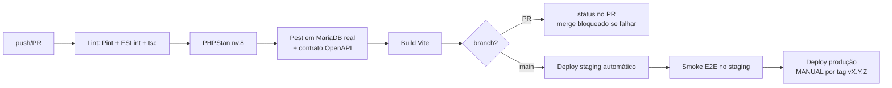

# 23 — Deploy

> **Status:** ⚠️ **Requer reescrita** — foi escrito assumindo SPA separada e ADR-0016 pendente · **Última atualização:** 2026-07-03 · **Responsável:** devops-specialist
> **ADRs:** [0014](../27-ADR/ADR-0014-fila-database.md) (filas) · [**0016**](../27-ADR/ADR-0016-hospedagem.md) (hospedagem — **plano Business, aceito em 2026-07-22**) · [**0019**](../27-ADR/ADR-0019-inertia-substitui-spa.md) (Inertia — deploy passa a ser único)
> **Documentos:** [Validação do ambiente Business](01-validacao-ambiente-business.md) ✅ · [Verificar cron e document root](02-verificar-cron-e-docroot.md) ✅ · [Instalação inicial](03-instalacao-inicial.md) ⏳ **próxima tarefa do Gate 01**

## 1. Objetivo

Ambientes, pipeline CI/CD, processo de release/rollback e backups — deploy de ERP fiscal não pode ser "arrastar arquivo no FTP".

## 2. Ambientes

| Ambiente | Onde | Banco | Para quê |
|---|---|---|---|
| **Local** | Docker (compose: PHP 8.4 + MariaDB espelhando produção) ou Laravel Herd | local | desenvolvimento |
| **Staging** | subdomínio `staging-gestao.donaarteira.com.br` (mesma hospedagem, isolado) | próprio, com dados **anonimizados** | validação de release, testes de sync com Woo staging, homologação SEFAZ |
| **Produção** | `gestao.donaarteira.com.br` | produção | operação |

Staging não é luxo: é onde updates do WordPress, NTs da SEFAZ e releases do ERP são validados sem arriscar a operação (riscos das pastas 14/16).

## 3. Pipeline (GitHub Actions)

## 4. Processo de release (produção)

1. Tag anotada `vX.Y.Z` + changelog (o que muda para o usuário + migrations incluídas).
2. **Backup pré-deploy** (dump completo + storage de XMLs) automático no script.
3. Deploy atômico por releases + symlink (Deployer via SSH): `releases/2026…/` → build → `php artisan migrate --force` → troca do symlink `current` → `config:cache`/`route:cache` → restart de workers.
4. Health check pós-deploy (endpoint `/api/health`) — falhou → rollback.
5. Rollback = voltar symlink + restaurar dump **somente se** migration destrutiva (regra expand/contract da pasta 04 torna isso raro).

Janela: nunca sexta à tarde nem véspera de pico; migrations longas rodam em maintenance mode com aviso prévio à equipe.

## 5. Especificidades do ambiente Hostinger (enquanto ADR-0016 pendente)

- **Scheduler:** cron do painel a cada minuto → `php artisan schedule:run`.
- **Fila:** sem supervisor no shared → cron dedicado `php artisan queue:work --stop-when-empty --max-time=50` a cada minuto (limitação séria: latência e concorrência — argumento central do ADR-0016 para VPS, onde roda supervisor/systemd).
- Document root: apontar subdomínio para `current/public` (verificar suporte a symlink no plano; alternativa: deploy por rsync do conteúdo).
- Versões PHP/extensões conferidas por script de pré-flight (openssl, soap, dom, intl, gd).

## 6. Backups (independentes dos da Hostinger)

| O quê | Frequência | Retenção | Destino |
|---|---|---|---|
| Dump MariaDB | diário (madrugada) | 30 diários + 12 mensais | storage externo (objeto: B2/R2) via rclone |
| Storage (XMLs NF-e, uploads) | diário incremental | 30 dias + mensal 5 anos p/ XML | idem |
| Repositório (código+docs) | contínuo | — | GitHub |

**Teste de restore trimestral obrigatório** (runbook próprio): backup que nunca foi restaurado não é backup. RPO/RTO na pasta 03.

## 7. Riscos

| Risco | Prob. | Impacto | Mitigação |
|---|---|---|---|
| Fila via cron atrasar syncs/NF-e | Alta (shared) | Alto | ADR-0016: VPS com supervisor; até lá, monitor de idade da fila |
| Deploy manual por FTP "só dessa vez" | Média | Alto | Pipeline é o único caminho: credenciais de produção só no Actions |
| Migration travar tabela grande em horário comercial | Baixa | Alto | migrations pesadas em maintenance window; expand/contract |

## 8. Evoluções futuras

- Blue/green simplificado no VPS · preview apps por PR (se equipe crescer) · IaC leve (scripts idempotentes de provisionamento documentados).
