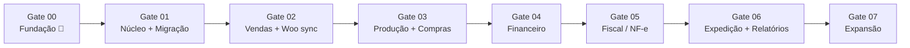

# 28 — Roadmap

> **Status:** Aprovado · **Última atualização:** 2026-07-03 · **Responsável:** chief-architect + dono
> Gates são sequenciais e **bloqueantes**: não se inicia o próximo sem cumprir os critérios de saída do atual. Datas são definidas pelo dono; o roadmap fixa ordem e critérios, não calendário.

## Visão de fases

A ordem protege o negócio: primeiro dados e estoque confiáveis, depois vender integrado, depois produzir/custear, depois dinheiro, **então** fiscal (que depende de tudo estar correto), e por fim conveniências.

## Gate 00 — Fundação de Engenharia ✅ (2026-07-03)

Toda a documentação desta pasta `docs/`, agentes, skills, ADRs. **Saída:** decisões pendentes levadas ao dono ([análise crítica](../00-Visao-Geral/04-analise-critica-gate00.md)).

## Gate 01 — Núcleo + Migração

**Tarefa 0 (bloqueante, antes de qualquer código):** [validação do ambiente Business](../23-Deploy/01-validacao-ambiente-business.md). Com o escopo completo contratado e a hospedagem compartilhada escolhida ([ADR-0016](../27-ADR/ADR-0016-hospedagem.md)), é preciso provar que o plano suporta a NF-e **antes** de investir 1.800 h nele.
**Entrega:** projeto Laravel + Inertia + React estruturado ([ADR-0019](../27-ADR/ADR-0019-inertia-substitui-spa.md), pastas 05/06), CI/CD e ambientes (23), auth+RBAC (18/19), auditoria (26), catálogo, clientes, estoque com ledger (09), health check, **migração executada até a fase 5** (17).
**Critérios de saída:** ambiente validado com veredito registrado · dados migrados validados e assinados pelo dono · CI verde bloqueante · estoque operável manualmente no ERP · staging funcionando.

## Gate 02 — Vendas + Sincronização WooCommerce 🔄 *aberto em 2026-07-28*

**Entrega:** pedidos multicanal (10), integração Woo bidirecional (15/16), **cutover executado** (17), painel de integrações, dashboards mínimos, e-mail transacional.
**Critérios de saída:** 14 dias de operação assistida com divergência zero não explicada · pedido do site ao rastreio sem tocar no wp-admin · equipe treinada operando pedidos no ERP.
**Decisão de sequência (2026-07-28):** o dono escolheu o fluxo *reserva-e-envia-depois* como primeiro; ordem dos cortes e o que fica adiado em [10/§2.1](../10-Vendas/README.md). Cortes 1 (reserva de estoque, BR-203) e 2 (pedido) entregues. **Reordenação no mesmo dia:** o corte 3 (fulfillment) foi para *standby* e o **corte 4 (entrada de pedidos do site, Woo→ERP)** assumiu a frente; a saída de status/rastreio (ERP→Woo) depende do corte 3 e acompanha o adiamento.

## Gate 03 — Produção + Compras

**Entrega:** OPs de pintura com etapas/perdas (08), recebimento com quarentena de secagem (11), custeio com mão de obra, fichas técnicas, custo médio, sugestão de reposição, encomendas ligadas a OPs.
**Critérios de saída:** 100% da produção passando por OP há 30 dias · fichas técnicas dos 50 produtos mais vendidos · custo médio conferido pelo dono.
**Pré-requisito:** entrevistas da pasta 30 concluídas e BRs 1xx validadas.
**Desenho do módulo:** Produção nasce com um ponto de extensão único (estratégia de produção plugável — [ADR-0026](../27-ADR/ADR-0026-producao-como-estrategia-plugavel.md)), do qual "pintura sobre peça crua comprada" ([ADR-0023](../27-ADR/ADR-0023-producao-e-pintura-nao-fundicao.md)) é a única implementação necessária hoje. Não muda o pré-requisito acima nem generaliza o resto do sistema.

## Gate 04 — Financeiro

**Entrega:** títulos automáticos (12), baixas, categorias, fluxo de caixa, aging.
**Critérios de saída:** 1 mês fechado no ERP batendo com extratos bancários (conferência manual) · plano de categorias aprovado.
**Solicitação de escopo pendente:** emissão de boletos — ver [M-01](#mudanças-de-escopo-solicitadas) e [ADR-0018](../27-ADR/ADR-0018-cobranca-boleto.md). **Ainda não incorporada à entrega**; depende de decisão do dono.

## Gate 05 — Fiscal / NF-e

**Entrega:** emissão completa (14) com perfis validados pelo contador (13), homologação permanente, contingência, guarda, perfil do contador.
**Critérios de saída:** 20 notas em homologação sem rejeição não-compreendida · amostra de notas de produção revisada pelo contador · runbooks fiscais prontos · alertas de certificado ativos.
**Pré-requisito bloqueante:** reunião fiscal com contador (pasta 13) + ambiente com extensões validadas.

## Gate 06 — Expedição avançada + Relatórios/Dashboards

**Entrega:** Melhor Envio (etiquetas/rastreio), catálogo de relatórios (20), dashboards completos (21), DRE gerencial, curva ABC, notificações de rastreio ao cliente.

## Gate 07 — Expansão (backlog priorizável)

Marketplaces · app mobile/PWA de produção · WhatsApp transacional · gateway de cobrança (atacado) · conciliação OFX · portal do lojista. Cada item entra com documento próprio + ADRs.

## Regras do roadmap

1. Mudança de ordem/escopo de gate = decisão do dono registrada aqui (com data e motivo).
2. Cada gate fecha com: retro curta, revisão dos docs do módulo, ADRs pendentes resolvidos, tag `gate-0X`.
3. Débitos técnicos ganham item nomeado no gate seguinte — nunca "depois a gente vê".

## Mudanças de escopo solicitadas

Registro vivo das solicitações que alteram o roadmap. Nada aqui é aplicado antes da decisão do dono (regra 1).

| # | Solicitação | Origem | Data | Impacto | Status |
|---|---|---|---|---|---|
| M-01 | **Emissão de boletos pelo ERP** — mover cobrança da fase 7 para o Gate 04 | cliente | 2026-07-22 | +80–120 h no Gate 04 · custo recorrente por boleto · nova superfície de segurança (credencial bancária) · depende de convênio bancário com semanas de lead time | ⚠️ **Aguardando decisão do dono** — [ADR-0018](../27-ADR/ADR-0018-cobranca-boleto.md), [doc 12/01](../12-Financeiro/01-cobranca-e-boletos.md) |

**Sobre M-01:** boleto é a materialização de um título a receber — não existe sem o Gate 04. Antecipá-lo isoladamente não é possível; o que se decide é se o **Gate 04 inteiro** sobe na fila ou se a cobrança entra quando ele chegar. Enquanto isso, o cliente pode emitir boletos pelo internet banking e a baixa é manual no ERP (Alternativa D do ADR-0018).
