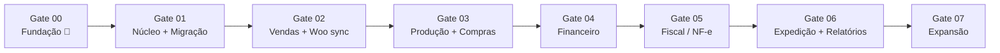

# 28 — Roadmap

> **Status:** Aprovado · **Última atualização:** 2026-07-03 · **Responsável:** chief-architect + dono
> Gates são sequenciais e **bloqueantes**: não se inicia o próximo sem cumprir os critérios de saída do atual. Datas são definidas pelo dono; o roadmap fixa ordem e critérios, não calendário.

## Visão de fases

A ordem protege o negócio: primeiro dados e estoque confiáveis, depois vender integrado, depois produzir/custear, depois dinheiro, **então** fiscal (que depende de tudo estar correto), e por fim conveniências.

## Gate 00 — Fundação de Engenharia ✅ (2026-07-03)

Toda a documentação desta pasta `docs/`, agentes, skills, ADRs. **Saída:** decisões pendentes levadas ao dono ([análise crítica](../00-Visao-Geral/04-analise-critica-gate00.md)).

## Gate 01 — Núcleo + Migração

**Entrega:** projeto Laravel+React estruturado (pastas 05/06), CI/CD e ambientes (23), auth+RBAC (18/19), auditoria (26), catálogo, clientes, estoque com ledger (09), health check, **migração executada até a fase 5** (17).
**Critérios de saída:** dados migrados validados e assinados pelo dono · CI verde bloqueante · estoque operável manualmente no ERP · decisão ADR-0016 tomada e ambiente definitivo provisionado · staging funcionando.

## Gate 02 — Vendas + Sincronização WooCommerce

**Entrega:** pedidos multicanal (10), integração Woo bidirecional (15/16), **cutover executado** (17), painel de integrações, dashboards mínimos, e-mail transacional.
**Critérios de saída:** 14 dias de operação assistida com divergência zero não explicada · pedido do site ao rastreio sem tocar no wp-admin · equipe treinada operando pedidos no ERP.

## Gate 03 — Produção + Compras

**Entrega:** OPs com etapas/perdas/moldes (08), fichas técnicas, compras+recebimento (11), custo médio ativo, sugestão de reposição, encomendas ligadas a OPs.
**Critérios de saída:** 100% da produção passando por OP há 30 dias · fichas técnicas dos 50 produtos mais vendidos · custo médio conferido pelo dono.
**Pré-requisito:** entrevistas da pasta 30 concluídas e BRs 1xx validadas.

## Gate 04 — Financeiro

**Entrega:** títulos automáticos (12), baixas, categorias, fluxo de caixa, aging.
**Critérios de saída:** 1 mês fechado no ERP batendo com extratos bancários (conferência manual) · plano de categorias aprovado.

## Gate 05 — Fiscal / NF-e

**Entrega:** emissão completa (14) com perfis validados pelo contador (13), homologação permanente, contingência, guarda, perfil do contador.
**Critérios de saída:** 20 notas em homologação sem rejeição não-compreendida · amostra de notas de produção revisada pelo contador · runbooks fiscais prontos · alertas de certificado ativos.
**Pré-requisito bloqueante:** reunião fiscal com contador (pasta 13) + ambiente com extensões validadas.

## Gate 06 — Expedição avançada + Relatórios/Dashboards

**Entrega:** Melhor Envio (etiquetas/rastreio), catálogo de relatórios (20), dashboards completos (21), DRE gerencial, curva ABC, notificações de rastreio ao cliente.

## Gate 07 — Expansão (backlog priorizável)

Marketplaces · app mobile/PWA de produção · WhatsApp transacional · gateway de cobrança (atacado) · conciliação OFX · portal do lojista. Cada item entra com documento próprio + ADRs.

## Regras do roadmap

1. Mudança de ordem/escopo de gate = decisão do dono registrada aqui (com data e motivo).
2. Cada gate fecha com: retro curta, revisão dos docs do módulo, ADRs pendentes resolvidos, tag `gate-0X`.
3. Débitos técnicos ganham item nomeado no gate seguinte — nunca "depois a gente vê".
