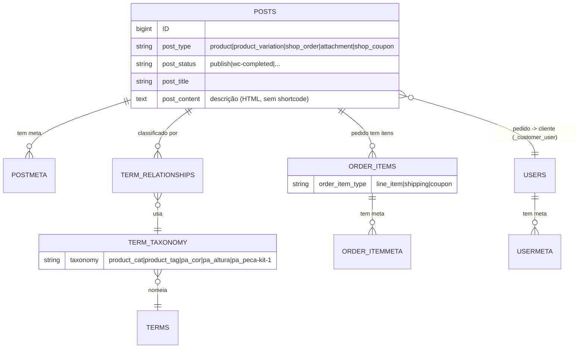

# 16 — Mapa de Entidades

> **Status:** Em revisão · **Última atualização:** 2026-07-06 · **Responsável:** senior-dba / chief-architect
> **Relacionado:** [04-Banco-de-Dados/01-modelo-conceitual](../04-Banco-de-Dados/01-modelo-conceitual.md), [02-Dominio](../02-Dominio/README.md)

## 1. Objetivo

Mapear as entidades reais das duas fontes legadas (WooCommerce e desktop) e seus relacionamentos, e cruzá-las com o modelo de domínio do ERP — mostrando o que existe, o que falta e onde as fontes divergem.

## 2. Entidades do WooCommerce (como estão)



- **Produto** = `posts(post_type=product)` + `postmeta` (`_price`, `_weight`, `_thumbnail_id`, `_product_attributes`...) + `wc_product_meta_lookup` (denormalizado).
- **Variação** = `posts(post_type=product_variation)` com `post_parent` → produto.
- **Categoria/Tag/Atributo** = `terms` + `term_taxonomy` + `term_relationships`.
- **Cliente** = `users(role=customer)` + `usermeta`; espelho denormalizado em `wc_customer_lookup`.
- **Pedido** = `posts(post_type=shop_order)` + `postmeta` (billing/shipping/total) + `woocommerce_order_items` (line_item/shipping/coupon) + `order_itemmeta`. **HPOS off** → `wc_orders` vazio.
- **Cupom** = `posts(post_type=shop_coupon)`.
- **Mídia** = `posts(post_type=attachment)`.

## 3. Entidades do desktop (referência)

```mermaid
erDiagram
    CLIENTS ||--o{ ORDERS : "faz"
    ORDERS ||--o{ ORDER_ITEMS : "contém"
    PIECES ||--o{ ORDER_ITEMS : "referenciado em"
    PIECES ||--o{ PIECE_IMAGES : "tem"
    PACKAGES ||--o{ PIECES : "embala"

    CLIENTS { string name; string cpf_cnpj "unique, not null"; string cep; string city; string state }
    PIECES { string code "unique SKU"; float price_retail; float price_wholesale; int in_stock; int package_id }
    PACKAGES { string name; float height_cm; float width_cm; float depth_cm; float weight_g }
    ORDERS { date order_date; date delivery_date; enum delivery_method; enum payment_method; float payment_value }
    ORDER_ITEMS { int quantity; float price "snapshot"; string description }
```

- **Peça** (`pieces`): SKU (`code`), **dois preços** (varejo/atacado), dimensões/peso, `in_stock` (contador), 1 embalagem, imagens em FTP.
- **Embalagem** (`packages`): catálogo dimensionado (base do frete) — 5 embalagens padrão pré-cadastradas (18×21×20/130g … 30×60×30/450g).
- **Cliente** (`clients`): endereço único, **CPF/CNPJ obrigatório e único**, sem e-mail.
- **Pedido** (`orders`): valor **único digitado** (não somado dos itens), sem status; item com preço **congelado**.

## 4. Cruzamento das fontes × modelo do ERP

| Conceito ERP | WooCommerce | Desktop | Observações |
|---|---|---|---|
| Produto/Peça | `product` (716, sem SKU) | `pieces` (com `code`) | Casar por SKU gerado / `product_id`; **duas fontes de catálogo** |
| Variação | `product_variation` (77) | — (não modela variação) | Cor/altura só no Woo |
| Embalagem | dimensões no produto | `packages` (dedicado) | **Só o desktop tem catálogo de embalagem** |
| Categoria | `product_cat` (48, árvore) | — | **Só o Woo tem categorias** |
| Atributos (cor/altura/kit) | `pa_*` | — | **Só o Woo** |
| Preço varejo | `_price`/`_regular_price` | `price_retail` | Ambos |
| **Preço atacado** | — | `price_wholesale` | **Só o desktop** |
| Cliente | `users`+meta (198, 100% PF) | `clients` (PF e PJ) | **Atacado/PJ só no desktop**; dedupe por e-mail/CPF |
| Endereço | billing/shipping (múltiplo por pedido) | 1 por cliente | ERP: múltiplos endereços por cliente |
| Pedido | `shop_order` (85) | `orders` | Duas origens; Woo tem status, desktop não |
| Estoque | `stock_status` (sem qtd) | `in_stock` (contador) | **Nenhuma das duas** é ledger → ERP introduz movimentos ([ADR-0008](../27-ADR/ADR-0008-ledger-estoque.md)) |
| Mídia | attachments (uploads) | `piece_images` (FTP) | **Dois acervos** |
| Pagamento | Mercado Pago (título) | enum simples | Higienizar/normalizar |
| Frete | Melhor Envio/Correios/retirada | `delivery_method` | Woo tem detalhe; desktop tem retirada/entrega |
| **Produção/BOM** | `pa_peca-kit-1` (texto) | — | **Nenhuma fonte estrutura** → novo no ERP |
| **Financeiro/Fiscal** | — (`calc_taxes=no`) | `payment_value` | **Novo no ERP** |

## 5. Entidades AUSENTES em ambas as fontes (o ERP cria)

Produção (OP de pintura, etapas, perdas, WIP) · **Ficha técnica/BOM** · Movimentos de estoque (ledger) · Reservas · Compras/fornecedores · Financeiro (títulos a pagar/receber, baixas) · Fiscal (NCM/CFOP/CSOSN) · NF-e · Usuários/permissões/auditoria · Mapeamentos de integração.

Isso confirma o escopo do roadmap: as fontes cobrem **catálogo, clientes e pedidos**; o coração do ERP (**produção, estoque-ledger, financeiro, fiscal**) **nasce novo**.

## 6. Relacionamentos implícitos descobertos

- **Produto composto → componentes**: kits/trios (`pa_peca-kit-1`) implicam relação produto→peças, hoje não estruturada → **BOM**.
- **Produto → embalagem**: no desktop é explícito (`package_id`); no Woo é implícito no peso/dimensão → base do frete.
- **Cor → acabamento de produção**: `pa_cor` (paleta) é insumo da etapa de pintura.
- **Pedido → conta de cliente**: no Woo, sempre há `_customer_user` (sem convidados).
