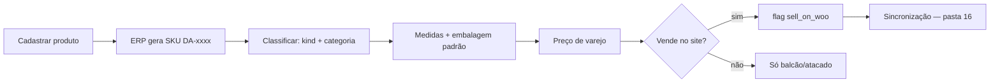

# 32 — Catálogo (Produtos)

> **Status:** Aprovado · **Última atualização:** 2026-07-25 · **Responsável:** business-analyst + chief-architect
> **Fase:** Gate 01 · **ADR:** [0022](../27-ADR/ADR-0022-modelo-de-produto-e-sku.md) (variação e SKU), [0008](../27-ADR/ADR-0008-ledger-estoque.md) (custo), [0013](../27-ADR/ADR-0013-dinheiro-decimal.md) (preço), [0017](../27-ADR/ADR-0017-midia-canonica.md) (imagens)
> **Regras:** BR-002 (SKU), BR-003 (varejo/atacado), BR-004/005 (embalagem/dimensões), BR-007 (categorias), BR-207 (estoque único)
>
> ⚠️ **Por que esta pasta é a número 32.** O número é a ordem em que ela
> foi criada (2026-07-25), não a posição do catálogo no domínio — que é
> anterior a estoque, vendas e produção. O mapa original da `docs/`
> descrevia produto apenas como uma linha do [modelo conceitual](../04-Banco-de-Dados/01-modelo-conceitual.md#catálogo),
> e a lacuna só apareceu quando o módulo entrou na fila. Renumerar as
> pastas existentes quebraria centenas de links internos; o custo não se
> paga.

## 1. Objetivo

Definir o que é um produto no ERP: como é identificado, classificado,
precificado, medido e publicado. É o cadastro do qual **tudo** depende —
sem chave de produto não há movimento de estoque (09), item de pedido
(10), ficha técnica (08) nem casamento com o WooCommerce (16).

## 2. Responsabilidades

**É deste módulo:** identidade do produto (SKU), classificação (`kind`,
categorias), atributos descritivos (cor, altura, material), medidas e
embalagem padrão, preços de lista, dados fiscais do cadastro, flags de
canal.

**Não é deste módulo:** saldo e custo (são do [ledger de estoque](../09-Estoque/README.md) —
o produto **não** tem coluna de quantidade), composição de kit/BOM
(pasta [08](../08-Producao/README.md), Gate 03), regras de tributação
(pasta [13](../13-Fiscal/README.md)), publicação no site (pasta
[16](../16-WooCommerce/README.md)).

## 3. O modelo

### 3.1 Um produto é uma coisa vendável ou consumível

`products` unifica peça acabada, matéria-prima, embalagem, revenda e
insumo num só cadastro e num só estoque (BR-207), distinguidos por
`kind`:

| `kind` | O que é | Exemplo real do catálogo |
|---|---|---|
| `finished_good` | Peça de fabricação própria | Buda sidarta 11 cm azul |
| `raw_material` | Matéria-prima | Gesso, tinta, verniz |
| `packaging` | Embalagem | Caixa 20×20, plástico-bolha |
| `resale` | Comprado pronto para revender | Incenso vareta Goloka, itens de MDF |
| `supply` | Consumo interno, não vendido | Lixa, pincel |

A distinção importa fora daqui: `resale` tem NCM próprio e fluxo de
compra (11), `finished_good` tem ficha técnica e ordem de produção (08),
`raw_material` e `packaging` são consumidos por ela.

### 3.2 Variação é produto, não atributo

Decidido no [ADR-0022](../27-ADR/ADR-0022-modelo-de-produto-e-sku.md).
"Buda sidarta 11 cm **azul**" e "Buda sidarta 11 cm **dourado**" são dois
produtos, com dois SKUs e dois saldos.

O motivo é do negócio, não da tecnologia: **a cor é um acabamento de
pintura manual** — 39 cores no vocabulário do ateliê ("bronze velho",
"marsala dourada") —, cada uma produzida separadamente, consumindo tintas
diferentes e ocupando lugar próprio na prateleira. Um saldo agregado de
"budas" não responde à única pergunta que a operação faz ao estoque.

Consequência prática: os **37 produtos de título duplicado** do
WooCommerce ([31/02 §7](../31-Inventario-Legado/02-produtos.md)) não são
sujeira a limpar — são variações que alguém cadastrou como produtos
separados porque o site tornava isso mais simples. No ERP, é a forma
correta.

Cor e altura ficam como **atributos descritivos** da linha (usados em
busca, filtro e rótulo), nunca como eixos de um produto-pai.

### 3.3 SKU: `DA-0001`, gerado pelo ERP, imutável

Nenhum dos 716 produtos do WooCommerce tem SKU
([31/02 §3.1](../31-Inventario-Legado/02-produtos.md): 100% vazio). O ERP
**cria** os códigos; não os importa.

- Prefixo fixo `DA-`, contador com quatro dígitos, indo a cinco depois de
  `DA-9999` sem quebrar os anteriores.
- **Sem significado embutido** — nada de prefixo por categoria. Um código
  que carrega classificação passa a mentir quando a classificação muda, e
  a BR-002 proíbe corrigi-lo. Com 30% do catálogo em kits/trios (a fatia
  que mais se reorganiza), isso aconteceria já na migração.
- Único no catálogo inteiro: peça, matéria-prima, embalagem e revenda
  dividem a mesma sequência, porque dividem a mesma tabela.
- **Imutável após a criação** (BR-002). Não há tela que edite SKU.

Como o código não é legível sozinho, **toda tela que exibe SKU exibe o
nome ao lado**, e a busca aceita nome, SKU e atributos. É requisito de
interface, não sugestão.

### 3.4 Categorias em árvore

`product_categories` com `parent_id` (BR-007), espelhando a árvore do
WooCommerce na migração. Um produto pertence a uma categoria; a
navegação por ancestrais é responsabilidade da consulta, não de campos
desnormalizados.

### 3.5 Preços: duas listas, uma delas ainda sem fonte

`product_prices` guarda preço por lista (`retail` / `wholesale`) com
`valid_from`, preservando histórico — preço passado não é sobrescrito,
porque pedido antigo precisa continuar explicável.

> ⚠️ **Pendência aberta: o preço de atacado nasce vazio.**
> A BR-003 diz que todo produto tem preço de varejo **e** de atacado. O
> WooCommerce guarda só o varejo; o atacado existe apenas no banco do
> sistema desktop (`pieces.price_wholesale`), cujo **dump não está
> disponível** — pendência RC-02 da [pasta 31](../31-Inventario-Legado/15-recomendacoes.md),
> risco alto. O dono confirmou em 2026-07-25 que não tem acesso por ora e
> decidiu seguir.
>
> Efeito: o campo existe e aceita nulo. A BR-003 fica **estruturalmente
> atendida e factualmente pendente** — e é preciso dizer isso em voz alta,
> porque um catálogo que parece completo e tem metade dos preços faltando
> é pior que um que se declara incompleto. Enquanto durar, venda no atacado
> depende de preço digitado à mão no pedido.
>
> **Como sair:** obter o dump do desktop, ou levantar a tabela de atacado
> com o negócio e carregá-la por planilha.

Dinheiro é `DECIMAL(15,2)` e `brick/money` no PHP
([ADR-0013](../27-ADR/ADR-0013-dinheiro-decimal.md)) — nunca float.

### 3.6 Medidas, embalagem e frete

Peso e dimensões do **produto** (BR-005) alimentam a cotação de frete;
`default_package_id` aponta para o catálogo de `packages` (BR-004), que
tem as medidas da **caixa**. São coisas diferentes: a peça cabe na
embalagem, e é a embalagem que viaja.

O inventário mostra 670 de 716 produtos com dados completos de frete
(93,6%); os 46 sem peso concentram-se em kits e incensários
([31/02 §3](../31-Inventario-Legado/02-produtos.md)). O cadastro **não
exige** peso para salvar — exigir travaria a migração de 46 produtos
legítimos —, mas a ausência é sinalizada na listagem, porque um produto
sem peso quebra a cotação de frete no momento da venda.

### 3.7 Dados fiscais no cadastro

`ncm`, `cest`, `origin` e `gtin` moram no produto porque são atributos
dele, não da venda. `gtin` é nulável — a maior parte das peças artesanais
não tem código de barras, e a NF-e aceita "SEM GTIN".

As **regras** de tributação (CFOP, CSOSN, alíquotas) são da
[pasta 13](../13-Fiscal/README.md) e dependem da operação, não do
produto. Aqui só ficam os dados que descrevem a mercadoria.

### 3.8 Status: ativo e arquivado

Produto **não é excluído** — mesma razão da conta de usuário (pasta 18):
pedido, movimento de estoque e nota fiscal antigos o referenciam.
`archived` some das telas de venda e do site, e continua existindo para o
histórico.

## 4. Fluxo

O saldo **não** entra neste fluxo: produto nasce com estoque zero e só
ganha quantidade por movimento no ledger (pasta 09, BR-207).

## 5. Dependências

Pasta [04](../04-Banco-de-Dados/README.md) (convenções e modelo) ·
[09](../09-Estoque/README.md) (saldo e custo saem daqui) ·
[13](../13-Fiscal/README.md) (usa NCM/CEST/origem) ·
[16](../16-WooCommerce/README.md) (publica o catálogo) ·
[17](../17-Migracao/README.md) (carrega os 716 produtos e gera os SKUs) ·
[31](../31-Inventario-Legado/README.md) (os dados reais que embasaram o ADR-0022).

## 6. Boas práticas

- SKU nunca em URL — a rota usa `public_id` (ULID), convenção da pasta 04.
- Produto arquivado continua consultável; nenhuma tela oferece exclusão.
- Toda tela com SKU mostra o nome junto (§3.3).
- Preço novo é linha nova em `product_prices`, nunca `UPDATE` na anterior.
- Peso ausente é aviso visível na listagem, não erro de validação.

## 7. Riscos

| Risco | Prob. | Impacto | Mitigação |
|---|---|---|---|
| **Atacado sem fonte de dados** (RC-02) | **Alta — já ocorrendo** | Alto | §3.5. Campo nulável e pendência declarada; venda de atacado com preço manual até resolver |
| Cadastro de variações ser penoso (uma peça, cinco cores) | Média | Médio | Reconhecido como dívida no [ADR-0022](../27-ADR/ADR-0022-modelo-de-produto-e-sku.md); só resolver se a operação reclamar, com "duplicar produto" — nunca reintroduzindo produto-pai |
| SKU ilegível atrapalhar o balcão | Média | Baixo | Nome sempre ao lado; busca por nome e atributo |
| Migração duplicar os 14 grupos de título repetido | Média | Alto | Pasta 17: os duplicados viram variações conscientemente, não por heurística cega |
| Produto sem peso quebrar cotação de frete na venda | Média | Médio | Aviso na listagem (§3.6); a validação dura fica na venda, onde o dado é necessário |

## 8. Evoluções futuras

- **Código legado pesquisável:** quando o dump do desktop aparecer,
  `pieces.code` vira campo de busca ao lado do SKU — sem trocar SKUs já
  criados, que são imutáveis. É o gatilho de revisão do ADR-0022.
- Ficha técnica (BOM) dos 213 kits/trios — Gate 03, pasta 08.
- Importação de catálogo por planilha, se o cadastro em lote doer.
- Busca FULLTEXT em `name`/`description`, avaliada quando o volume
  justificar (a pasta 04 já a previa como opcional).
