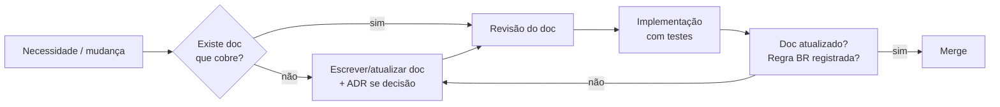

# Documentação — Dona Arteira ERP

> Última atualização: 2026-07-03 · Gate 00 — Fundação de Engenharia

Esta pasta é a **fonte canônica de conhecimento** do projeto. Regra de ouro: *se não está documentado, não está decidido; se não está decidido, não se implementa.*

## Como esta documentação funciona

- Cada pasta numerada é um **domínio documental** com um `README.md` principal e documentos complementares numerados.
- Todo documento segue o template em [`_templates/TEMPLATE-DOCUMENTO.md`](_templates/TEMPLATE-DOCUMENTO.md): objetivo, responsabilidades, fluxo, dependências, boas práticas, riscos e evoluções futuras.
- Decisões arquiteturais vivem em [`27-ADR/`](27-ADR/README.md) — imutáveis depois de aceitas (revoga-se com um novo ADR, nunca editando o antigo).
- Regras de negócio vivem em [`01-Regras-de-Negocio/01-registro-de-regras.md`](01-Regras-de-Negocio/01-registro-de-regras.md) com IDs `BR-xxx` citados por código e testes.
- Status possíveis de um documento: `Rascunho` → `Em revisão` → `Aprovado` → `Obsoleto`.

## Mapa da documentação

| # | Pasta | Conteúdo | Fase de uso |
|---|---|---|---|
| 00 | [Visao-Geral](00-Visao-Geral/README.md) | Visão executiva, escopo, stakeholders, governança, análise crítica | Sempre |
| 01 | [Regras-de-Negocio](01-Regras-de-Negocio/README.md) | Registro canônico de regras `BR-xxx` + levantamento do legado | Sempre |
| 02 | [Dominio](02-Dominio/README.md) | Bounded contexts, agregados, eventos de domínio, linguagem ubíqua | Sempre |
| 03 | [Arquitetura](03-Arquitetura/README.md) | Estilo arquitetural, C4, camadas, NFRs | Sempre |
| 04 | [Banco-de-Dados](04-Banco-de-Dados/README.md) | Modelo conceitual, convenções, estratégia de dados | Gate 01+ |
| 05 | [Backend](05-Backend/README.md) | Padrões Laravel, estrutura modular, pacotes | Gate 01+ |
| 06 | [Frontend](06-Frontend/README.md) | Padrões React/Vite/TS, estrutura, UI | Gate 01+ |
| 07 | [API](07-API/README.md) | Convenções REST, erros, versionamento, fluxo OpenAPI | Gate 01+ |
| 08 | [Producao](08-Producao/README.md) | Ordens de produção, etapas artesanais, moldes, perdas, custo | Gate 03 |
| 09 | [Estoque](09-Estoque/README.md) | Ledger de movimentos, reservas, inventário, custeio | Gate 01+ |
| 10 | [Vendas](10-Vendas/README.md) | Pedidos multicanal, máquina de estados, preços, expedição | Gate 02 |
| 11 | [Compras](11-Compras/README.md) | Fornecedores, pedidos de compra, recebimento | Gate 03 |
| 12 | [Financeiro](12-Financeiro/README.md) | Contas a pagar/receber, fluxo de caixa, categorias | Gate 04 |
| 13 | [Fiscal](13-Fiscal/README.md) | Regime tributário, CFOP/NCM/CSOSN, reforma tributária | Gate 05 |
| 14 | [NFe](14-NFe/README.md) | Emissão NF-e, certificado A1, contingência, eventos, guarda | Gate 05 |
| 15 | [Integracoes](15-Integracoes/README.md) | Framework de integração: adapters, filas, idempotência | Gate 02+ |
| 16 | [WooCommerce](16-WooCommerce/README.md) | Design da sincronização bidirecional com o e-commerce | Gate 02 |
| 17 | [Migracao](17-Migracao/README.md) | ETL WooCommerce → ERP, saneamento, cutover | Gate 01 |
| 18 | [Usuarios](18-Usuarios/README.md) | Personas, ciclo de vida de contas, autenticação | Gate 01 |
| 19 | [Permissoes](19-Permissoes/README.md) | RBAC, matriz papel×ação, alçadas | Gate 01 |
| 20 | [Relatorios](20-Relatorios/README.md) | Catálogo de relatórios, padrões de construção | Gate 06 |
| 21 | [Dashboards](21-Dashboards/README.md) | KPIs, painéis por papel | Gate 06 |
| 22 | [Testes](22-Testes/README.md) | Estratégia de testes, pirâmide, cobertura mínima | Gate 01+ |
| 23 | [Deploy](23-Deploy/README.md) | Ambientes, CI/CD, releases, rollback, backups | Gate 01+ |
| 24 | [Monitoramento](24-Monitoramento/README.md) | Health checks, alertas, logs, runbooks | Gate 02+ |
| 25 | [Seguranca](25-Seguranca/README.md) | Controles, LGPD, gestão de segredos, certificado A1 | Sempre |
| 26 | [Auditoria](26-Auditoria/README.md) | Trilha de auditoria, retenção, acesso | Gate 01+ |
| 27 | [ADR](27-ADR/README.md) | Registros de decisão arquitetural | Sempre |
| 28 | [Roadmap](28-Roadmap/README.md) | Fases, gates, critérios de saída | Sempre |
| 29 | [Glossario](29-Glossario/README.md) | Linguagem ubíqua: negócio + técnica + fiscal | Sempre |
| 30 | [Dominio-da-Dona-Arteira](30-Dominio-da-Dona-Arteira/README.md) | O negócio: processo artesanal, canais, sazonalidade, descoberta | Sempre |
| 31 | [Inventario-Legado](31-Inventario-Legado/README.md) | Engenharia reversa do WooCommerce e do desktop: produtos, clientes, pedidos, plugins, qualidade de dados | Gate 01 |
| 32 | [Catalogo](32-Catalogo/README.md) | Produto: SKU, variação, `kind`, categorias, preços, medidas, dados fiscais de cadastro | Gate 01+ |

> O número 32 é a ordem de criação da pasta (2026-07-25), não a posição
> do catálogo no domínio — que vem antes de estoque, vendas e produção. A
> `docs/` original descrevia produto só como uma linha do modelo
> conceitual, e a lacuna apareceu quando o módulo entrou na fila.
> Renumerar quebraria centenas de links; o custo não se paga.

## Fluxo docs-first (obrigatório)

## Papéis documentais

- **Dono do produto** (Diego): aprova escopo, ADRs com impacto de custo, gates do roadmap.
- **Arquiteto** (agente `chief-architect`): guarda a coerência entre docs, ADRs e código.
- **Escritor técnico** (agente `technical-writer`): mantém índices, glossário e templates.

## Convenções

- pt-BR em toda a documentação; termos técnicos consagrados podem permanecer em inglês (ex.: *webhook*, *ledger*).
- Arquivos sem acento, kebab-case, prefixo numérico para ordenação.
- Diagramas em **Mermaid** dentro do próprio Markdown (versionável e revisável).
- Referências cruzadas por link relativo — nunca duplicar conteúdo entre documentos.
